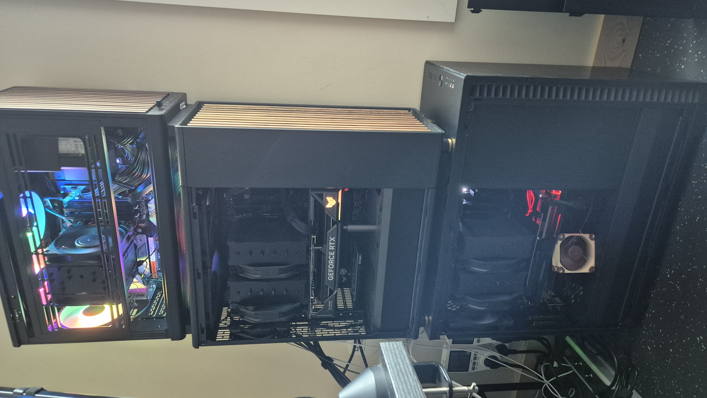
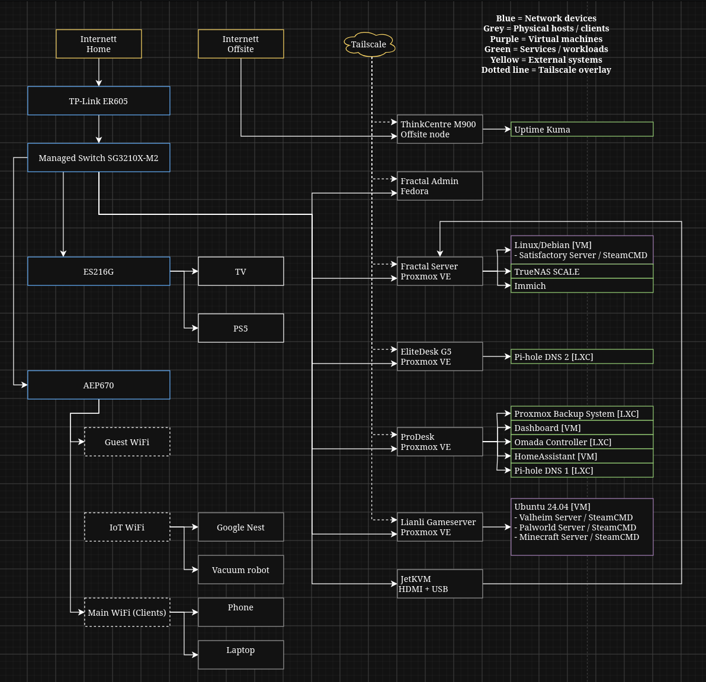
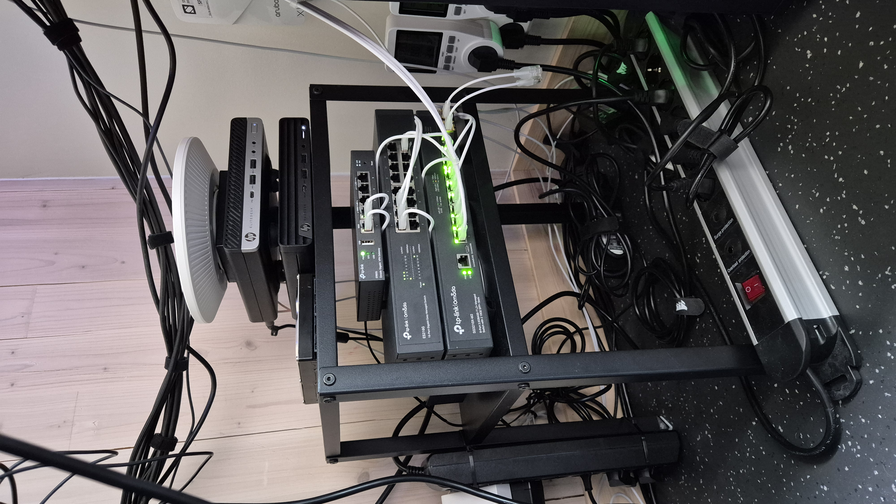

# Homelab

> A multi-node homelab for hands-on work with virtualization, Linux, storage, networking, backup, monitoring, security, and self-hosted services.

## Overview

This repository documents the design, operation, and continued development of my personal homelab.

The environment has grown from a single server and a flat network into a multi-node platform with dedicated roles for storage, infrastructure, backup, DNS redundancy, game hosting, and offsite monitoring.

The goal is not simply to run self-hosted applications. I use the lab to gain practical experience with:

- Proxmox VE and virtualization
- Linux server administration
- Storage and ZFS
- Backup and recovery
- VLANs, routing, DNS, DHCP, and ACLs
- Network and service segmentation
- Remote administration
- Monitoring and dashboards
- Troubleshooting and incident recovery
- Infrastructure documentation

The repository is intended both as operational documentation and as a technical portfolio.



---

## Architecture

The homelab is built around four local Proxmox VE hosts and one offsite Linux node.

| System | Primary Role |
|---|---|
| **`pve-main`** | Main virtualization and storage host |
| **`prodesk`** | Infrastructure, management services, and Proxmox Backup Server |
| **`elitedesk`** | Dedicated secondary DNS node |
| **`pve-game-server`** | Dedicated game-server virtualization |
| **ThinkCentre M900** | Offsite monitoring, Tailscale, and utility tasks |

The roles are deliberately separated.

Storage-heavy workloads remain on `pve-main`, while supporting infrastructure such as DNS, network management, Home Assistant, the operations dashboard, and backup services are placed on separate nodes. Externally reachable game workloads are isolated on their own Proxmox host, and secondary DNS is kept on a separate physical machine.

### High-Level Architecture



Detailed diagrams are kept under [`docs/architecture/`](docs/architecture/) and [`diagrams/`](diagrams/).

---

## Infrastructure

### Compute

#### Main Proxmox — `pve-main`

Primary storage and virtualization host.

**Hardware**

- Intel Core i9-9900K
- 64 GB DDR4
- NVIDIA GTX 1070 Ti
- Intel I226-T1 2.5 GbE NIC
- LSI 9207-8i HBA in IT mode
- 1 TB Samsung 970 EVO Plus NVMe
- Additional local SSD storage
- Multiple HDDs passed through to TrueNAS

**Main workloads**

- TrueNAS
- Immich
- Linux / Debian server
- Satisfactory
- Experimental Kubernetes lab

Several supporting infrastructure services previously hosted here have been migrated to `prodesk`.

Documentation: [`docs/nodes/pve-main.md`](docs/nodes/pve-main.md)

---

#### ProDesk — `prodesk`

Infrastructure and backup node.

**Storage**

- 1 TB WD_BLACK NVMe for Proxmox and VM/LXC storage
- 2 TB Samsung 990 PRO NVMe dedicated to the PBS datastore

**Main workloads**

- Proxmox Backup Server
- Pi-hole DNS 1
- Home Assistant
- Omada Controller
- Homepage dashboard

The ProDesk became the primary support node during the Server 2.0 migration and workload cleanup. Consolidating these services here reduces unrelated dependencies on `pve-main` and keeps the backup datastore on separate physical hardware.

Documentation: [`docs/nodes/pve-prodesk.md`](docs/nodes/pve-prodesk.md)

---

#### EliteDesk — `elitedesk`

Lightweight Proxmox node dedicated to secondary DNS.

**Hardware**

- HP EliteDesk 800 G5 Mini
- Intel Core i5-9600T
- 16 GB RAM
- 1 GbE networking

**Main workload**

- Pi-hole DNS 2

The EliteDesk intentionally runs only the secondary Pi-hole instance. This provides DNS redundancy across separate physical hosts without making the node another general-purpose infrastructure server.

Documentation: [`docs/nodes/pve-elitedesk.md`](docs/nodes/pve-elitedesk.md)

---

#### Game Server — `pve-game-server`

Dedicated Proxmox host for game workloads.

**Hardware**

- Intel Core i5-14500
- ASUS Prime B760M-A WIFI
- 32 GB DDR5
- Noctua NH-U12A
- Samsung SSD
- Lian Li A3 chassis

**Current workloads**

- Linux game-server VM
- Palworld
- Valheim
- Playit.gg
- Game-save backup and maintenance scripts

Satisfactory is still hosted on the Linux/Debian VM on `pve-main` and remains part of the remaining game-workload migration.

The dedicated host allows game servers to be restarted, updated, rebuilt, or exposed externally without tying their lifecycle to TrueNAS, Immich, or other private infrastructure.

Documentation: [`docs/nodes/pve-gameserver.md`](docs/nodes/pve-gameserver.md)

---

#### Offsite ThinkCentre M900

Separate Debian system located away from the main homelab.

**Hardware**

- Lenovo ThinkCentre M900
- Intel Core i5-6500T
- 32 GB DDR4
- 1 TB NVMe
- 2 TB-class HDD storage
- Intel 1 GbE networking

**Main workloads**

- Uptime Kuma
- Tailscale
- SSH administration
- External availability monitoring
- Selected utility/offsite tasks

Documentation: [`docs/nodes/offsite-m900.md`](docs/nodes/offsite-m900.md)

---

### Network

The network is one subsystem of the homelab and is documented in depth under [`docs/network/`](docs/network/).

The core hardware is:

| Device | Role |
|---|---|
| TP-Link ER605 V2 | Gateway, routing, DHCP, NAT, and gateway ACLs |
| TP-Link SG3210X-M2 | Main managed 2.5 GbE switch |
| TP-Link ES216G | Secondary managed access switch |
| TP-Link EAP670 | Wi-Fi 6 access point |
| Omada Controller | Centralized network management |
| JetKVM | Remote physical console access |

The network is centrally managed through Omada.




---

### Storage

TrueNAS runs as a VM on `pve-main`.

An LSI 9207-8i HBA in IT mode is passed through to TrueNAS so that ZFS manages the physical disks directly.

Current main storage includes:

- 4 × 8 TB HDDs in a RAIDZ1-style ZFS layout with one-disk parity
- 2 × 2 TB HDDs mirrored for Immich storage
- 3 TB Workdrive storage
- SSD/NVMe storage for Proxmox and VM workloads

TrueNAS provides storage using SMB/NFS and is an important dependency for services such as Immich.

Proxmox Backup Server storage is kept on the separate ProDesk node using a dedicated 2 TB Samsung 990 PRO NVMe datastore.

Documentation: [`docs/services/truenas.md`](docs/services/truenas.md)

---

## Network Design

The network uses VLANs to separate systems with different trust levels and purposes.

| VLAN | Name | Purpose |
|---:|---|---|
| 1 | `DEFAULT` | Restricted legacy/default network |
| 10 | `INFRA` | Hypervisors, servers, and infrastructure |
| 20 | `TRUSTED` | Personal and administrative clients |
| 25 | `GAME-DMZ` | Game-server workloads |
| 30 | `IOT` | Smart-home and IoT devices |
| 40 | `GUEST` | Guest devices |

At a high level:

- `TRUSTED` is the administration/client network.
- `INFRA` contains servers and infrastructure.
- `GAME-DMZ` is isolated from private infrastructure.
- `IOT` is restricted from initiating connections into trusted infrastructure, with explicit exceptions where required.
- `GUEST` is isolated from internal systems.
- `DEFAULT` is not used as a normal trusted client network.
- Pi-hole DNS is explicitly allowed where required.
- Home Assistant has an explicit exception for required communication with IoT devices.

Inter-VLAN policy is enforced using gateway ACLs.

Detailed documentation:

- [`docs/network/vlan-design.md`](docs/network/vlan-design.md)
- [`docs/network/ip-plan.md`](docs/network/ip-plan.md)
- [`docs/network/acl-policy.md`](docs/network/acl-policy.md)
- [`docs/network/port-mapping.md`](docs/network/port-mapping.md)

---

## Virtualization

The local environment currently uses four Proxmox VE hosts.

VMs are used where a full guest OS or stronger isolation is useful, while lightweight infrastructure is also run in LXC containers.

### Main Workloads

| Workload | Host | Role |
|---|---|---|
| TrueNAS | `pve-main` | NAS, ZFS, SMB/NFS |
| Immich | `pve-main` | Photo/video management |
| Linux / Debian Server | `pve-main` | Satisfactory and supporting scripts |
| Home Assistant | `prodesk` | Home automation |
| Omada Controller | `prodesk` | Network management |
| Homepage Dashboard | `prodesk` | Operations dashboard |
| Proxmox Backup Server | `prodesk` | VM/LXC backup platform |
| Pi-hole DNS 1 | `prodesk` | Primary DNS/filtering |
| Pi-hole DNS 2 | `elitedesk` | Secondary DNS/filtering |
| Game Server VM | `pve-game-server` | Palworld and Valheim |

The Kubernetes environment is currently experimental rather than production infrastructure.

### Node-Based VMID Convention

The current workload numbering convention is based on physical host:

```text
pve-main      100–199
prodesk       200–299
elitedesk     300–399
game-server   400–499
```

Historical Kubernetes IDs remain outside this finalized layout until that project is revisited.

---

## Services

| Service | Purpose | Documentation |
|---|---|---|
| **TrueNAS** | ZFS storage, SMB, and NFS | [`truenas.md`](docs/services/truenas.md) |
| **Proxmox Backup Server** | Backup and recovery of selected workloads | [`proxmox-backup-server.md`](docs/services/proxmox-backup-server.md) |
| **Pi-hole ×2** | DNS filtering and physical-host redundancy | [`pihole.md`](docs/services/pihole.md) |
| **Home Assistant** | Home automation | [`home-assistant.md`](docs/services/home-assistant.md) |
| **Immich** | Self-hosted photo/video management | [`immich.md`](docs/services/immich.md) |
| **Omada Controller** | Central network management | [`omada-controller.md`](docs/services/omada-controller.md) |
| **Homepage** | Internal operations dashboard | [`homepage-dashboard.md`](docs/services/homepage-dashboard.md) |
| **Uptime Kuma** | Offsite availability monitoring | [`uptime-kuma.md`](docs/services/uptime-kuma.md) |
| **Game Servers** | Palworld, Valheim, and Satisfactory | [`game-servers.md`](docs/services/game-servers.md) |
| **Tailscale** | Secure remote administration | [`remote-access.md`](docs/security/remote-access.md) |
| **Playit.gg** | External game connectivity | [`game-servers.md`](docs/services/game-servers.md) |

---

## Service Dependencies

Some important dependencies are deliberately documented because VM state alone does not describe service health.

Examples:

- **Immich → TrueNAS** for media storage
- **Clients → Pi-hole DNS 1 / DNS 2** for DNS
- **Proxmox workloads → PBS on ProDesk** for backup
- **Home Assistant → IoT devices** for automation
- **Omada hardware → Omada Controller** for centralized management
- **Game servers → Playit.gg** for external player connectivity
- **Uptime Kuma → external connectivity** for independent monitoring

More detail: [`docs/architecture/logical-topology.md`](docs/architecture/logical-topology.md)

---

## Security

### Network Security

The current design uses:

- VLAN segmentation
- Gateway ACLs
- Separate infrastructure, trusted-client, IoT, guest, and game-server zones
- Explicit cross-VLAN exceptions
- Restricted use of the default VLAN
- No direct Internet exposure of normal management interfaces
- A dedicated DMZ-style network for game workloads

Documentation: [`docs/security/segmentation.md`](docs/security/segmentation.md)

### Administrative Access

The primary administration workstation runs Fedora and resides on `TRUSTED`.

Administration is performed using:

- HTTPS management interfaces
- SSH
- Proxmox console access
- JetKVM when physical console access is required
- Tailscale for remote administration

### Remote Access

Remote access is separated by purpose:

- **Tailscale** — private administration
- **Playit.gg** — public game connectivity

This is particularly useful because the homelab is behind an upstream network where normal inbound port forwarding is not available.

Documentation: [`docs/security/remote-access.md`](docs/security/remote-access.md)

### Secrets Management

This repository is intended to be public.

The following must never be committed:

- Passwords
- API tokens
- Private keys
- Tailscale authentication keys
- Playit.gg tunnel secrets
- Discord webhook URLs
- Wi-Fi credentials
- Session cookies
- Application secrets
- Unredacted configuration exports containing credentials

Configuration examples use placeholders or sanitized `.env.example` files.

Recommended `.gitignore` entries:

```gitignore
.env
.env.*
!.env.example
*.key
*.pem
secrets/
credentials/
```

---

## Backup & Recovery

### Backup Strategy

Proxmox Backup Server runs on `prodesk`, physically separate from `pve-main`.

PBS uses a dedicated 2 TB Samsung 990 PRO NVMe datastore.

Important VMs and containers are backed up to PBS, while temporary test systems and experimental workloads can be treated as lower priority.

The design intentionally distinguishes between **VM backup** and **data backup**.

A backup of the TrueNAS VM does **not** back up the physical data disks passed through to TrueNAS. The large ZFS datasets therefore require their own data-protection strategy.

The current PBS datastore does not have enough capacity to store a complete second copy of all TrueNAS bulk data, so stronger offsite protection remains a roadmap item.

Documentation: [`docs/security/backup-strategy.md`](docs/security/backup-strategy.md)

### Recovery

Important recovery scenarios include:

- Restoring a VM/LXC from PBS
- Recovering Pi-hole DNS
- Rebuilding or replacing a Proxmox host
- Recovering network management after a VLAN/switch configuration error
- Restoring game-server saves
- Validating TrueNAS and Immich dependencies after maintenance

The long-term goal is to test restore paths regularly rather than treating a successful backup job as proof of recoverability.

---

## Monitoring & Management

### Homepage Dashboard

Homepage runs on `prodesk` and provides an internal overview of the environment.

It is used for:

- Proxmox nodes
- Core services
- Pi-hole
- TrueNAS
- PBS
- Omada
- Home Assistant
- Immich
- Game-server status
- Management links

The dashboard is primarily for visibility and navigation rather than replacing native administrative interfaces.

### Uptime Kuma

Uptime Kuma runs on the offsite ThinkCentre M900.

This placement allows it to detect failures that could also take down an internally hosted monitoring service, including:

- Internet loss
- Local power loss
- Host failure
- Service failure
- Loss of remote reachability

### Scripts and Automation

Small scripts are used for tasks such as:

- Service checks
- Game-server maintenance
- Save-file backups
- Network/availability checks
- Disk-temperature checks
- Notifications

Reusable and sanitized scripts are stored under [`configs/scripts/`](configs/scripts/).

---

## Projects

### Network Segmentation and Omada Migration

The network was migrated from a flat LAN to dedicated trust zones.

The work included:

- VLAN planning
- DHCP and DNS design
- Omada deployment
- Trunk/access port configuration
- Migrating hosts and services
- Gateway ACL design
- Testing permitted and blocked traffic
- Recovering an ES216G management/adoption failure

Documentation: [`docs/network/`](docs/network/)

---

### Server 2.0 Node and Workload Cleanup

The Proxmox environment was reorganized to give each physical node a clearer role.

The work included:

- introducing the ProDesk as the main infrastructure/support node
- moving Proxmox Backup Server and its datastore from EliteDesk to ProDesk
- migrating Pi-hole DNS 1, Home Assistant, Omada Controller, and Homepage to ProDesk
- reducing EliteDesk to a dedicated secondary DNS role
- standardizing workload IDs using node-based VMID ranges
- reducing service concentration on `pve-main`

Documentation: [`docs/timeline/timeline.md`](docs/timeline/timeline.md)

---

### Dedicated Game-Server Platform

Game workloads are being separated from the main infrastructure host.

The project includes:

- Dedicated physical hardware
- Proxmox
- Linux game-server VM
- `GAME-DMZ`
- Playit.gg
- Save-file backups
- Independent update/restart routines

Palworld and Valheim are already hosted on the dedicated node. Satisfactory remains on `pve-main` and is the main remaining migration item.

Documentation: [`docs/services/game-servers.md`](docs/services/game-servers.md)

---

### Backup Infrastructure

Proxmox Backup Server now runs on ProDesk with a dedicated 2 TB NVMe datastore.

This work includes:

- migration of the existing PBS datastore
- physically separate backup storage
- retention planning
- VM/LXC backup jobs
- restore testing
- offsite backup planning

Documentation: [`docs/services/proxmox-backup-server.md`](docs/services/proxmox-backup-server.md)

---

### Operations Dashboard

A Homepage dashboard on ProDesk consolidates service status, metrics, and management links.

The project includes:

- Linux VM deployment
- Docker
- Homepage configuration
- API integrations
- Least-privilege/read-only access where supported
- Authentication and TLS troubleshooting

Documentation: [`docs/services/homepage-dashboard.md`](docs/services/homepage-dashboard.md)

---

### Offsite Monitoring

The ThinkCentre M900 provides an external point of observation for the main homelab.

The project uses:

- Debian
- Uptime Kuma
- Tailscale
- SSH
- External service checks

Documentation: [`docs/services/uptime-kuma.md`](docs/services/uptime-kuma.md)

---

## Incidents & Troubleshooting

Operational mistakes and recovery work are documented rather than hidden.

One example is the **ES216G recovery incident**.

A management/uplink VLAN change interrupted controller communication with the secondary switch. Recovery required local management access, restoring the correct management configuration, validating the trunk path, and re-adopting the switch into Omada.

The main lessons were:

1. Make one management-path change at a time.
2. Record the working state before changing uplinks or native VLANs.
3. Verify connectivity immediately after each change.
4. Keep a rollback path.
5. Fix the failed dependency before changing unrelated working systems.

Documentation: [`docs/network/incidents/es216g-recovery.md`](docs/network/incidents/es216g-recovery.md)

---

## Diagrams

Architecture diagrams are kept outside the root README.

Current diagram topics include:

- compute and virtualization
- network and VLAN architecture
- deployment
- storage and backup architecture

Exported diagrams belong under [`diagrams/images/`](diagrams/images/), while editable Draw.io sources remain under [`diagrams/`](diagrams/).

The root README intentionally stays at architecture level. Detailed cable paths, IP addresses, switch ports, and ACL flows belong in the dedicated documentation.

---

## Documentation

| Area | Content |
|---|---|
| [`docs/architecture/`](docs/architecture/) | Physical and logical architecture |
| [`docs/network/`](docs/network/) | VLANs, IP plan, ACLs, port mapping, incidents |
| [`docs/nodes/`](docs/nodes/) | Physical hosts and their roles |
| [`docs/services/`](docs/services/) | Service-specific documentation |
| [`docs/security/`](docs/security/) | Segmentation, backup, and remote access |
| [`docs/timeline/`](docs/timeline/) | Homelab development timeline |
| [`diagrams/`](diagrams/) | Draw.io sources and exported diagrams |
| [`configs/`](configs/) | Sanitized configuration examples and scripts |
| [`screenshots/`](screenshots/) | Selected documentation screenshots |

---

## Repository Structure

```text
homelab/
│
├── README.md
│
├── docs/
│   ├── architecture/
│   │   ├── overview.md
│   │   ├── physical-topology.md
│   │   └── logical-topology.md
│   │
│   ├── network/
│   │   ├── README.md
│   │   ├── vlan-design.md
│   │   ├── ip-plan.md
│   │   ├── acl-policy.md
│   │   ├── port-mapping.md
│   │   └── incidents/
│   │       └── es216g-recovery.md
│   │
│   ├── nodes/
│   │   ├── pve-main.md
│   │   ├── pve-prodesk.md
│   │   ├── pve-elitedesk.md
│   │   ├── pve-gameserver.md
│   │   └── offsite-m900.md
│   │
│   ├── services/
│   │   ├── truenas.md
│   │   ├── proxmox-backup-server.md
│   │   ├── pihole.md
│   │   ├── home-assistant.md
│   │   ├── immich.md
│   │   ├── omada-controller.md
│   │   ├── homepage-dashboard.md
│   │   ├── uptime-kuma.md
│   │   └── game-servers.md
│   │
│   ├── security/
│   │   ├── segmentation.md
│   │   ├── backup-strategy.md
│   │   └── remote-access.md
│   │
│   └── timeline/
│       └── timeline.md
│
├── diagrams/
│   └── images/
│
├── configs/
│   ├── pihole/
│   ├── systemd/
│   └── scripts/
│
└── screenshots/
```

---

## Software & Technologies

**Virtualization & storage**

- Proxmox VE
- QEMU/KVM
- LXC
- Proxmox Backup Server
- TrueNAS
- ZFS
- SMB / NFS

**Networking**

- TP-Link Omada
- VLANs / 802.1Q
- Gateway ACLs
- DHCP / DNS
- Pi-hole
- Tailscale
- Playit.gg

**Systems & services**

- Debian
- Linux server workloads
- Fedora
- Docker
- Homepage
- Home Assistant
- Immich
- Uptime Kuma

**Lab & documentation**

- Kubernetes
- Bash
- systemd
- Git
- GitHub
- Mermaid
- Draw.io

---

## Current Status

### Operational

- [x] Four local Proxmox VE hosts
- [x] TrueNAS storage
- [x] Dual Pi-hole DNS across separate physical hosts
- [x] Proxmox Backup Server on separate physical hardware
- [x] Omada-managed network
- [x] VLAN segmentation and gateway ACLs
- [x] Separate infrastructure, trusted, IoT, guest, and game-server networks
- [x] Tailscale remote administration
- [x] Offsite Uptime Kuma monitoring
- [x] Homepage operations dashboard
- [x] Dedicated game-server host
- [x] ProDesk infrastructure migration
- [x] Node-based VMID cleanup
- [x] ES216G recovery and re-adoption completed
- [x] Core architecture diagrams created

### In Progress / Planned

- [ ] Migrate Satisfactory from `pve-main` to the dedicated game-server host
- [ ] Expand and verify backup coverage
- [ ] Build a stronger offsite strategy for irreplaceable TrueNAS data
- [ ] Perform and document regular restore tests
- [ ] Continue network and management-plane hardening
- [ ] Convert remaining notes into structured repo documentation
- [ ] Revisit the Kubernetes lab
- [ ] Add UPS/power-loss protection

---

## Roadmap

### Short Term

- Complete the GitHub documentation structure
- Finish the remaining Satisfactory migration
- Validate PBS restores
- Review backup retention
- Document remaining service dependencies
- Integrate the completed architecture diagrams into the repository

### Medium Term

- Improve offsite backup coverage
- Add UPS protection
- Improve monitoring and alerting
- Continue security hardening
- Add more reusable operational runbooks

### Long Term

- Revisit Kubernetes
- Explore additional infrastructure automation
- Increase configuration-as-code coverage
- Improve disaster-recovery capability

---

## Lessons Learned

### One Change at a Time

Management-path changes can remove the access required to fix them. VLAN, uplink, trunk, and management changes should be made individually and verified immediately.

### Backup and Restore Are Different Things

A successful backup job does not prove that recovery works. Restore procedures need to be tested.

### VM Backup Is Not the Same as Data Backup

Backing up the TrueNAS VM does not back up physical disks passed through to TrueNAS. Hypervisor backup and data protection must be designed separately.

### Redundancy Should Cross Failure Domains

Two DNS servers are more useful when they do not depend on the same physical host. The same principle applies to monitoring and backup.

### Dependencies Matter

A VM can be running while the service is unusable because a dependency such as DNS, storage, or networking is unavailable.

### Documentation Is Part of the Infrastructure

Port mappings, VLAN decisions, backup policies, incidents, migrations, and recovery procedures are easier to maintain when they are documented while the information is current.

### Security Is Easier to Reason About When It Is Explicit

Separate trust zones and narrow exceptions are easier to understand and maintain than broad network access rules.

---

## Disclaimer

This repository documents a personal homelab and learning environment.

Sensitive information is intentionally excluded. Credentials, authentication tokens, private keys, public endpoints, Wi-Fi passwords, webhook URLs, and other secrets are stored outside the repository.

Internal addresses, hostnames, and diagrams may also be simplified or sanitized where appropriate.


## AI Assistance

AI tools were used to assist with documentation structure, wording, and review.

The homelab architecture, configuration, implementation, troubleshooting, and technical decisions documented in this repository are my own work.

Some systems are intentionally experimental and may be stopped, rebuilt, or removed as the lab evolves.
