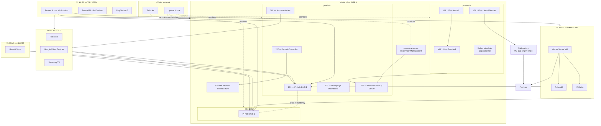
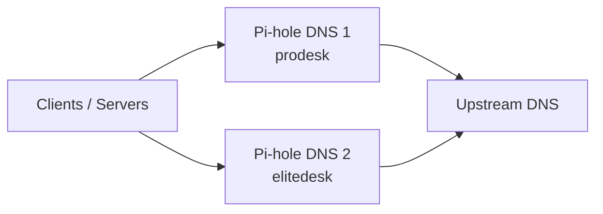
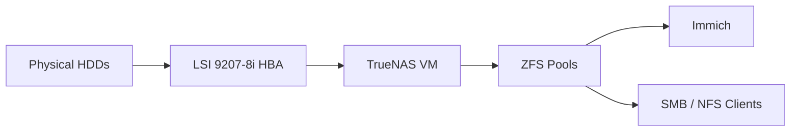
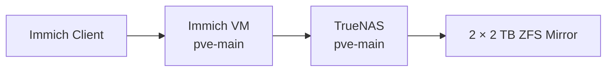
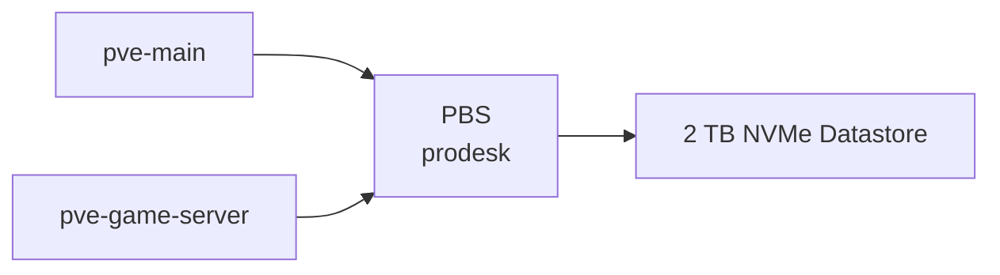
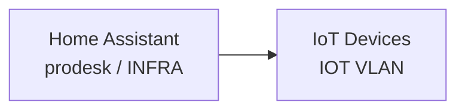
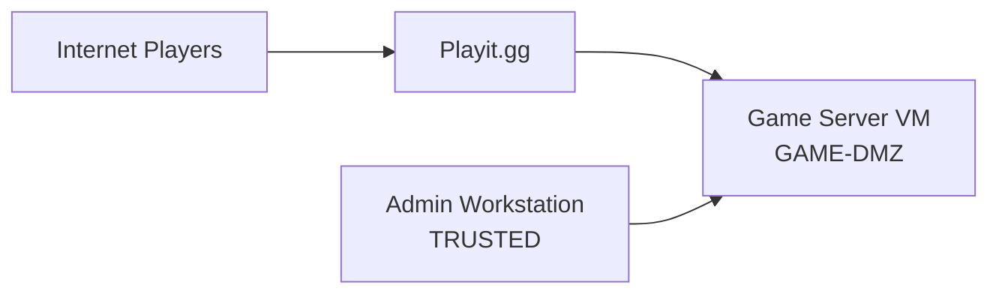
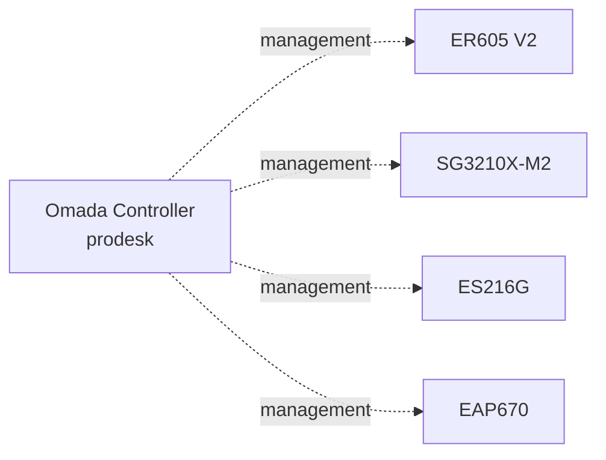
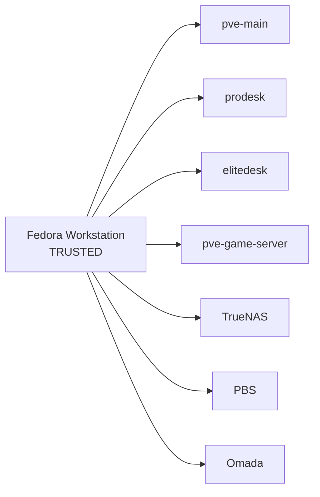
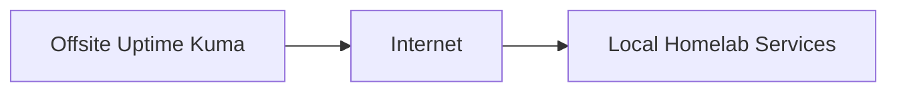

# Logical Topology

This document describes the logical architecture of the homelab.

It focuses on:

- Proxmox hosts
- Virtual machines and LXC containers
- Service placement
- VLAN placement
- Service dependencies
- Administrative and external access paths
- Failure-domain separation

Physical cabling and hardware layout are documented in [`physical-topology.md`](physical-topology.md).

Detailed network policy, IP addressing, ACLs, and switch-port configuration are documented under [`../network/`](../network/).

---

## Overview

The homelab is built around four local Proxmox VE hosts with distinct responsibilities:

| Host | Logical Role |
|---|---|
| `pve-main` | Primary storage and storage-dependent workloads |
| `prodesk` | Infrastructure, management services, and backup |
| `elitedesk` | Dedicated secondary DNS |
| `pve-game-server` | Dedicated game-server workloads |

An offsite ThinkCentre M900 runs independent monitoring and remote-access services.

The logical design separates:

- Storage
- Core infrastructure
- Backup
- Trusted administration
- Game-server workloads
- IoT devices
- Guest clients
- DNS redundancy
- Offsite monitoring

The current topology is the result of a Server 2.0 cleanup where workloads were redistributed so that each physical node has a clearer role.

---

## High-Level Logical Diagram



This diagram is intentionally simplified. It shows the major logical relationships without including every IP address, switch port, or ACL rule.

---

# Proxmox Layout

## `pve-main`

The main Proxmox node is now focused primarily on storage and workloads that directly benefit from that storage.

| ID | Workload | Type | Role |
|---:|---|---|---|
| 100 | Linux / Debian Server | VM | Satisfactory, SteamCMD, scripts |
| 101 | TrueNAS | VM | NAS, ZFS, SMB, NFS |
| 106 | Immich | VM | Photo and video management |

Several workloads that were previously hosted here have been moved to `prodesk`.

These include:

- Pi-hole DNS 1
- Home Assistant
- Omada Controller
- Homepage Dashboard

This reduces the number of unrelated infrastructure services that depend on the main storage host.

### Experimental Workloads

The Kubernetes lab has historically used:

| ID | Workload | Role |
|---:|---|---|
| 550 | k8s-base | Template / lab base |
| 551 | k8s-cp1 | Kubernetes control plane |
| 552 | k8s-w1 | Kubernetes worker |
| 553 | k8s-w2 | Kubernetes worker |

These VMs are experimental and are not considered part of the finalized production-like workload layout.

They may be rebuilt, relocated, renumbered, or removed when the Kubernetes project is revisited.

---

## `prodesk`

The ProDesk is the primary infrastructure and backup node.

| ID | Workload | Type | Role |
|---:|---|---|---|
| 200 | Omada Controller | LXC | Central network management |
| 201 | Pi-hole DNS 1 | LXC | Primary DNS and filtering |
| 202 | Home Assistant | VM | Home automation |
| 203 | Homepage Dashboard | VM | Internal operations dashboard |
| 299 | Proxmox Backup Server | LXC | Backup and restore platform |

This node took over several infrastructure workloads during the Server 2.0 migration.

Its role is deliberately different from `pve-main`:

```text
pve-main
└── storage and storage-dependent workloads

prodesk
└── infrastructure, management, and backup
```

---

## `elitedesk`

The EliteDesk now has a deliberately narrow role.

| Workload | Type | Role |
|---|---|---|
| Pi-hole DNS 2 | LXC | Secondary DNS and filtering |

The exact CTID is intentionally omitted here until the workload has been fully aligned with the current EliteDesk VMID range.

The EliteDesk no longer hosts:

- Proxmox Backup Server
- Homepage Dashboard
- general infrastructure workloads

Its purpose is physical host separation for secondary DNS.

---

## `pve-game-server`

The dedicated game-server host separates externally reachable game workloads from private infrastructure.

| Workload | Type | Role |
|---|---|---|
| Game Server VM | VM | Dedicated game-server environment |
| Palworld | Application | Active game server |
| Valheim | Application | Active game server |
| Playit.gg | Tunnel service | External player connectivity |

Satisfactory is still hosted on the Linux/Debian VM on `pve-main`.

The remaining migration goal is therefore:

```text
Satisfactory
pve-main
   │
   ▼
pve-game-server
```

The dedicated game-server host allows game maintenance to occur independently of storage, backup, DNS, and private infrastructure services.

---

# VMID Convention

The current VMID convention is based on physical host:

```text
pve-main      100–199
prodesk       200–299
elitedesk     300–399
game-server   400–499
```

This makes workload placement easier to identify and reduces historical ID overlap.

The Kubernetes lab currently retains historical IDs outside this structure because it is still experimental.

---

# Network Zones

The logical design uses separate VLANs for systems with different trust levels and purposes.

| VLAN | Name | Logical Purpose |
|---:|---|---|
| 1 | `DEFAULT` | Restricted default / legacy zone |
| 10 | `INFRA` | Servers, hypervisors, and infrastructure |
| 20 | `TRUSTED` | Administration and trusted clients |
| 25 | `GAME-DMZ` | Game-server workloads |
| 30 | `IOT` | Smart-home and IoT devices |
| 40 | `GUEST` | Guest clients |

---

## INFRA

`INFRA` contains infrastructure and private services.

Examples include:

- Proxmox management interfaces
- TrueNAS
- Proxmox Backup Server
- Pi-hole
- Home Assistant
- Immich
- Omada Controller
- Homepage Dashboard
- Omada switches and access point
- JetKVM

The network is intentionally not treated as a general-purpose client network.

---

## TRUSTED

`TRUSTED` is the primary administrative and personal-client network.

The main Fedora workstation resides here.

`TRUSTED` is allowed to initiate approved connections toward:

- `INFRA`
- `GAME-DMZ`
- `IOT`

This provides a central administrative path without giving the other VLANs equivalent access back toward trusted clients.

---

## GAME-DMZ

`GAME-DMZ` contains game-server workloads.

Its purpose is to separate services that may be externally reachable from private infrastructure.

Game workloads retain:

- Internet access
- DNS access through Pi-hole
- external connectivity through Playit.gg

They are restricted from initiating general connections toward private infrastructure.

The Proxmox management interface of the physical game-server host remains on `INFRA`.

---

## IOT

`IOT` contains devices such as:

- Roborock
- Nest / Google devices
- Samsung TV
- other smart-home devices

IoT devices are prevented from initiating unrestricted traffic toward internal systems.

Home Assistant is given an explicit exception so that it can communicate with IoT devices when required.

---

## GUEST

`GUEST` is intended for visitor devices.

Guest clients receive:

- Internet connectivity
- DNS through Pi-hole

They do not receive general access to internal systems.

---

## DEFAULT

`DEFAULT` remains a restricted default/legacy network.

It is not used as a normal trusted client network.

Detailed policy is documented in [`../network/acl-policy.md`](../network/acl-policy.md).

---

# Service Placement

## Core Infrastructure

| Service | Host | Zone |
|---|---|---|
| TrueNAS | `pve-main` | INFRA |
| Immich | `pve-main` | INFRA |
| Linux / Debian Server | `pve-main` | INFRA |
| Omada Controller | `prodesk` | INFRA |
| Pi-hole DNS 1 | `prodesk` | INFRA |
| Home Assistant | `prodesk` | INFRA |
| Homepage Dashboard | `prodesk` | INFRA |
| Proxmox Backup Server | `prodesk` | INFRA |
| Pi-hole DNS 2 | `elitedesk` | INFRA |

---

## Game Infrastructure

| Service | Host | Zone |
|---|---|---|
| Game-server hypervisor management | `pve-game-server` | INFRA |
| Game Server VM | `pve-game-server` | GAME-DMZ |
| Palworld | Game Server VM | GAME-DMZ |
| Valheim | Game Server VM | GAME-DMZ |
| Playit.gg | Game-server environment | GAME-DMZ → Internet |
| Satisfactory | VM 100 on `pve-main` | Current legacy placement |

Satisfactory is the remaining major game workload still hosted on the main node.

---

# DNS Architecture

The homelab uses two Pi-hole instances on separate physical hosts.



Both instances reside logically on `INFRA`, but they do not share the same hypervisor.

This provides resilience against:

- Pi-hole container failure
- ProDesk maintenance
- EliteDesk maintenance
- failure of one DNS host

The design provides host-level DNS redundancy without requiring a dedicated physical DNS appliance.

---

# Storage Architecture

TrueNAS is the primary storage service and runs on `pve-main`.



Current storage roles include:

- 4 × 8 TB HDDs in the primary ZFS pool
- one-disk parity
- 2 × 2 TB mirror for Immich storage
- 3 TB Workdrive storage

Important distinction:

- TrueNAS runs as a VM.
- The main data disks are physical disks passed through to TrueNAS.
- Proxmox VM backup does not automatically protect all data stored in the ZFS pools.

---

# Immich Dependency

Immich depends on TrueNAS-backed storage.



This means that:

- the Immich VM can be running while media access is unavailable
- TrueNAS availability is part of Immich service health
- storage changes must be validated from the application level

---

# Backup Architecture

Proxmox Backup Server now runs on `prodesk`.



The backup target is physically separate from `pve-main`.

PBS was migrated from the EliteDesk to the ProDesk during the Server 2.0 infrastructure cleanup.

The PBS datastore is stored on a dedicated 2 TB NVMe device.

PBS primarily protects selected VM/LXC workloads.

Large TrueNAS datasets require a separate backup strategy.

---

# Home Assistant and IoT

Home Assistant runs on `prodesk` inside `INFRA`.

Smart-home devices reside on `IOT`.



An explicit ACL exception allows Home Assistant to initiate required connections toward IoT devices.

General `INFRA → IOT` access remains restricted.

This keeps the exception narrow and tied to the service that requires it.

---

# Game-Server Access

The dedicated game workloads are logically separated from both trusted clients and infrastructure.



Public game traffic does not require direct inbound port forwarding through the local gateway.

Administrative access follows a separate trusted path.

Satisfactory remains an exception to the target architecture until its migration from `pve-main` is completed.

---

# Omada Management

The Omada Software Controller runs on `prodesk`.

It manages:

- ER605 V2
- SG3210X-M2
- ES216G
- EAP670



The controller is required for centralized management and monitoring.

Already-deployed switching, routing, and wireless configuration does not depend on the controller remaining online continuously.

---

# Administrative Access

The main administration path is:



Remote administration uses Tailscale where appropriate.

Management services are not intentionally exposed directly to the Internet.

JetKVM provides remote physical-console access to the main server where required.

---

# Remote Access

Tailscale and Playit.gg solve different problems.

## Tailscale

Used for:

- private SSH
- remote administration
- access between trusted systems

## Playit.gg

Used for:

- external game-player connectivity
- game-server tunnels
- environments where direct inbound port forwarding is unavailable

These access paths are intentionally separated.

---

# Offsite Monitoring

Uptime Kuma runs on the offsite ThinkCentre M900.



Because it is outside the local failure domain, it can detect failures that would also remove an internally hosted monitoring service.

Examples include:

- local power loss
- gateway failure
- Internet loss
- Proxmox host failure
- service unavailability

The offsite M900 also runs Tailscale for secure remote connectivity.

---

# Failure Domains

## `pve-main`

A complete failure of `pve-main` affects:

- TrueNAS
- primary ZFS storage
- Immich
- Immich media storage
- Workdrive
- Satisfactory
- experimental workloads hosted on the node

It does not automatically remove:

- Pi-hole DNS 1
- Pi-hole DNS 2
- PBS
- Omada Controller
- Home Assistant
- Homepage Dashboard
- Palworld
- Valheim
- offsite monitoring

This is a major improvement compared with the earlier workload layout.

---

## `prodesk`

A complete failure of `prodesk` affects:

- Proxmox Backup Server
- access to the PBS datastore
- Pi-hole DNS 1
- Home Assistant
- Omada Controller
- Homepage Dashboard

It does not automatically remove:

- TrueNAS
- Immich
- Pi-hole DNS 2
- `pve-main`
- dedicated game workloads
- offsite monitoring

Pi-hole DNS 2 remains available on the EliteDesk.

---

## `elitedesk`

A complete failure of `elitedesk` affects:

- Pi-hole DNS 2
- secondary DNS redundancy

Pi-hole DNS 1 remains available on ProDesk.

The narrow role of this node intentionally limits its failure impact.

---

## `pve-game-server`

A failure of the dedicated game-server host affects:

- Palworld
- Valheim
- game-server Playit.gg tunnels associated with that host

It does not directly remove:

- TrueNAS
- Immich
- Home Assistant
- Omada Controller
- Pi-hole
- PBS
- Homepage Dashboard

Satisfactory currently remains available independently because it is still hosted on `pve-main`.

---

## Network Core

The ER605 and SG3210X-M2 remain important shared infrastructure.

Failure of the network core can affect several otherwise independent services at the same time.

The environment therefore has service and host separation, but it is not a fully high-availability design.

---

# Current Logical Migration State

The Server 2.0 workload cleanup is largely complete.

Completed changes include:

- ProDesk introduced as a central infrastructure node
- PBS migrated from EliteDesk to ProDesk
- PBS datastore moved to dedicated NVMe storage on ProDesk
- Pi-hole DNS 1 moved to ProDesk
- Home Assistant moved to ProDesk
- Omada Controller moved to ProDesk
- Homepage Dashboard moved to ProDesk
- EliteDesk reduced to secondary DNS
- Palworld moved to the dedicated game-server host
- Valheim moved to the dedicated game-server host
- VMID ownership standardized by physical node

The main remaining game-workload migration is:

```text
Satisfactory
pve-main
   │
   ▼
pve-game-server
```

The current target architecture is:

```text
pve-main
├── TrueNAS
├── Immich
├── Satisfactory [temporary]
└── experimental lab capacity

prodesk
├── Proxmox Backup Server
├── Pi-hole DNS 1
├── Home Assistant
├── Omada Controller
└── Homepage Dashboard

elitedesk
└── Pi-hole DNS 2

pve-game-server
├── Palworld
├── Valheim
└── Satisfactory [planned]

offsite M900
├── Uptime Kuma
└── Tailscale
```

---

# Design Decisions

## Separate Storage and Infrastructure Roles

`pve-main` remains the primary storage host, while supporting infrastructure has been moved to ProDesk.

This reduces the number of unrelated services lost during main-server maintenance.

---

## Separate Management and Workload Networks

The Proxmox management interface for `pve-game-server` belongs to `INFRA`, while game workloads belong to `GAME-DMZ`.

This keeps hypervisor management out of the externally oriented workload zone.

---

## Separate DNS Instances Across Hosts

Pi-hole DNS 1 and Pi-hole DNS 2 are intentionally placed on different physical hosts.

Running two DNS instances on the same hypervisor would provide application redundancy but not host-level redundancy.

---

## Backup on Separate Hardware

PBS is hosted on ProDesk rather than on `pve-main`.

This provides a useful recovery boundary if the primary storage/compute host is unavailable.

The PBS datastore is also kept on a dedicated NVMe device.

---

## Minimal EliteDesk Role

The EliteDesk intentionally runs only secondary DNS.

The node's value is resilience rather than workload density.

Keeping it lightweight also makes its failure domain simple and easy to reason about.

---

## Dedicated Game-Server Host

Palworld and Valheim are isolated from the main infrastructure on `pve-game-server`.

The same target placement is planned for Satisfactory.

This reduces:

- external-exposure overlap
- maintenance coupling
- restart impact
- workload contention
- dependency complexity

---

## Offsite Monitoring

The monitoring system is outside the main site so that it can observe failures affecting the entire local environment.

---

## Narrow Cross-VLAN Exceptions

Cross-zone communication is introduced only where required.

Examples include:

- DNS access to Pi-hole
- Home Assistant → IoT
- TRUSTED → infrastructure management

This is easier to audit and maintain than unrestricted inter-VLAN access.

---

# Scope of This Document

This document describes logical relationships.

It intentionally does not contain:

- full IP-address inventory
- MAC addresses
- DHCP reservations
- switch-port configuration
- complete ACL rules
- passwords or credentials
- backup retention details
- application-specific configuration

Those details belong in dedicated documentation.

---

## Related Documentation

- [`overview.md`](overview.md) — overall architectural summary
- [`physical-topology.md`](physical-topology.md) — physical hardware and cabling
- [`../network/README.md`](../network/README.md) — network overview
- [`../network/vlan-design.md`](../network/vlan-design.md) — VLAN design
- [`../network/ip-plan.md`](../network/ip-plan.md) — IP addressing
- [`../network/acl-policy.md`](../network/acl-policy.md) — inter-VLAN security policy
- [`../nodes/pve-main.md`](../nodes/pve-main.md) — main storage node
- [`../nodes/pve-prodesk.md`](../nodes/pve-prodesk.md) — infrastructure and backup node
- [`../nodes/pve-elitedesk.md`](../nodes/pve-elitedesk.md) — secondary DNS node
- [`../nodes/pve-gameserver.md`](../nodes/pve-gameserver.md) — dedicated game-server node
- [`../nodes/offsite-m900.md`](../nodes/offsite-m900.md) — offsite monitoring node
- [`../services/`](../services/) — individual service documentation
- [`../security/`](../security/) — security, backup, and remote access
- [`../../diagrams/`](../../diagrams/) — diagram source files and exports
