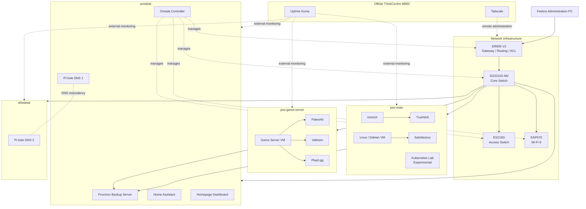
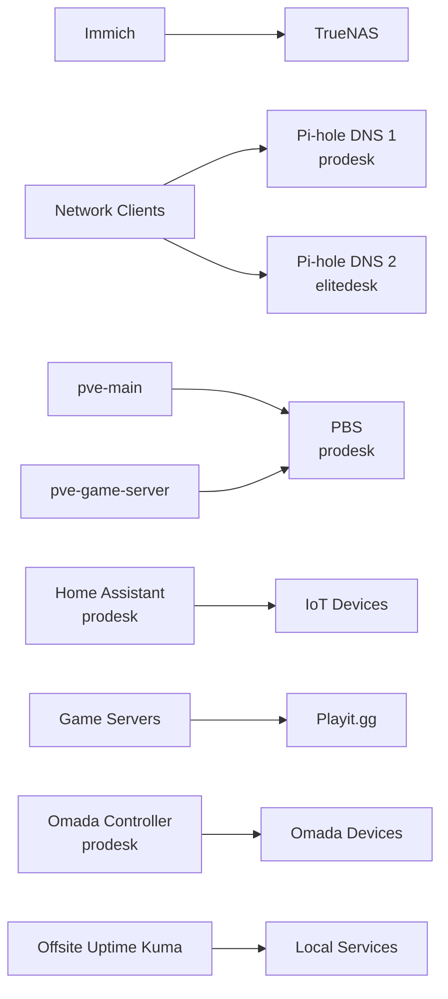

# Architecture Overview

This document provides a high-level architectural overview of the homelab.

It describes how the main physical systems, virtualization hosts, storage, network infrastructure, backup platform, and supporting services are divided into roles and how they relate to each other.

Detailed physical connections are documented in [`physical-topology.md`](physical-topology.md), while VM, container, service, VLAN, and dependency relationships are documented in [`logical-topology.md`](logical-topology.md).

---

## Architecture Goals

The homelab is designed around a few core goals:

- Separate storage, infrastructure, backup, DNS redundancy, and externally reachable workloads
- Reduce unnecessary shared failure domains
- Keep backup infrastructure separate from primary storage and compute
- Segment systems by trust level and purpose
- Make maintenance possible without taking down unrelated services
- Keep service dependencies understandable and documented
- Provide secure remote administration without exposing management interfaces directly
- Use the environment as a practical platform for learning, testing, troubleshooting, and recovery
- Keep the infrastructure structured enough to serve as a technical portfolio

The architecture has evolved from a single server and flat network into a multi-node environment with defined responsibilities for each physical system.

---

# High-Level Design

The local homelab consists of four Proxmox VE hosts:

| Node | Primary Role |
|---|---|
| `pve-main` | Primary storage and storage-dependent workloads |
| `prodesk` | Infrastructure, management services, and backup |
| `elitedesk` | Dedicated secondary DNS |
| `pve-game-server` | Dedicated game-server workloads |

A Lenovo ThinkCentre M900 is located offsite and provides independent monitoring, Tailscale connectivity, and selected utility functions.

The network is built around TP-Link Omada hardware and separates infrastructure, trusted clients, game workloads, IoT devices, and guests into dedicated VLANs.

---

# Architecture Diagram



This diagram intentionally omits detailed IP addresses, switch ports, ACL rules, and individual client devices.

---

# Physical Layers

The environment can be viewed as four main architectural layers.

## 1. Network Layer

The network provides:

- routing
- DHCP
- VLAN segmentation
- gateway ACL enforcement
- DNS reachability
- switching
- wireless access
- infrastructure management connectivity

Main components:

- TP-Link ER605 V2 gateway
- TP-Link SG3210X-M2 core switch
- TP-Link ES216G access switch
- TP-Link EAP670 access point
- Omada Software Controller

The Omada Controller itself runs on `prodesk`.

Detailed network design is maintained under [`../network/`](../network/).

---

## 2. Compute Layer

The compute layer consists of four Proxmox VE systems with deliberately different responsibilities.

### `pve-main`

The main node is focused on storage and workloads that directly benefit from the storage platform.

Primary responsibilities:

- TrueNAS
- Immich
- Linux / Debian server
- Satisfactory
- experimental lab capacity

Several supporting services were moved away from this node during the Server 2.0 cleanup.

This reduced the number of unrelated services affected by maintenance or failure of the main storage server.

---

### `prodesk`

The ProDesk is the primary infrastructure and backup node.

Primary responsibilities:

- Proxmox Backup Server
- Pi-hole DNS 1
- Home Assistant
- Omada Controller
- Homepage Dashboard

This node became the main support platform after workloads were migrated from both `pve-main` and the EliteDesk.

Its role is focused on:

```text
Infrastructure
+
Management
+
Backup
```

---

### `elitedesk`

The EliteDesk now has one deliberately narrow responsibility:

- Pi-hole DNS 2

The node is intentionally kept lightweight so that secondary DNS remains physically separate from the primary Pi-hole instance on ProDesk.

Its value comes from failure-domain separation rather than workload density.

---

### `pve-game-server`

The game-server host is isolated by role.

Its purpose is to run workloads that:

- may be externally reachable
- are frequently updated or restarted
- should not affect private infrastructure during maintenance
- benefit from independent lifecycle management

Current dedicated workloads include:

- Palworld
- Valheim
- Playit.gg

Satisfactory is still hosted on `pve-main` and remains the main game workload planned for migration.

---

# Storage and Backup Layer

TrueNAS provides the main bulk-storage environment.

TrueNAS runs as a VM on `pve-main`, while the physical data disks are passed through using an LSI 9207-8i HBA in IT mode.

```text
Physical HDDs
     │
     ▼
LSI 9207-8i
     │
     ▼
PCIe passthrough
     │
     ▼
TrueNAS VM
     │
     ▼
ZFS
```

Current major storage roles include:

- 4 × 8 TB HDDs in the primary ZFS pool
- one-disk parity
- 2 × 2 TB mirrored storage for Immich
- 3 TB Workdrive storage
- local SSD/NVMe storage for Proxmox and virtual workloads

Important storage relationships include:

- Immich depends on TrueNAS-backed storage
- Proxmox workloads use local SSD/NVMe storage
- Proxmox Backup Server runs on `prodesk`
- the PBS datastore uses a dedicated 2 TB Samsung 990 PRO NVMe
- large TrueNAS datasets require a separate backup strategy from normal VM backups

A backup of the TrueNAS VM does not constitute a backup of the physical data stored in the ZFS pools.

---

# Offsite Layer

The ThinkCentre M900 is physically separated from the main homelab.

Its architectural purpose is to provide services that remain useful when the local environment is unavailable.

Current responsibilities include:

- Uptime Kuma
- Tailscale
- remote SSH administration
- external availability monitoring
- selected future offsite tasks

This allows monitoring to detect failures such as:

- local power loss
- Internet outage
- router failure
- complete server outage
- loss of service availability

The offsite node creates a monitoring failure domain independent of the main site.

---

# Logical Segmentation

The network is segmented according to trust level and workload type.

| VLAN | Name | Role |
|---:|---|---|
| 1 | `DEFAULT` | Restricted default / legacy network |
| 10 | `INFRA` | Servers and infrastructure |
| 20 | `TRUSTED` | Personal and administrative clients |
| 25 | `GAME-DMZ` | Game-server workloads |
| 30 | `IOT` | Smart-home and IoT devices |
| 40 | `GUEST` | Guest clients |

The primary administration workstation resides on `TRUSTED`, while servers and hypervisor management reside on `INFRA`.

Game-server workloads are placed in `GAME-DMZ` so that externally oriented services do not share the same trust zone as private infrastructure.

Home Assistant resides on `INFRA` and has a specific ACL exception allowing required communication toward devices on `IOT`.

Detailed VLAN behavior and ACL policy are documented under [`../network/`](../network/).

---

# Service Placement

Services are placed according to operational role rather than simply where spare resources are available.

## `pve-main`

Primary services:

- TrueNAS
- Immich
- Linux / Debian server
- Satisfactory
- experimental Kubernetes workloads

## `prodesk`

Primary services:

- Proxmox Backup Server
- Pi-hole DNS 1
- Home Assistant
- Omada Controller
- Homepage Dashboard

## `elitedesk`

Primary service:

- Pi-hole DNS 2

## `pve-game-server`

Primary services:

- Palworld
- Valheim
- Playit.gg
- game-related backup and maintenance scripts

## Offsite M900

Primary services:

- Uptime Kuma
- Tailscale
- external monitoring

---

# VMID Ownership

The current VMID convention is based on physical host:

```text
pve-main      100–199
prodesk       200–299
elitedesk     300–399
game-server   400–499
```

This makes workload placement easier to identify and keeps the virtualization environment more consistent.

Experimental Kubernetes workloads still retain historical IDs outside this convention until that project is revisited.

---

# Important Dependencies

The main service dependencies are:



These relationships are operationally important.

For example:

- Immich can be running while its media storage is unavailable.
- A Proxmox host can be healthy while a dependent application is not.
- The Omada Controller can be offline while already-deployed routing and switching continue operating.
- Internal monitoring cannot reliably report a total local outage, which is why Uptime Kuma is hosted offsite.
- DNS redundancy only provides meaningful host resilience because the two Pi-hole instances reside on separate physical systems.

---

# Redundancy and Failure Domains

The homelab does not attempt full high availability.

Instead, selected services are intentionally placed across separate physical systems to reduce shared failure domains.

## DNS

Pi-hole runs on two different Proxmox hosts:

- Pi-hole DNS 1 on `prodesk`
- Pi-hole DNS 2 on `elitedesk`

This means maintenance or failure of one DNS host does not automatically remove both resolvers.

---

## Backup

Proxmox Backup Server runs on `prodesk`.

The PBS datastore is physically separate from `pve-main` and resides on a dedicated NVMe device.

This creates a useful recovery boundary between:

```text
Primary storage / compute
          and
Backup infrastructure
```

PBS does not provide a complete backup of the large TrueNAS datasets.

---

## Monitoring

Uptime Kuma runs on the offsite M900.

This separates monitoring from the local infrastructure it monitors.

---

## Game Hosting

Game workloads are increasingly consolidated onto their own Proxmox server.

Palworld and Valheim are already separated from the main infrastructure.

Satisfactory remains on `pve-main` until the remaining migration is completed.

---

# Failure Impact by Node

## `pve-main`

A complete failure affects:

- TrueNAS
- ZFS storage
- Immich
- Workdrive
- Satisfactory
- experimental workloads hosted locally

It does not automatically remove:

- Pi-hole DNS 1
- Pi-hole DNS 2
- PBS
- Home Assistant
- Omada Controller
- Homepage Dashboard
- Palworld
- Valheim
- offsite monitoring

---

## `prodesk`

A complete failure affects:

- Proxmox Backup Server
- PBS datastore access
- Pi-hole DNS 1
- Home Assistant
- Omada Controller
- Homepage Dashboard

It does not automatically remove:

- TrueNAS
- Immich
- Pi-hole DNS 2
- dedicated game workloads
- offsite monitoring

---

## `elitedesk`

A complete failure affects:

- Pi-hole DNS 2
- secondary DNS redundancy

Its deliberately narrow role limits the impact of node maintenance or failure.

---

## `pve-game-server`

A complete failure affects:

- Palworld
- Valheim
- associated external game connectivity

It does not directly remove private storage, backup, DNS, or management infrastructure.

---

# Administration

The primary administration workstation runs Fedora and resides on `TRUSTED`.

Administrative access is performed using:

- HTTPS management interfaces
- SSH
- Proxmox console
- JetKVM
- Tailscale for remote access

Management interfaces are not intentionally exposed directly to the public Internet.

Externally reachable game traffic is handled separately through Playit.gg.

---

# Design Principles

## Separation by Responsibility

Each physical system has a defined purpose.

```text
pve-main
→ storage and storage-dependent workloads

prodesk
→ infrastructure, management, and backup

elitedesk
→ secondary DNS

pve-game-server
→ game workloads

offsite M900
→ monitoring and remote utility services
```

This makes it easier to reason about:

- maintenance impact
- dependencies
- failure domains
- backup priorities
- security boundaries

---

## Least Required Connectivity

Network communication between security zones is restricted unless there is a known requirement.

Specific exceptions are preferred over broad allow rules.

Examples include:

- DNS access to Pi-hole
- Home Assistant → IoT
- `TRUSTED` → infrastructure management

---

## Recoverability

The architecture is designed with recovery in mind.

Important systems should have:

- documented dependencies
- backup coverage where appropriate
- known recovery procedures
- a way to regain administrative access after configuration failure

Backup success and restore capability are treated as separate concerns.

---

## Observable Infrastructure

Monitoring is treated as part of the infrastructure.

The Homepage dashboard provides internal operational visibility, while offsite Uptime Kuma provides an independent external view.

---

## Documentation as Infrastructure

Architecture, network design, node configuration, migrations, incidents, and service documentation are maintained as part of the system itself.

The repository should make it possible to understand:

- what exists
- where it runs
- why it is placed there
- what it depends on
- what happens when it fails

---

# Server 2.0 Reorganization

The current architecture is the result of a significant node and workload cleanup.

Completed changes include:

- ProDesk introduced as the main support/infrastructure node
- PBS migrated from EliteDesk to ProDesk
- PBS datastore moved to dedicated NVMe storage on ProDesk
- Pi-hole DNS 1 moved to ProDesk
- Home Assistant moved to ProDesk
- Omada Controller moved to ProDesk
- Homepage Dashboard moved to ProDesk
- EliteDesk reduced to a dedicated secondary DNS role
- Palworld moved to the dedicated game-server host
- Valheim moved to the dedicated game-server host
- workload IDs standardized using node-based VMID ranges

The main remaining workload migration is Satisfactory from `pve-main` to `pve-game-server`.

---

# Current Architectural State

The current architecture can be summarized as:

- Four local Proxmox hosts with distinct responsibilities
- One offsite Debian monitoring/utility node
- TrueNAS-based centralized storage on `pve-main`
- Dedicated infrastructure and backup node on `prodesk`
- Redundant DNS across ProDesk and EliteDesk
- Dedicated game-server infrastructure
- Omada-managed segmented network
- Tailscale remote administration
- Offsite Uptime Kuma monitoring
- Internal Homepage operations dashboard
- Experimental Kubernetes environment

The next architectural improvements are focused primarily on:

- migrating Satisfactory to the dedicated game-server host
- stronger offsite backup coverage
- restore testing
- UPS / power-loss protection
- further operational documentation
- continued security hardening
- revisiting the Kubernetes lab

---

## Related Documentation

- [`physical-topology.md`](physical-topology.md) — physical hosts, network devices, and connections
- [`logical-topology.md`](logical-topology.md) — VMs, containers, services, VLANs, and dependencies
- [`../network/README.md`](../network/README.md) — network documentation
- [`../nodes/pve-main.md`](../nodes/pve-main.md) — main storage node
- [`../nodes/pve-prodesk.md`](../nodes/pve-prodesk.md) — infrastructure and backup node
- [`../nodes/pve-elitedesk.md`](../nodes/pve-elitedesk.md) — secondary DNS node
- [`../nodes/pve-gameserver.md`](../nodes/pve-gameserver.md) — dedicated game-server node
- [`../nodes/offsite-m900.md`](../nodes/offsite-m900.md) — offsite monitoring node
- [`../services/`](../services/) — service documentation
- [`../security/`](../security/) — security, backup, and remote-access documentation
- [`../../diagrams/`](../../diagrams/) — diagram source files and exports
