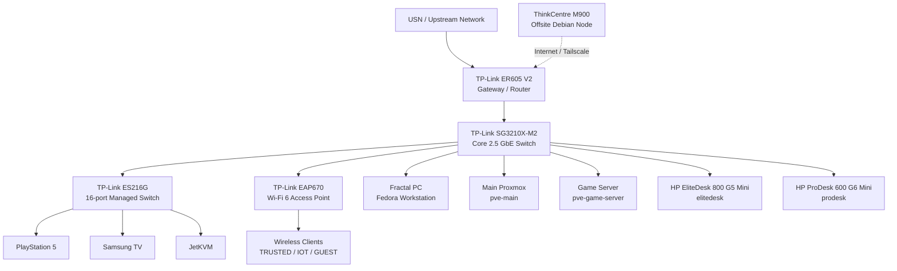

# Physical Topology

This document describes the physical layout of the homelab: the physical hosts, network devices, storage hardware, and the connections between them.

It intentionally focuses on **hardware and cabling** rather than VLAN policy, VM placement, or service dependencies.

For the logical view of the environment, see [`logical-topology.md`](logical-topology.md).

---

## Overview

The homelab consists of:

- Four local Proxmox VE hosts
- One offsite Debian node
- A TP-Link Omada network stack
- Direct-attached storage managed through TrueNAS
- A dedicated administration workstation
- A JetKVM for remote physical console access

The local environment is connected through a central TP-Link SG3210X-M2 managed switch.

---

## Physical Topology Diagram



The ThinkCentre M900 is not physically connected to the local LAN. It is located at a separate site and communicates with the homelab over the Internet using Tailscale and normal service monitoring.

---

# Core Network Path

The main physical network path is:

```text
USN / upstream network
        │
        ▼
TP-Link ER605 V2
        │
        ▼
TP-Link SG3210X-M2
        │
        ├── Fractal administration PC
        ├── pve-main
        ├── pve-game-server
        ├── elitedesk
        ├── prodesk
        ├── ES216G access switch
        └── EAP670 access point
```

The SG3210X-M2 is the central switching point for the primary local infrastructure.

---

# Network Hardware

## TP-Link ER605 V2

**Role:** Gateway / router

The ER605 connects the local homelab to the upstream USN network.

Primary responsibilities include:

- WAN connectivity
- Routing
- DHCP
- NAT
- VLAN gateway interfaces
- Gateway ACL enforcement

Physical connection:

```text
USN Network
    │
    ▼
ER605 V2
    │
    ▼
SG3210X-M2
```

Detailed routing and VLAN configuration is documented under [`../network/`](../network/).

---

## TP-Link SG3210X-M2

**Role:** Core managed switch

The SG3210X-M2 is the main physical aggregation point for the homelab.

It connects:

- Fractal administration workstation
- Main Proxmox server
- Dedicated game-server Proxmox host
- EliteDesk Proxmox host
- ProDesk Proxmox host
- ES216G
- EAP670
- ER605 gateway

Current physical port mapping:

| Port | Connected Device |
|---:|---|
| 1 | Fractal administration PC |
| 2 | Main Proxmox — `pve-main` |
| 3 | Game Server Proxmox — `pve-game-server` |
| 4 | EliteDesk Proxmox — `elitedesk` |
| 5 | ProDesk Proxmox — `prodesk` |
| 6 | ES216G uplink |
| 7 | EAP670 |
| 8 | ER605 V2 |
| 9 | Unused |
| 10 | Unused |

Logical VLAN and trunk configuration is documented separately in [`../network/port-mapping.md`](../network/port-mapping.md).

---

## TP-Link ES216G

**Role:** Secondary access switch

The ES216G expands the number of available wired ports and carries downstream client and management devices.

Current important physical connections include:

| Port | Connected Device |
|---:|---|
| 1 | Uplink to SG3210X-M2 |
| 3 | PlayStation 5 |
| 5 | Samsung TV |
| 16 | JetKVM |

The ES216G uplink connects to SG3210X-M2 port 6.

Detailed switch configuration belongs in [`../network/port-mapping.md`](../network/port-mapping.md).

---

## TP-Link EAP670

**Role:** Wireless access point

The EAP670 provides Wi-Fi connectivity for:

- Trusted personal devices
- IoT devices
- Guest clients

It is physically connected to the SG3210X-M2 and centrally managed by the Omada Controller.

SSID and VLAN configuration is documented under [`../network/`](../network/).

---

# Compute Hosts

## Main Proxmox — `pve-main`

The main Proxmox server is the largest local compute and storage host.

### Hardware

| Component | Hardware |
|---|---|
| CPU | Intel Core i9-9900K |
| Memory | 64 GB DDR4 |
| GPU | NVIDIA GTX 1070 Ti |
| NIC | Intel I226-T1 2.5 GbE |
| HBA | LSI 9207-8i, IT mode |
| Primary NVMe | Samsung 970 EVO Plus 1 TB |
| Chassis | Fractal Design Define 7 |

Additional local SATA SSD storage is also present.

### Physical Role

- Primary storage platform
- Main virtualization host
- Physical disk host for TrueNAS

### Network Connection

```text
pve-main
    │
    │ 2.5 GbE
    ▼
SG3210X-M2
Port 2
```

Documentation: [`../nodes/pve-main.md`](../nodes/pve-main.md)

---

# Storage Attached to `pve-main`

The main Proxmox host contains the physical disks used by TrueNAS.

Current storage includes:

- 4 × 8 TB HDD
- 2 × 2 TB HDD
- 1 × 3 TB Workdrive
- local SSD/NVMe storage for Proxmox and virtual workloads

The TrueNAS VM receives direct access to the relevant physical HDDs through the LSI 9207-8i HBA.

Physical relationship:

```text
pve-main
│
├── Local Proxmox NVMe / SSD storage
│
└── LSI 9207-8i HBA
    │
    ├── 4 × 8 TB HDD
    ├── 2 × 2 TB HDD
    └── 3 TB HDD
         │
         ▼
      TrueNAS VM
         │
         ▼
        ZFS
```

TrueNAS is virtualized, but the data disks themselves are physically installed in the main Proxmox system.

The detailed ZFS layout belongs in [`../services/truenas.md`](../services/truenas.md).

---

## ProDesk — `prodesk`

The HP ProDesk 600 G6 Mini is the primary local infrastructure and backup host.

### Hardware

| Component | Hardware |
|---|---|
| System | HP ProDesk 600 G6 Mini |
| CPU | Intel Core i5-10500 vPro |
| CPU configuration | 6 cores / 12 threads |
| Base clock | 2.3 GHz |
| Turbo clock | Up to 3.8 GHz |
| Memory | 16 GB |
| NVMe 1 | Samsung 990 PRO 2 TB |
| NVMe 2 | WD_BLACK SN7100 1 TB |
| NIC | Intel I219-LM Gigabit Ethernet |
| Network speed | 1 GbE |

### Storage Roles

The two NVMe devices have different purposes:

```text
ProDesk
├── WD_BLACK SN7100 1 TB
│   ├── Proxmox VE
│   └── VM / LXC storage
│
└── Samsung 990 PRO 2 TB
    └── Proxmox Backup Server datastore
```

The Samsung 990 PRO was moved from the EliteDesk to the ProDesk during the Server 2.0 migration.

### Physical Role

- Infrastructure virtualization
- Backup platform
- Local PBS datastore host

### Network Connection

```text
prodesk
    │
    │ 1 GbE
    ▼
SG3210X-M2
Port 5
```

Documentation: [`../nodes/pve-prodesk.md`](../nodes/pve-prodesk.md)

---

## EliteDesk — `elitedesk`

The HP EliteDesk 800 G5 Mini is a lightweight secondary Proxmox host.

### Hardware

| Component | Hardware |
|---|---|
| System | HP EliteDesk 800 G5 Mini |
| CPU | Intel Core i5-9600T |
| Memory | 16 GB |
| Primary storage | KIOXIA KBG40ZNV256G 256 GB M.2 NVMe SSD |
| NIC | Integrated 1 GbE |

The larger NVMe devices previously installed in the EliteDesk were moved to the ProDesk during the Server 2.0 node reorganization.

The EliteDesk now uses a dedicated 256 GB KIOXIA NVMe device, which is sufficient for its intentionally small workload footprint.

### Physical Role

- Dedicated secondary DNS host
- Independent lightweight Proxmox node

### Network Connection

```text
elitedesk
    │
    │ 1 GbE
    ▼
SG3210X-M2
Port 4
```

Documentation: [`../nodes/pve-elitedesk.md`](../nodes/pve-elitedesk.md)

---

## Game Server — `pve-game-server`

The dedicated game-server host runs Proxmox VE and is physically separate from the storage and infrastructure nodes.

### Hardware

| Component | Hardware |
|---|---|
| CPU | Intel Core i5-14500 |
| Motherboard | ASUS Prime B760M-A WIFI |
| Memory | 32 GB DDR5 |
| CPU cooler | Noctua NH-U12A |
| Storage | Samsung SSD |
| Chassis | Lian Li A3 |

### Physical Role

- Dedicated game-server virtualization
- Isolation of game workloads from private infrastructure

### Network Connection

```text
pve-game-server
       │
       ▼
SG3210X-M2
Port 3
```

Documentation: [`../nodes/pve-gameserver.md`](../nodes/pve-gameserver.md)

---

# Administration Workstation

## Fractal PC

The main desktop is also the primary administration workstation for the homelab.

Current operating system:

- Fedora Linux

Main administrative use:

- Proxmox administration
- TrueNAS administration
- Omada administration
- SSH
- Git/GitHub documentation
- general maintenance

The workstation connects directly to the core switch.

```text
Fractal PC
    │
    ▼
SG3210X-M2
Port 1
```

The workstation is not required for normal operation of the homelab.

---

# JetKVM

JetKVM provides remote console access to physical hardware.

It is connected to the ES216G for network access and to the relevant server through its KVM interfaces.

Physical concept:

```text
Remote Admin
     │
     ▼
   Network
     │
     ▼
   JetKVM
     │
     ├── HDMI / video
     ├── USB HID
     └── host control
          │
          ▼
     Physical Server
```

JetKVM is particularly useful when:

- SSH is unavailable
- Proxmox networking is broken
- the host is stuck during boot
- BIOS/UEFI access is required
- remote reboot or console access is needed

---

# Offsite Node

## Lenovo ThinkCentre M900

The ThinkCentre M900 is located at a separate physical site.

### Hardware

| Component | Hardware |
|---|---|
| System | Lenovo ThinkCentre M900 |
| CPU | Intel Core i5-6500T |
| Memory | 32 GB DDR4 |
| Primary storage | 1 TB NVMe |
| Secondary storage | HDD |
| NIC | Intel I219-LM 1 GbE |
| Operating system | Debian |

It is not connected directly to the local switching infrastructure.

Instead:

```text
Local Homelab
     │
     ▼
  Internet
     ▲
     │
ThinkCentre M900
```

Tailscale provides private connectivity between the offsite system and selected homelab devices.

Its physical separation is important because it can remain available during failures affecting the main location.

Documentation: [`../nodes/offsite-m900.md`](../nodes/offsite-m900.md)

---

# Physical Node Summary

| Node | CPU | RAM | Primary Storage | Network | Main Physical Role |
|---|---|---:|---|---|---|
| `pve-main` | i9-9900K | 64 GB | 1 TB 970 EVO Plus + attached HDDs | 2.5 GbE | Storage / virtualization |
| `prodesk` | i5-10500 | 16 GB | 1 TB SN7100 + 2 TB 990 PRO | 1 GbE | Infrastructure / backup |
| `elitedesk` | i5-9600T | 16 GB | 256 GB KIOXIA NVMe | 1 GbE | Secondary DNS |
| `pve-game-server` | i5-14500 | 32 GB | Samsung SSD | Ethernet | Game virtualization |
| Offsite M900 | i5-6500T | 32 GB | 1 TB NVMe + HDD | 1 GbE | Offsite monitoring |

---

# Physical Failure Domains

The physical design creates several distinct host-level failure domains.

## `pve-main` Failure

Affected physically:

- workloads hosted on `pve-main`
- TrueNAS VM
- access to the directly attached ZFS disks through TrueNAS
- storage-dependent applications hosted on the node

Not automatically affected:

- ProDesk
- EliteDesk
- game-server host
- PBS datastore on ProDesk
- secondary DNS on EliteDesk
- offsite monitoring

---

## ProDesk Failure

Affected physically:

- workloads hosted on ProDesk
- access to the local PBS datastore
- primary infrastructure services hosted there

Not automatically affected:

- `pve-main`
- TrueNAS storage
- EliteDesk
- secondary DNS
- game-server host
- offsite monitoring

---

## EliteDesk Failure

Affected physically:

- workloads hosted on EliteDesk
- secondary DNS host availability

Not automatically affected:

- ProDesk
- primary DNS
- PBS
- `pve-main`
- TrueNAS
- game-server host

Because the EliteDesk now has a narrow role, the physical blast radius of a node failure is intentionally small.

---

## Game Server Failure

Affected:

- game workloads hosted on `pve-game-server`

Not automatically affected:

- TrueNAS
- Immich
- Home Assistant
- DNS
- PBS
- Omada Controller

This is one of the main reasons for maintaining a separate game-server node.

---

## Core Switch Failure

A failure of the SG3210X-M2 would affect most local wired infrastructure because it is the primary aggregation switch.

This remains one of the larger physical single points of failure in the environment.

---

## Gateway Failure

A failure of the ER605 would remove normal routed connectivity between the homelab and the upstream network.

Local switching may continue, but routed network access, inter-VLAN routing, and Internet connectivity would be affected.

---

## Local Power Failure

The homelab currently does not have UPS protection.

A complete local power failure can therefore affect:

- router
- switches
- access point
- all four local Proxmox hosts
- TrueNAS storage
- local services

The offsite ThinkCentre can remain operational and may detect the outage externally.

UPS / power-loss protection remains part of the roadmap.

---

# Physical Design Decisions

## Dedicated Infrastructure Host

The ProDesk provides a physical home for infrastructure and backup workloads that previously existed on the main server or EliteDesk.

This reduces workload concentration on `pve-main` and gives the backup platform its own physical host and dedicated storage device.

---

## Minimal EliteDesk Role

After the Server 2.0 migration, the EliteDesk no longer needs large local storage.

Its 256 GB KIOXIA NVMe is sufficient for a small Proxmox installation and the secondary DNS workload.

Keeping this node lightweight preserves it as a simple and independent failure domain.

---

## Dedicated PBS Storage

The 2 TB Samsung 990 PRO is installed in the ProDesk and used as the PBS datastore.

The backup data is therefore stored on hardware physically separate from the primary Proxmox / TrueNAS server.

---

## Dedicated Game Hardware

Game workloads are physically separated from the primary server to reduce operational impact from:

- game updates
- reboots
- experimental configurations
- external exposure
- higher load

---

## Offsite Monitoring

Monitoring is physically separated from the main location.

This prevents a local power or Internet outage from simultaneously taking down both the infrastructure and the only monitoring system capable of reporting it.

---

## Direct Disk Access for TrueNAS

TrueNAS uses physical disk passthrough through an HBA rather than storing the primary ZFS pool inside ordinary Proxmox virtual disks.

This allows TrueNAS to manage the storage devices directly.

---

# Scope of This Document

This file documents the **physical topology only**.

It does not attempt to document:

- full IP addressing
- DHCP reservations
- VLAN tagging
- gateway ACL rules
- VM IDs
- container IDs
- application configuration
- service-to-service communication
- authentication
- backup schedules

Those belong in the corresponding logical, network, node, service, and security documentation.

---

## Related Documentation

- [`overview.md`](overview.md) — overall architecture
- [`logical-topology.md`](logical-topology.md) — VMs, containers, services, VLANs, and dependencies
- [`../network/README.md`](../network/README.md) — network overview
- [`../network/port-mapping.md`](../network/port-mapping.md) — detailed switch port configuration
- [`../nodes/pve-main.md`](../nodes/pve-main.md) — main Proxmox host
- [`../nodes/pve-prodesk.md`](../nodes/pve-prodesk.md) — ProDesk host
- [`../nodes/pve-elitedesk.md`](../nodes/pve-elitedesk.md) — EliteDesk host
- [`../nodes/pve-gameserver.md`](../nodes/pve-gameserver.md) — game-server host
- [`../nodes/offsite-m900.md`](../nodes/offsite-m900.md) — offsite node
- [`../../diagrams/`](../../diagrams/) — Draw.io source files and exported diagrams
