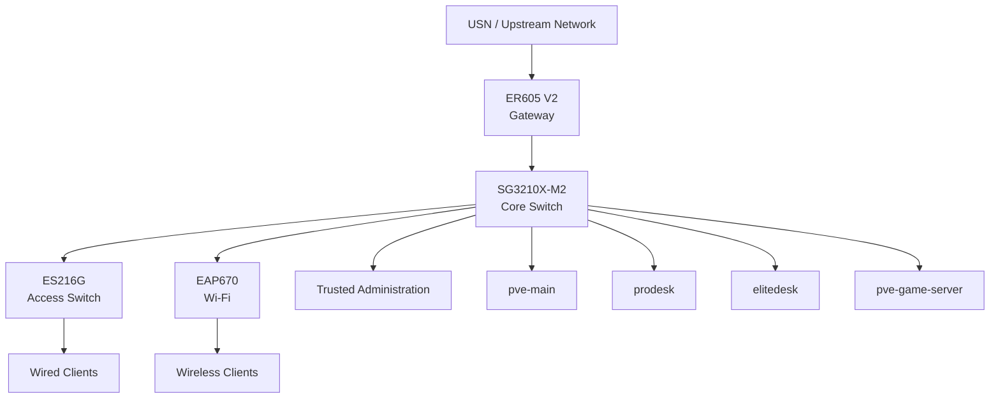

# Network

This directory documents the network architecture, segmentation model, addressing, access-control policy, switch-port configuration, and network incidents for the homelab.

The network is built around TP-Link Omada and provides connectivity for the four Proxmox hosts, internal services, trusted clients, game-server workloads, IoT devices, guest devices, and wireless clients.

The detailed documentation is split by responsibility so that VLAN design, addressing, ACL policy, and physical port configuration can be maintained independently.

---

## Overview

The network evolved from a flat LAN into a segmented design with separate trust zones.

The current environment uses:

- TP-Link ER605 V2 gateway
- TP-Link SG3210X-M2 core switch
- TP-Link ES216G access switch
- TP-Link EAP670 Wi-Fi 6 access point
- Omada Software Controller
- Two Pi-hole DNS servers

The network is currently operational and VLAN segmentation has been implemented and function-tested.

---

## Design Goals

The network design is based on a few main principles:

### Separate Systems by Trust Level

Infrastructure, trusted clients, game servers, IoT devices, and guests should not share one unrestricted broadcast domain.

Each category therefore has its own VLAN and security policy.

### Keep Administration on a Trusted Path

The primary administration workstation resides on the `TRUSTED` network.

It can initiate approved management traffic toward infrastructure and other required zones without giving those zones equivalent access back toward trusted clients.

### Isolate Externally Reachable Workloads

Game servers are placed in `GAME-DMZ`.

This limits the amount of internal infrastructure reachable from workloads that may be exposed externally through services such as Playit.gg.

### Restrict IoT and Guest Devices

IoT and guest devices receive the services they require without being given unrestricted access to the rest of the homelab.

### Prefer Explicit Exceptions

Required cross-VLAN communication is handled with narrow exceptions rather than broad allow rules.

Examples include:

- Pi-hole DNS access
- Home Assistant → IoT
- TRUSTED → infrastructure administration

---

## High-Level Topology

The exact physical port mapping is documented in [`port-mapping.md`](port-mapping.md).

---

## Network Zones

| VLAN | Name | Purpose |
|---:|---|---|
| 1 | `DEFAULT` | Restricted legacy/management network |
| 10 | `INFRA` | Hypervisors, servers, and network infrastructure |
| 20 | `TRUSTED` | Personal and administrative clients |
| 25 | `GAME-DMZ` | Game-server workloads |
| 30 | `IOT` | Smart-home and IoT devices |
| 40 | `GUEST` | Guest clients |

This table only describes the role of each zone.

Subnets, gateways, DHCP pools, DNS configuration, and reservations are maintained in [`ip-plan.md`](ip-plan.md).

The reasoning behind the VLAN boundaries is documented in [`vlan-design.md`](vlan-design.md).

---

## Security Model

Inter-VLAN segmentation is enforced through **Gateway ACLs** on the ER605.

At a high level:

- `TRUSTED` is the administrative network.
- `INFRA` contains internal infrastructure and servers.
- `GAME-DMZ` is isolated from private internal networks.
- `IOT` is restricted from initiating traffic toward trusted systems.
- `GUEST` is isolated from internal networks.
- `DEFAULT` is deliberately restricted and is not used as a normal client network.

Required exceptions are defined explicitly.

The complete implemented rule set, ordering, object groups, and traffic matrix belong in [`acl-policy.md`](acl-policy.md).

Switch ACL and EAP ACL are not currently used for the inter-VLAN security model.

---

## DNS

The homelab uses two Pi-hole instances hosted on separate Proxmox nodes.

Both are located on `INFRA` and provide DNS service to the active VLANs.

This gives DNS redundancy across two physical hosts and prevents routine maintenance of one Proxmox node from automatically removing all local DNS service.

Detailed addresses and DNS configuration are documented in [`ip-plan.md`](ip-plan.md).

---

## Network Management

The Omada Software Controller manages:

- ER605 V2
- SG3210X-M2
- ES216G
- EAP670

The controller provides centralized configuration, monitoring, and device management.

The network does not depend on the controller VM remaining online for basic forwarding of already-deployed configuration. If the controller is unavailable, centralized management and telemetry are affected, while the configured gateway, switching, and wireless functions can continue operating.

---

## Current State

The network is currently in a stable operational state.

Completed work includes:

- [x] Omada gateway, switches, and access point deployed
- [x] Infrastructure moved into dedicated VLANs
- [x] Trusted administration network established
- [x] Dedicated game-server VLAN created
- [x] IoT network created
- [x] Guest network created
- [x] Dual Pi-hole DNS available across required VLANs
- [x] Gateway ACL segmentation implemented
- [x] Home Assistant → IoT exception implemented
- [x] ES216G restored and re-adopted after management failure
- [x] Core inter-VLAN behavior function-tested

Remaining work is primarily hardening, validation, and documentation rather than a redesign of the network.

---

## Operational Principles

Several rules are followed when making network changes:

1. Make one management, VLAN, or uplink change at a time.
2. Record the working state before modifying a management path.
3. Verify critical traffic immediately after a change.
4. Maintain a rollback path before touching uplinks or management VLANs.
5. Place explicit permit exceptions before the corresponding deny rules.
6. Preserve administration from `TRUSTED` to required infrastructure.
7. Add narrow service exceptions instead of broad cross-VLAN access.

These rules were reinforced by the ES216G recovery incident.

---

## Documentation

### [`vlan-design.md`](vlan-design.md)

Documents **why** the VLANs exist and how the trust zones are intended to behave.

Contains:

- VLAN purposes
- Trust boundaries
- Design rationale
- Intended communication model
- Management-network decisions

It should not become a full IP-address list or ACL configuration dump.

---

### [`ip-plan.md`](ip-plan.md)

Documents addressing and network services.

Contains:

- Subnets
- Gateways
- DHCP pools
- DNS servers
- Infrastructure addresses
- Important reservations
- Naming/addressing conventions

This is the authoritative location for IP-address planning.

---

### [`acl-policy.md`](acl-policy.md)

Documents the implemented security policy between network zones.

Contains:

- Gateway ACL rules
- Rule order
- Permit exceptions
- Deny rules
- Object/IP groups
- Traffic matrix
- Validation results
- Deferred hardening

Detailed ACL information should live here rather than being duplicated across the other network documents.

---

### [`port-mapping.md`](port-mapping.md)

Documents physical switch connectivity and logical port configuration.

Contains:

- SG3210X-M2 port mapping
- ES216G port mapping
- Access/trunk role
- Native VLAN
- Tagged VLANs
- Uplink relationships

Physical architecture at homelab level is documented separately in [`../architecture/physical-topology.md`](../architecture/physical-topology.md).

---

### [`incidents/es216g-recovery.md`](incidents/es216g-recovery.md)

Documents the ES216G management/adoption incident.

Contains:

- Initial state
- Triggering change
- Symptoms
- Root cause
- Recovery procedure
- Validation
- Lessons learned

The incident is referenced here because it changed the operational approach to management-path changes, but the full troubleshooting history belongs only in the incident document.

---

## Documentation Boundaries

To avoid duplication, the network documentation follows these boundaries:

| Information | Authoritative Document |
|---|---|
| Network overview and navigation | `README.md` |
| Why VLANs exist | `vlan-design.md` |
| Subnets, IPs, DHCP, DNS | `ip-plan.md` |
| Inter-VLAN policy and ACL rules | `acl-policy.md` |
| Switch ports, trunks, native/tagged VLANs | `port-mapping.md` |
| ES216G failure and recovery | `incidents/es216g-recovery.md` |
| Full homelab physical architecture | `../architecture/physical-topology.md` |
| VMs, containers and service relationships | `../architecture/logical-topology.md` |

If the same information is needed in more than one document, the detailed version should exist in only one place and the other document should link to it.

---

## Planned Improvements

The network is operational, but several improvements remain under consideration:

- Additional gateway-management hardening
- Review of unused switch ports and profiles
- Continued validation after infrastructure changes
- mDNS/multicast design if cross-VLAN discovery becomes necessary
- Continued cleanup of old or unused configuration
- Improved monitoring and configuration documentation

These changes should be introduced incrementally rather than as a large simultaneous reconfiguration.

---

## Related Homelab Documentation

- [`../architecture/overview.md`](../architecture/overview.md) — overall homelab architecture
- [`../architecture/physical-topology.md`](../architecture/physical-topology.md) — physical infrastructure
- [`../architecture/logical-topology.md`](../architecture/logical-topology.md) — VMs, services, and dependencies
- [`../nodes/`](../nodes/) — Proxmox and offsite host documentation
- [`../services/`](../services/) — individual service documentation
- [`../security/segmentation.md`](../security/segmentation.md) — higher-level security view
