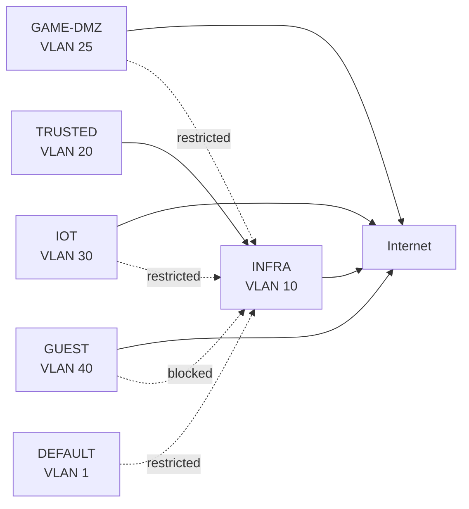

# VLAN Design

This document describes the VLAN architecture and trust-zone design used in the homelab.

The network is segmented by role and trust level rather than operating as one flat LAN. Infrastructure, trusted clients, public-facing game workloads, IoT devices, and guest devices are placed in separate VLANs with different communication expectations.

Detailed IP addressing belongs in [`ip-plan.md`](ip-plan.md), while the implemented inter-VLAN access rules belong in [`acl-policy.md`](acl-policy.md).

---

## Overview

| VLAN | Name | Purpose |
|---:|---|---|
| 1 | `DEFAULT` | Restricted legacy/default network |
| 10 | `INFRA` | Infrastructure, servers, management interfaces |
| 20 | `TRUSTED` | Trusted personal and administrative clients |
| 25 | `GAME-DMZ` | Externally reachable game-server workloads |
| 30 | `IOT` | Smart-home and lower-trust IoT devices |
| 40 | `GUEST` | Guest clients with Internet access only |

The design follows:

```text
Different role / trust level
          │
          ▼
      Separate VLAN
          │
          ▼
Explicit communication policy
```

---

# Design Goals

The VLAN design is intended to:

- reduce unnecessary lateral movement
- separate infrastructure from normal clients
- isolate externally reachable workloads
- restrict IoT devices
- isolate guest devices
- keep administration on trusted paths
- allow only required cross-VLAN communication
- make the network easier to reason about and troubleshoot

The network therefore uses broad separation first, followed by narrow exceptions where functionality requires communication between zones.

---

# High-Level Model



This diagram represents the intended trust relationships, not the exact Gateway ACL rule order.

---

# VLAN 1 — DEFAULT

`DEFAULT` is retained as a restricted legacy/default network.

Subnet:

```text
192.168.0.0/24
```

Gateway:

```text
192.168.0.1
```

The ER605 management interface remains on this network.

`DEFAULT` is not used as the normal client or administration network.

Its purpose is intentionally limited because relying on the default VLAN for normal trusted activity would make the trust model less explicit.

---

# VLAN 10 — INFRA

`INFRA` is the core infrastructure and management zone.

Subnet:

```text
192.168.10.0/24
```

Typical systems include:

- Proxmox management interfaces
- TrueNAS
- Proxmox Backup Server
- Pi-hole
- Home Assistant
- Immich
- Omada Controller
- Homepage
- managed switches
- access point management
- JetKVM

Examples of current infrastructure addresses include:

```text
pve-main           192.168.10.10
elitedesk          192.168.10.20
prodesk            192.168.10.21
pve-game-server    192.168.10.30
TrueNAS            192.168.10.40
PBS                192.168.10.50
Home Assistant     192.168.10.70
Immich             192.168.10.71
Pi-hole 1          192.168.10.90
Pi-hole 2          192.168.10.91
Omada Controller   192.168.10.100
```

The complete addressing plan is documented in:

[`ip-plan.md`](ip-plan.md)

---

## Why Infrastructure Has Its Own VLAN

Infrastructure systems have a different trust role from user devices.

Separating them provides:

- clearer management boundaries
- reduced accidental exposure
- simpler ACL design
- easier troubleshooting
- better containment if a lower-trust endpoint is compromised

Infrastructure is reachable from trusted administration paths, but lower-trust networks do not receive unrestricted access to it.

---

# VLAN 20 — TRUSTED

`TRUSTED` contains devices considered appropriate for normal personal use and homelab administration.

Subnet:

```text
192.168.20.0/24
```

Typical examples include:

- primary Fedora workstation
- PS5
- trusted personal devices where appropriate

The primary administration workstation is located here.

The intended role is:

```text
TRUSTED
   │
   ▼
Administration of INFRA
```

This allows management of Proxmox, TrueNAS, PBS, Omada, Pi-hole, Home Assistant, and other internal systems without placing the administration workstation directly inside the infrastructure VLAN.

---

# VLAN 25 — GAME-DMZ

`GAME-DMZ` contains game-server workloads.

Subnet:

```text
192.168.25.0/24
```

Current game-server VM:

```text
192.168.25.10
```

Current workloads include:

- Palworld
- Valheim

Satisfactory is still hosted separately on `pve-main` and remains a migration exception.

The physical `pve-game-server` management interface remains on `INFRA`, while the game VM is placed on `GAME-DMZ`.

---

## Why Use a GAME-DMZ?

Game servers have a different risk profile because they may:

- accept connections from external players
- run third-party server software
- receive frequent updates
- expose services through Playit.gg

The game workloads therefore do not share the same trust zone as infrastructure management.

Conceptually:

```text
INFRA
└── Proxmox management

GAME-DMZ
└── game-server workloads
```

A compromised game server should not automatically provide broad access to internal management systems.

---

# VLAN 30 — IOT

`IOT` contains smart-home and embedded devices.

Subnet:

```text
192.168.30.0/24
```

Examples include:

- Samsung TV
- Roborock
- Nest Audio devices
- other smart-home endpoints

IoT devices are treated as lower-trust systems.

The intended model is:

```text
IOT
 │
 ├── Internet where required
 ├── DNS
 └── restricted access to internal networks
```

---

## Home Assistant Relationship

Home Assistant itself is not placed on the IoT VLAN.

It runs on:

```text
INFRA / VLAN 10
```

and receives a specific exception to initiate traffic toward IoT devices.

Conceptually:

```text
Home Assistant
      │
      │ allowed
      ▼
IOT
```

while broad IoT-to-infrastructure access remains restricted.

This preserves functionality without treating IoT devices as trusted infrastructure.

---

# VLAN 40 — GUEST

`GUEST` is intended for temporary or untrusted client devices.

Subnet:

```text
192.168.40.0/24
```

The intended behavior is:

```text
GUEST
  │
  ├── Internet
  └── DNS
```

without normal access to internal networks.

Guest clients should not be able to initiate unrestricted traffic toward:

- `INFRA`
- `TRUSTED`
- `IOT`
- `GAME-DMZ`

---

# DNS Across VLANs

The homelab uses two Pi-hole DNS servers:

```text
192.168.10.90
192.168.10.91
```

Both are located on `INFRA`.

Lower-trust VLANs still require DNS, so narrow ACL exceptions permit DNS traffic to the Pi-hole pair.

Conceptually:

```text
GAME-DMZ ──┐
IOT      ──┼── DNS only ──► Pi-hole
GUEST    ──┘
```

This avoids granting broad access to the infrastructure VLAN simply to provide DNS.

---

# Inter-VLAN Policy

The VLAN design describes the intended trust model.

The implemented communication policy is enforced through Gateway ACLs on the ER605.

At a high level:

```text
TRUSTED     → INFRA        allowed for administration
GUEST       → internal     blocked
IOT         → INFRA        blocked
INFRA       → IOT          blocked by default
Home Assistant → IOT       explicit exception
GAME-DMZ    → INFRA        restricted
```

The exact rule order, permit exceptions, deny rules, and address groups are maintained in:

[`acl-policy.md`](acl-policy.md)

---

# Management VLAN Design

Infrastructure management interfaces are kept on `INFRA`.

Examples include:

- Proxmox management
- SG3210X-M2
- ES216G
- EAP670
- Omada Controller
- JetKVM

The main exception is the ER605 management interface, which remains on `DEFAULT`.

This arrangement is deliberate and reflects the current deployed state rather than an assumption that every management interface must share the same VLAN.

---

# Switch and Trunk Design

The VLANs are transported through the managed Omada switching infrastructure.

Core relationships include:

```text
ER605
  │
  ▼
SG3210X-M2
  │
  ├── pve-main
  ├── pve-game-server
  ├── elitedesk
  ├── prodesk
  ├── ES216G
  └── EAP670
```

Proxmox hosts use trunk relationships where required so that:

```text
Host management → INFRA
VM/LXC workload → assigned VLAN
```

The detailed port configuration belongs in:

[`port-mapping.md`](port-mapping.md)

---

# Wireless VLAN Placement

The EAP670 carries the required VLANs for wireless clients.

Wireless networks can therefore place clients into different trust zones rather than sharing one common LAN.

The access point itself is managed on `INFRA`.

Detailed SSID configuration is intentionally not duplicated here unless it becomes necessary for the architecture documentation.

---

# mDNS and Multicast

Cross-VLAN mDNS/multicast forwarding is not currently enabled.

Current state:

```text
Cross-VLAN mDNS: disabled
Multicast forwarding: not enabled as a general feature
```

This reduces automatic discovery between trust zones.

If cross-VLAN discovery is required later, it should be introduced only for a defined use case rather than broadly enabling discovery between all VLANs.

---

# DHCP

Active VLANs use DHCP for normal client addressing.

The general DHCP range is:

```text
.100 – .199
```

with a documented lease time of:

```text
120 minutes
```

Infrastructure systems use stable addresses where appropriate.

The authoritative DHCP and addressing details belong in:

[`ip-plan.md`](ip-plan.md)

---

# Design Decisions

## Separate by Trust Level

The network is not segmented because every service needs its own VLAN.

Instead, VLANs represent groups with similar security characteristics.

For example:

```text
INFRA
├── storage
├── backup
├── DNS
├── automation
└── management
```

These services belong together because they share a similar infrastructure trust role.

Game workloads and IoT devices do not.

---

## Trusted Administration Outside INFRA

The main administration workstation resides on `TRUSTED` rather than directly on `INFRA`.

This keeps:

```text
administrative client
```

separate from:

```text
server / infrastructure zone
```

while still permitting required management access.

---

## Dedicated GAME-DMZ

Externally reachable game workloads are deliberately separated from the infrastructure management plane.

This provides containment without requiring a separate physical network.

---

## Restricted IoT

IoT devices receive the connectivity they require without being treated as trusted systems.

Home Assistant is given the specific cross-zone access needed to control them.

---

## Guest Isolation

Guest devices are treated as untrusted by default.

Internet access does not imply internal network access.

---

## DEFAULT Is Not the Main LAN

The default VLAN remains present for compatibility and specific infrastructure requirements, but it is not used as the normal trusted network.

This makes the intended trust model explicit.

---

# Validation

The VLAN design should be function-tested after major changes.

Representative checks include:

- `TRUSTED` can reach required infrastructure
- `GUEST` cannot reach internal networks
- `IOT` cannot initiate unrestricted access to infrastructure
- Home Assistant can reach required IoT devices
- `GAME-DMZ` cannot broadly access `INFRA`
- lower-trust VLANs can resolve DNS through Pi-hole
- all active VLANs retain expected Internet access
- Proxmox management remains reachable on `INFRA`

The current inter-VLAN design has been function-tested.

---

# Current State

Current confirmed state:

- VLAN 1 `DEFAULT`: active / restricted
- VLAN 10 `INFRA`: active
- VLAN 20 `TRUSTED`: active
- VLAN 25 `GAME-DMZ`: active
- VLAN 30 `IOT`: active
- VLAN 40 `GUEST`: active
- Gateway ACL segmentation: active
- trusted administration path: active
- Pi-hole DNS available to required VLANs
- Home Assistant → IoT exception: active
- guest isolation: active
- IoT isolation: active
- game-server isolation: active
- cross-VLAN mDNS/multicast: not enabled
- inter-VLAN behavior: function-tested

---

# Roadmap

Potential improvements include:

- continue validating segmentation after infrastructure changes
- review ACL exceptions as services evolve
- introduce mDNS only if a specific use case requires it
- keep unused switch ports disabled
- periodically review management VLAN placement
- continue removing old or unused network configuration
- document wireless VLAN assignments in more detail if needed

---

# Scope of This Document

This file owns the VLAN design and trust-zone architecture:

- VLAN purpose
- trust boundaries
- design rationale
- zone relationships
- management placement
- DNS exception concept
- Home Assistant / IoT relationship
- GAME-DMZ reasoning
- guest isolation
- mDNS design state

It does not own:

- exact IP reservations
- DHCP implementation details
- Gateway ACL rule order
- switch-port configuration
- service-specific firewall settings

Those belong in the dedicated network and service documentation.

---

## Related Documentation

- [`README.md`](README.md) — network overview
- [`ip-plan.md`](ip-plan.md) — addressing and DHCP
- [`acl-policy.md`](acl-policy.md) — implemented inter-VLAN policy
- [`port-mapping.md`](port-mapping.md) — physical switch connectivity
- [`../security/segmentation.md`](../security/segmentation.md) — higher-level security model
- [`../services/pihole.md`](../services/pihole.md) — DNS
- [`../services/home-assistant.md`](../services/home-assistant.md) — IoT control
- [`../services/game-servers.md`](../services/game-servers.md) — GAME-DMZ workloads
