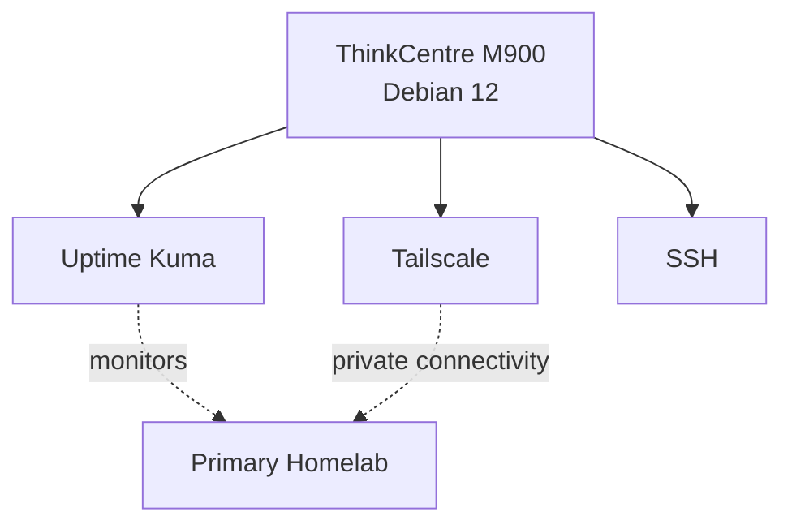

# Offsite ThinkCentre M900

This document describes the Lenovo ThinkCentre M900 used as the offsite monitoring and utility node for the homelab.

Unlike the three local Proxmox hosts, the M900 is physically located at a separate site and runs Debian directly.

Its main purpose is to provide services that remain useful when the primary homelab location is unavailable.

---

## Overview

| Item | Value |
|---|---|
| System | Lenovo ThinkCentre M900 |
| Operating system | Debian 12 minimal |
| Primary role | Offsite monitoring and remote-access utility node |
| Location | Separate physical site |
| Remote connectivity | Tailscale |
| Monitoring | Uptime Kuma |
| Administration | SSH |

The M900 sits outside the main homelab failure domain.

This allows it to detect failures that an internally hosted monitoring system might disappear with.

---

## Role

The node currently has three main responsibilities:

1. **External monitoring**
   - Runs Uptime Kuma.
   - Checks whether selected homelab services are reachable from outside the main site.

2. **Remote connectivity**
   - Runs Tailscale.
   - Provides a trusted private path between selected systems.

3. **Offsite utility platform**
   - Provides a physically separate Linux system for future backup and lightweight service use.

The M900 is **not** the primary Proxmox backup node.

That role belongs to Proxmox Backup Server on [`pve-elitedesk`](pve-elitedesk.md).

---

## Hardware

| Component | Hardware |
|---|---|
| System | Lenovo ThinkCentre M900 |
| CPU | Intel Core i5-6500T |
| Memory | 32 GB DDR4 |
| Primary storage | 1 TB NVMe |
| Secondary storage | 2.5 TB HDD |
| Ethernet | Intel I219-LM 1 GbE |
| Wi-Fi | Intel Wireless 8260 |
| Operating system | Debian 12 minimal |

Wi-Fi is not used for normal server operation.

The system uses wired Ethernet at its offsite location.

---

## Storage

Current storage layout:

| Storage | Intended Use |
|---|---|
| 1 TB NVMe | Operating system and services |
| 2.5 TB HDD | Secondary storage / offsite data capacity |

The node has significantly less storage than the primary TrueNAS environment.

It should therefore not be documented as a complete replica of the NAS.

Its storage is better suited to:

- selected critical data
- configuration backups
- small offsite datasets
- monitoring data
- utility workloads

A broader offsite backup strategy remains part of the homelab roadmap.

---

## Operating System

The M900 runs:

```text
Debian 12 minimal
```

A minimal Linux installation is used because the node does not require a desktop environment.

This reduces unnecessary software and keeps the system focused on server workloads such as:

- Uptime Kuma
- Tailscale
- SSH
- future lightweight services

---

# Physical Separation

The most important architectural property of the M900 is not its compute power.

It is its **location**.

```text
Main Homelab
     │
     │ Internet
     ▼
────────────────────────
     Separate Site
────────────────────────
     ▲
     │
ThinkCentre M900
```

The M900 does not depend on:

- the local ER605 gateway
- the local SG3210X-M2
- the local Proxmox hosts
- the local power circuit

for its own basic operation.

This gives it value as an independent observation point.

---

# Network Connectivity

The M900 is connected to the network at its offsite location using wired Ethernet.

It does not belong to the local homelab VLAN structure.

The local VLANs:

```text
INFRA
TRUSTED
GAME-DMZ
IOT
GUEST
```

exist at the primary site and should not be applied conceptually to the offsite node.

Communication with selected homelab systems instead uses Tailscale.

---

## Tailscale

Tailscale provides private remote connectivity between the M900 and selected devices in the homelab.

Conceptually:

```text
ThinkCentre M900
       │
       │ Tailscale
       ▼
Private Overlay Network
       │
       ├── pve
       ├── elitedesk
       ├── selected Linux systems
       └── trusted administration devices
```

Tailscale is used as a remote-access layer.

It is **not** a replacement for the VLAN segmentation inside the primary homelab.

Detailed remote-access architecture belongs in:

[`../security/remote-access.md`](../security/remote-access.md)

---

# Uptime Kuma

Uptime Kuma is the primary active service on the M900.

Its purpose is to monitor selected homelab services from outside the main physical location.

This is architecturally different from running monitoring on one of the local Proxmox nodes.

---

## Why Monitor Offsite?

Consider a monitor hosted locally:

```text
Homelab loses power
        │
        ├── services go offline
        └── monitoring server also goes offline
```

The monitoring platform cannot reliably report the outage if it disappears at the same time.

With the M900:

```text
Main Homelab
     │
     X  outage
     │

Offsite M900
     │
     └── remains online
          │
          ▼
     detects failure
```

This allows Uptime Kuma to observe failures affecting the complete primary site.

---

## Monitoring Scope

The offsite monitor can be used to identify problems such as:

- Internet connectivity loss
- Gateway failure
- Complete local power loss
- Proxmox host outage
- Service outage
- Loss of remote connectivity
- Selected game-server availability issues

The exact monitors and notification configuration belong in service-specific documentation rather than this node file.

---

# SSH Administration

SSH is used for normal administration of the M900.

Typical tasks include:

- Debian updates
- service management
- storage checks
- Uptime Kuma maintenance
- Tailscale maintenance
- log inspection
- system health checks

SSH credentials and remote addresses are intentionally excluded from the public repository.

---

# Service Layout

The node is intentionally simple.



The limited service count is intentional.

The node should remain reliable enough to perform its monitoring role rather than accumulating unrelated workloads.

---

# Relationship to the Main Homelab

The M900 is logically part of the homelab but physically outside it.

```text
Local Site
├── pve
├── elitedesk
├── pve-game-server
└── Omada network

Offsite
└── ThinkCentre M900
```

Its architecture is therefore based on **site separation** rather than VLAN separation.

---

# Relationship to Proxmox Backup Server

The M900 and PBS have different roles.

### EliteDesk / PBS

Primary purpose:

```text
Fast local VM/LXC backup and restore
```

Advantages:

- close to Proxmox hosts
- dedicated PBS integration
- useful for normal recovery
- physically separate from `pve`

Limitation:

- still located at the main site

### M900

Primary current purpose:

```text
Offsite monitoring and utility services
```

Potential future backup purpose:

```text
Selected offsite data
```

Advantages:

- separate physical location
- independent power/network failure domain

Limitation:

- insufficient capacity for a full copy of the complete TrueNAS dataset

The two systems should therefore complement rather than replace each other.

---

# Offsite Backup Role

The M900 has storage that can support an offsite backup role, but the current architecture should distinguish between **planned capability** and **confirmed backup coverage**.

Suitable future targets include:

- important configuration files
- scripts
- Git-managed configuration
- selected irreplaceable documents
- selected application data
- selected game saves
- other small high-value datasets

The node should not currently be described as providing full offsite protection for all TrueNAS data.

---

## Why Selected Data First?

The main NAS has substantially more data capacity than the M900.

Trying to mirror everything would exceed the available offsite storage.

A more realistic model is:

```text
All data
   │
   ├── replaceable / large
   │      └── local protection strategy
   │
   └── critical / irreplaceable
          └── offsite copy
```

This allows limited offsite storage to protect the data with the highest recovery value.

---

# Failure Domains

## Main-Site Power Failure

Expected effect:

```text
Local Proxmox hosts   → offline
Local network         → offline
Local services        → offline
ThinkCentre M900      → unaffected
```

The M900 can continue running and detect the loss of the primary site.

---

## Main Internet Failure

The M900 remains operational at its own location.

It may detect that the primary homelab is no longer externally reachable.

---

## Main Proxmox Failure

The M900 remains available because it does not run on Proxmox at the primary site.

---

## EliteDesk / PBS Failure

The M900 remains available.

This is important because the offsite node is not dependent on the local backup server for its monitoring role.

---

## M900 Failure

Affected:

- offsite Uptime Kuma
- offsite Tailscale endpoint
- any data stored exclusively on the M900

Not directly affected:

- local Proxmox hosts
- TrueNAS
- Pi-hole
- Home Assistant
- Omada
- game servers
- local network

The M900 is therefore a supporting system rather than a dependency required for normal local operation.

---

# Startup and Availability

Because the node provides monitoring from a remote location, unattended recovery is important.

Desired behavior includes:

- boot automatically after power restoration
- start required services automatically
- restore network connectivity without manual login
- bring Tailscale online automatically
- start Uptime Kuma automatically

The node should require as little physical intervention as practical.

---

# Maintenance

Typical maintenance includes:

- Debian security updates
- package updates
- Uptime Kuma updates
- Tailscale updates
- SMART/storage checks
- filesystem capacity checks
- service-status verification
- reboot validation

Because the M900 monitors the main homelab, maintenance should be planned so that a temporary monitoring gap is understood rather than mistaken for a homelab failure.

---

## Pre-Maintenance Checklist

Before planned maintenance:

1. Confirm the primary homelab is currently stable.
2. Check current Uptime Kuma monitor state.
3. Check available disk space.
4. Check system/storage health.
5. Record any active alerts.
6. Apply updates or reboot.

---

## Post-Maintenance Validation

Verify:

- Debian boot completed
- wired networking available
- SSH available
- Tailscale connected
- Uptime Kuma running
- configured monitors reporting normally
- storage mounted and healthy
- automatic service startup working

---

# Monitoring the Monitor

An offsite monitoring system introduces an obvious question:

> How do you know when the monitoring node itself is down?

The current architecture does not provide full monitoring redundancy for the M900.

Its loss should therefore be interpreted separately from an outage reported **by** the M900.

Possible future improvements could include:

- external heartbeat monitoring
- a second independent monitoring path
- hosted status/heartbeat services

These are optional improvements rather than current requirements.

---

# Security Considerations

The M900 provides remote connectivity into selected parts of the homelab and should therefore be treated as a trusted infrastructure system.

Important controls include:

- minimal Debian installation
- SSH administration
- Tailscale for private remote connectivity
- no unnecessary exposed services
- regular security updates
- secrets stored outside the public repository
- limited service scope

The machine should not become a general-purpose user workstation.

---

# Design Decisions

## Debian Instead of Proxmox

The node does not currently need a virtualization layer.

Running Debian directly provides:

- simpler operation
- lower overhead
- fewer components to maintain
- direct service deployment
- sufficient capability for Uptime Kuma and Tailscale

If the service count grows substantially, virtualization or containers can be reconsidered later.

---

## Offsite Instead of Another Local Node

The primary value of this machine comes from being outside the main site.

A fourth local machine would provide more compute capacity but would still share several failure risks:

- local power
- local Internet
- physical-site failure

Placing the M900 elsewhere creates a more valuable independent failure domain.

---

## Monitoring Before Full Backup

The current confirmed role prioritizes offsite monitoring.

A full offsite backup system requires:

- sufficient storage
- transfer strategy
- retention design
- encryption
- restore testing

Those requirements are separate from the monitoring role and should not be assumed to exist simply because the node is offsite.

---

## Keep the Node Independent

The node should avoid unnecessary dependencies on the infrastructure it monitors.

For example, core operation should not require:

- local Pi-hole
- local TrueNAS mounts
- a local Proxmox VM
- the local Omada Controller

The more independent the node remains, the more useful it is during a local outage.

---

# Current Status

Current confirmed role:

- Debian 12 minimal: active
- Wired Ethernet: used for server operation
- Uptime Kuma: active
- Tailscale: active
- SSH administration: active
- Offsite location: active
- External homelab monitoring: active
- Full TrueNAS offsite replication: not implemented
- Primary Proxmox backup role: handled by `elitedesk`, not the M900

The node should currently be described primarily as an **offsite monitoring and utility node with future backup potential**.

---

# Roadmap

Possible future improvements include:

- Define which datasets require offsite protection
- Automate selected offsite backups
- Encrypt backup data appropriately
- Test restore procedures from offsite copies
- Add heartbeat monitoring for the M900 itself
- Verify automatic recovery after power failure
- Continue keeping the service footprint minimal

---

# Public Repository Notes

This document intentionally excludes:

- offsite physical address
- Tailscale IP addresses
- SSH credentials
- usernames
- passwords
- API tokens
- private keys
- notification/webhook URLs
- local router information at the offsite location
- public IP addresses

The fact that the node is physically offsite is architecturally relevant; its exact location is not.

---

# Scope of This Document

This file owns documentation for the **physical offsite M900 node**:

- hardware
- operating system
- physical role
- monitoring role
- Tailscale role
- storage capacity
- failure-domain separation
- maintenance considerations
- potential offsite backup role

It does not own:

- detailed Uptime Kuma configuration
- Tailscale credentials or addressing
- backup scripts
- backup retention
- local network configuration at the offsite site

Those belong in dedicated service, security, or configuration documentation.

---

## Related Documentation

- [`../architecture/overview.md`](../architecture/overview.md) — overall architecture
- [`../architecture/physical-topology.md`](../architecture/physical-topology.md) — physical topology
- [`../architecture/logical-topology.md`](../architecture/logical-topology.md) — logical service relationships
- [`../security/remote-access.md`](../security/remote-access.md) — Tailscale and remote administration
- [`../security/backup-strategy.md`](../security/backup-strategy.md) — backup architecture
- [`../services/uptime-kuma.md`](../services/uptime-kuma.md) — monitoring service
- [`pve-main.md`](pve-main.md) — main infrastructure node
- [`pve-elitedesk.md`](pve-elitedesk.md) — local backup/support node
- [`pve-gameserver.md`](pve-gameserver.md) — dedicated game-server node
