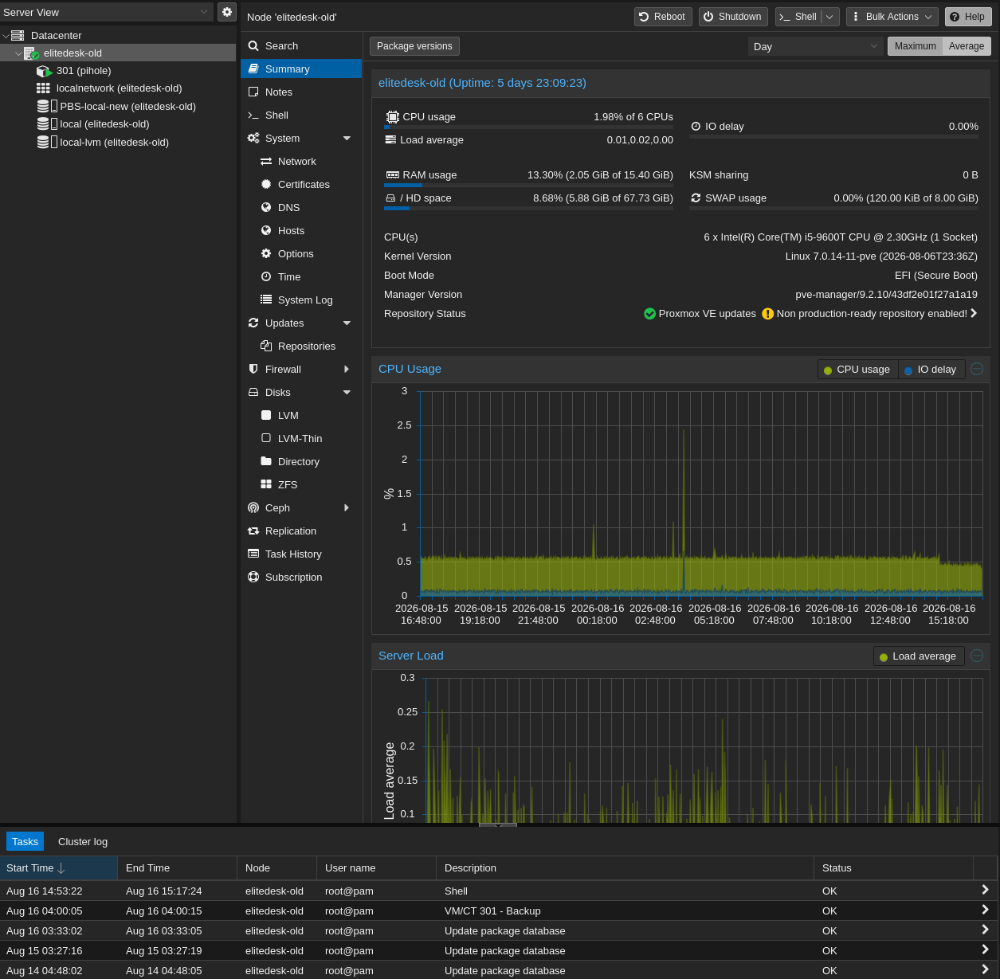

# EliteDesk Proxmox Node — `elitedesk`

This document describes the HP EliteDesk Proxmox node used as a dedicated secondary DNS host in the homelab.

The node previously carried several infrastructure responsibilities, including Proxmox Backup Server and dashboard services. After the Server 2.0 migration and workload cleanup, those services were moved to the newer ProDesk node.

The EliteDesk now has a deliberately narrow role: **provide physically separate Pi-hole redundancy**.

Detailed Pi-hole configuration is documented under [`../services/pihole.md`](../services/pihole.md).




---

## Overview

| Item | Value |
|---|---|
| Hostname | `elitedesk` |
| Platform | Proxmox VE |
| Hardware | HP EliteDesk 800 G5 Mini |
| Primary role | Secondary DNS host |
| Management network | `INFRA` / VLAN 10 |
| Network link | 1 GbE |
| Active workload | Pi-hole DNS 2 |

The EliteDesk is intentionally kept lightweight.

Its value is not compute capacity, but **failure-domain separation** from the ProDesk node that hosts the primary Pi-hole instance and several other infrastructure services.

---

## Current Role

The node has one primary responsibility:

### Secondary DNS

The EliteDesk hosts the second Pi-hole instance used for local DNS filtering and redundancy.

```text
ProDesk
└── Pi-hole DNS 1

EliteDesk
└── Pi-hole DNS 2
```

If the ProDesk node is unavailable, the secondary Pi-hole remains on a separate physical host.

This prevents local DNS from depending entirely on a single Proxmox node.

---

## Hardware

| Component | Hardware |
|---|---|
| System | HP EliteDesk 800 G5 Mini |
| CPU | Intel Core i5-9600T |
| Memory | 16 GB |
| NIC | Integrated 1 GbE |

The EliteDesk previously contained storage later migrated to the ProDesk as part of the infrastructure reorganization.

Because its current workload is limited to a lightweight Pi-hole container, the node no longer requires the storage or compute footprint of the primary infrastructure nodes.

---

## Virtualization

The physical host runs Proxmox VE.

Current workload layout:

```text
EliteDesk G5
└── Proxmox VE
    └── Pi-hole DNS 2 [LXC]
```

The node is not intended to act as a general-purpose virtualization host.

Keeping the workload count low makes its role clear and reduces dependencies on the node.

---

## Networking

The EliteDesk is connected to the managed Omada network and resides in the infrastructure segment.

```text
EliteDesk
    │
    │ 1 GbE
    ▼
Omada switching
    │
    ▼
INFRA — VLAN 10
```

The Proxmox management interface is kept on the infrastructure network.

Administration is performed from trusted management devices rather than exposing the host directly to the public Internet.

Detailed network configuration is maintained in:

- [`../network/vlan-design.md`](../network/vlan-design.md)
- [`../network/ip-plan.md`](../network/ip-plan.md)
- [`../network/port-mapping.md`](../network/port-mapping.md)
- [`../network/acl-policy.md`](../network/acl-policy.md)

---

## DNS Redundancy

DNS is split across two physical Proxmox hosts.

```text
                 Local clients
                      │
              ┌───────┴───────┐
              ▼               ▼
       Pi-hole DNS 1      Pi-hole DNS 2
          ProDesk           EliteDesk
```

This design provides resilience against:

- ProDesk maintenance
- ProDesk hardware failure
- primary Pi-hole container failure
- selected host-level outages

The two Pi-hole instances provide the same logical DNS role while remaining separated at the physical host level.

---

## Failure Impact

A complete EliteDesk outage has a limited impact on the overall homelab.

### Affected

- Pi-hole DNS 2
- secondary DNS redundancy
- Proxmox management access to this node

### Not automatically affected

- Pi-hole DNS 1
- ProDesk
- PVE-main
- TrueNAS
- Immich
- Home Assistant
- Omada Controller
- Proxmox Backup Server
- Homepage Dashboard
- dedicated game-server host
- offsite Uptime Kuma monitoring

Normal DNS service should continue through the primary Pi-hole instance while the EliteDesk is offline.

---

## Service Availability During Maintenance

| Service | Expected State |
|---|---|
| Pi-hole DNS 2 | Offline |
| Pi-hole DNS 1 | Available |
| ProDesk infrastructure services | Available |
| Proxmox Backup Server | Available |
| Home Assistant | Available |
| Omada Controller | Available |
| Homepage Dashboard | Available |
| TrueNAS | Available |
| Immich | Available |
| Game servers | Available |
| Offsite monitoring | Available |

The narrow workload scope makes planned maintenance low-risk compared with the primary infrastructure nodes.

---

## Monitoring

The EliteDesk is monitored externally by the offsite Uptime Kuma instance.

Monitoring focuses primarily on:

- host availability
- Pi-hole availability
- network reachability

Proxmox itself provides local visibility into:

- CPU usage
- memory usage
- storage state
- LXC state
- node health

Because the node has only one active infrastructure workload, monitoring can stay simple and focused.

---

## Maintenance

Typical maintenance includes:

- Proxmox VE updates
- Pi-hole updates
- container updates
- storage health checks
- temperature checks
- network connectivity validation

### Post-Maintenance Validation

After maintenance or reboot, verify:

1. Proxmox node is online.
2. Pi-hole DNS 2 container is running.
3. DNS queries are being answered.
4. Network connectivity on `INFRA` is working.
5. Offsite monitoring sees the node as available.

---

## Security Considerations

The EliteDesk is an infrastructure system and should be treated accordingly.

Current design principles include:

- management on `INFRA`
- administration from trusted devices
- no intentional direct public exposure
- remote administration through secure overlay networking where required
- credentials stored outside the public repository
- network segmentation enforced by the Omada environment

The Pi-hole service itself is intended for internal DNS use and is not exposed as a public resolver.

---

## Design Decision: Dedicated Secondary DNS Host

Running two Pi-hole instances on the same hypervisor would provide service redundancy but not host redundancy.

The current layout avoids that problem:

```text
ProDesk failure
      │
      ├── Pi-hole DNS 1 unavailable
      │
      ▼
EliteDesk remains online
      │
      └── Pi-hole DNS 2 available
```

The EliteDesk therefore remains useful even with only one active workload.

Its purpose is **resilience**, not workload density.

---

## Design Decision: Keep the Node Minimal

The EliteDesk previously hosted more infrastructure services.

During the Server 2.0 migration, those workloads were consolidated onto the newer ProDesk node.

This resulted in a clearer role split:

```text
ProDesk
├── Proxmox Backup Server
├── Omada Controller
├── Home Assistant
├── Homepage Dashboard
└── Pi-hole DNS 1

EliteDesk
└── Pi-hole DNS 2
```

Keeping the EliteDesk minimal reduces operational complexity and preserves it as an independent DNS failure domain.

---

## Current Status

`elitedesk` is operational as the homelab's secondary DNS node.

Current responsibility:

- Pi-hole DNS 2: active
- secondary DNS redundancy: active

Services previously hosted here have been migrated to ProDesk as part of the Server 2.0 infrastructure cleanup.

---

## Public Repository Notes

This document intentionally excludes:

- passwords
- API tokens
- private keys
- Tailscale addresses
- MAC addresses
- serial numbers
- credentials
- secrets

Only architecture and operational information suitable for a public portfolio repository should be committed.

---

## Scope of This Document

This file owns documentation for the physical `elitedesk` node:

- hardware
- current role
- virtualization
- networking
- DNS redundancy
- failure impact
- monitoring
- maintenance
- design decisions

It does not own detailed configuration for:

- Pi-hole
- VLAN design
- ACL rules
- IP addressing
- switch port configuration

Those belong in the relevant service and network documents.

---

## Related Documentation

- [`../architecture/overview.md`](../architecture/overview.md) — overall architecture
- [`../architecture/physical-topology.md`](../architecture/physical-topology.md) — physical topology
- [`../architecture/logical-topology.md`](../architecture/logical-topology.md) — logical topology
- [`../network/README.md`](../network/README.md) — network overview
- [`../network/vlan-design.md`](../network/vlan-design.md) — VLAN design
- [`../network/acl-policy.md`](../network/acl-policy.md) — ACL policy
- [`../services/pihole.md`](../services/pihole.md) — Pi-hole DNS
- [`pve-main.md`](pve-main.md) — primary infrastructure node
- [`pve-prodesk.md`](pve-prodesk.md) — primary support and infrastructure node
- [`pve-gameserver.md`](pve-gameserver.md) — dedicated game-server node
- [`offsite-m900.md`](offsite-m900.md) — offsite monitoring node
