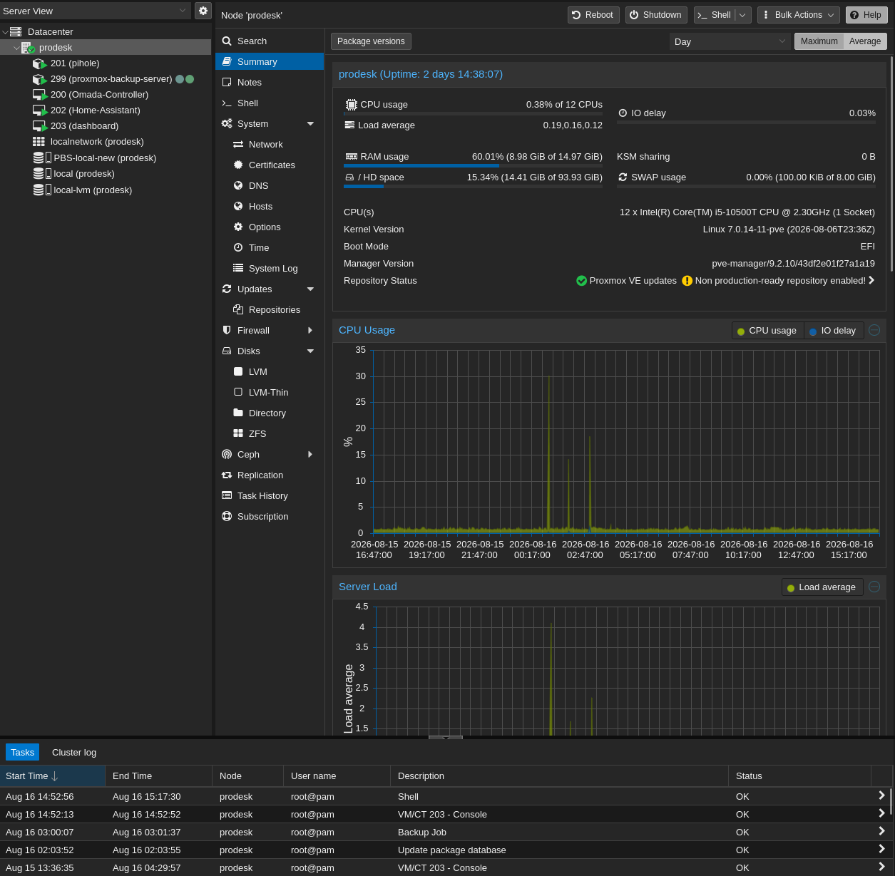
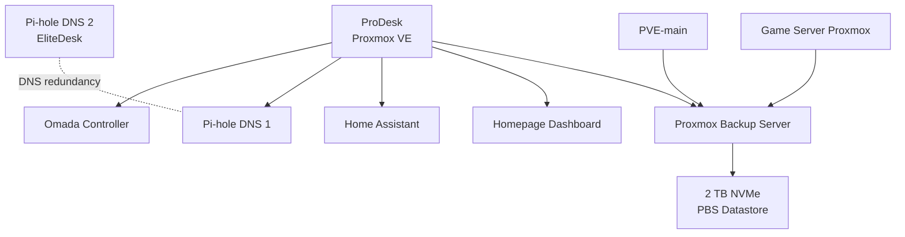

# ProDesk Proxmox Node — `prodesk`

This document describes the ProDesk Proxmox node used for backup, core infrastructure services, and supporting management workloads in the homelab.

The node became a central infrastructure host during the Server 2.0 cleanup and migration. Several services previously spread across other systems were consolidated here to create a clearer workload layout and more consistent VM/LXC numbering.

Detailed configuration for individual services is documented under [`../services/`](../services/).

---

## Overview

| Item | Value |
|---|---|
| Hostname | `prodesk.home.arpa` |
| Platform | Proxmox VE 9.2.4 |
| Primary role | Infrastructure and backup node |
| Management network | `INFRA` / VLAN 10 |
| Management address | `192.168.10.21` |
| Main backup service | Proxmox Backup Server |
| Backup datastore | 2 TB NVMe |

The ProDesk hosts several infrastructure services that support the rest of the homelab.

Its main responsibilities are:

- Proxmox Backup Server
- primary Pi-hole DNS
- Home Assistant
- Omada Controller
- Homepage dashboard

---

## Role

The ProDesk has three main responsibilities.

### 1. Backup Infrastructure

The node hosts Proxmox Backup Server and its local backup datastore.

This provides a physically separate backup target from the main Proxmox host.

### 2. Core Infrastructure Services

The node hosts several services that support networking and normal homelab operation:

- Pi-hole DNS 1
- Omada Controller
- Home Assistant

### 3. Operations and Management

The node also hosts the internal Homepage dashboard used as a central navigation and visibility layer for the homelab.

---

## Storage

The ProDesk currently uses two NVMe devices with separate roles.

| Storage | Role |
|---|---|
| 1 TB WD_BLACK NVMe | Proxmox VE, VM/LXC storage |
| 2 TB Samsung 990 PRO NVMe | Proxmox Backup Server datastore |

Conceptually:

```text
ProDesk
├── 1 TB NVMe
│   ├── Proxmox VE
│   └── VM/LXC storage
│
└── 2 TB NVMe
    └── PBS datastore
```

Keeping the PBS datastore on its own device separates backup data from the node's normal VM/LXC storage.

The backup datastore is also physically separate from the storage used by the main Proxmox server.

---

## Storage Migration

The current storage layout was created during the Server 2.0 infrastructure migration.

The 2 TB Samsung 990 PRO containing the PBS data was moved from the previous EliteDesk backup node to the ProDesk.

During the migration:

1. Existing PBS data was preserved.
2. The old storage layout was cleaned up.
3. A new dedicated backup datastore was created.
4. Existing backup data was migrated back.
5. The PBS container was restored on the ProDesk.

This allowed the ProDesk to take over the backup role without discarding the existing backup history.

---

## Virtualization

The ProDesk runs Proxmox VE and hosts a focused set of infrastructure workloads.

| ID | Workload | Type | Role | Criticality |
|---:|---|---|---|---|
| 200 | Omada Controller | LXC | Network management | High |
| 201 | Pi-hole DNS 1 | LXC | Primary DNS and filtering | High |
| 202 | Home Assistant | VM | Home automation | Medium |
| 203 | Homepage Dashboard | VM | Operations dashboard | Medium |
| 299 | Proxmox Backup Server | LXC | Backup and restore platform | High |

The node-based VMID convention reserves the `200–299` range for workloads hosted on ProDesk.

---

## Workload Layout

```text
ProDesk
└── Proxmox VE
    ├── 200  Omada Controller [LXC]
    ├── 201  Pi-hole DNS 1 [LXC]
    ├── 202  Home Assistant [VM]
    ├── 203  Homepage Dashboard [VM]
    └── 299  Proxmox Backup Server [LXC]
```

This layout gives the node a clear infrastructure-oriented role and avoids mixing these workloads with the main storage and application server where possible.

---

## Proxmox Backup Server

Proxmox Backup Server is hosted as an LXC container on the ProDesk.

Its datastore is backed by the dedicated 2 TB NVMe device.

Logical relationship:

```text
PVE-main
    │
    │ VM/LXC backups
    ▼
ProDesk
    │
    └── Proxmox Backup Server
            │
            ▼
       2 TB NVMe datastore
```

The dedicated game-server Proxmox host can also use PBS as a backup target for selected workloads.

Documentation:

[`../services/proxmox-backup-server.md`](../services/proxmox-backup-server.md)

---

## Backup Strategy

PBS protects selected workloads that would be important or time-consuming to rebuild.

The backup system is intended for:

- infrastructure VMs and containers
- important service configuration
- selected game-server workloads
- recoverable application state

Bulk TrueNAS data is not fully replicated to PBS because the dataset is significantly larger than the local backup datastore.

Large NAS datasets therefore require a separate backup strategy.

The authoritative policy belongs in:

[`../security/backup-strategy.md`](../security/backup-strategy.md)

---

## Pi-hole DNS 1

The ProDesk hosts the primary Pi-hole instance.

DNS redundancy is provided by a second Pi-hole hosted on the EliteDesk.

```text
ProDesk
└── Pi-hole DNS 1

EliteDesk
└── Pi-hole DNS 2
```

The two instances are intentionally separated across physical hosts.

If the ProDesk is unavailable, the EliteDesk can continue providing secondary DNS service.

Documentation:

[`../services/pihole.md`](../services/pihole.md)

---

## Omada Controller

The Omada Controller runs on the ProDesk and manages the Omada network environment.

Managed infrastructure includes:

- ER605 gateway
- SG3210X-M2 managed switch
- ES216G managed switch
- EAP670 wireless access point

The controller is part of the management plane.

The network is designed so that forwarding does not depend on the controller remaining continuously available.

Documentation:

[`../services/omada-controller.md`](../services/omada-controller.md)

---

## Home Assistant

Home Assistant runs as a VM on the ProDesk.

Its role is to provide the automation and management layer for smart-home devices and integrations.

Keeping Home Assistant on the ProDesk separates it from the main storage workloads on PVE-main.

Documentation:

[`../services/home-assistant.md`](../services/home-assistant.md)

---

## Homepage Dashboard

The Homepage dashboard runs as a VM on the ProDesk.

It provides a central operations overview and navigation layer for services such as:

- Proxmox
- TrueNAS
- PBS
- Pi-hole
- Home Assistant
- Immich
- Omada
- game servers
- monitoring

The dashboard is a convenience and visibility layer rather than a dependency for the underlying services.

Documentation:

[`../services/homepage-dashboard.md`](../services/homepage-dashboard.md)

---

## Networking

The ProDesk resides on the infrastructure network.

```text
ProDesk
    │
    ▼
Managed Omada network
    │
    ▼
INFRA — VLAN 10
```

The Proxmox management interface is placed on `INFRA`.

Hosted workloads use the appropriate network configuration according to their service role and the current VLAN/ACL design.

Detailed network configuration is maintained in:

- [`../network/vlan-design.md`](../network/vlan-design.md)
- [`../network/ip-plan.md`](../network/ip-plan.md)
- [`../network/acl-policy.md`](../network/acl-policy.md)
- [`../network/port-mapping.md`](../network/port-mapping.md)

---

## Management

Primary management methods include:

- Proxmox web interface
- SSH
- Proxmox VM/LXC console
- Tailscale for remote administration where required

Administrative access is intended to originate from trusted devices.

Management interfaces are not intentionally exposed directly to the public Internet.

---

## Service Relationships

A simplified logical view of the node is:



The node is primarily an infrastructure and support platform rather than a general application host.

---

## Failure Impact

Because several infrastructure services are consolidated on the ProDesk, a complete node failure has a larger impact than an EliteDesk outage.

### Affected

- Proxmox Backup Server
- PBS datastore access
- Pi-hole DNS 1
- Omada Controller
- Home Assistant
- Homepage Dashboard

### Not automatically affected

- Pi-hole DNS 2 on EliteDesk
- PVE-main
- TrueNAS
- Immich
- dedicated game-server Proxmox host
- offsite Uptime Kuma monitoring

The secondary Pi-hole provides DNS resilience during a ProDesk outage.

The Omada-managed network should continue forwarding traffic even if the controller itself is unavailable.

---

## Service Availability During Maintenance

| Service | Expected State |
|---|---|
| PBS | Offline |
| Backup target | Unavailable |
| Pi-hole DNS 1 | Offline |
| Pi-hole DNS 2 | Available |
| Omada Controller | Offline |
| Home Assistant | Offline |
| Homepage Dashboard | Offline |
| PVE-main | Available |
| TrueNAS | Available |
| Immich | Available |
| Game-server host | Available |
| Offsite monitoring | Available |

Planned maintenance should therefore be scheduled with awareness of both backup jobs and infrastructure service availability.

---

## Monitoring

The ProDesk is monitored through multiple layers.

### Proxmox

Provides local monitoring of:

- CPU usage
- memory usage
- storage state
- VM/LXC state
- node health

### Homepage

Provides a broader operational overview of homelab services.

### Offsite Uptime Kuma

The offsite ThinkCentre independently checks availability from outside the main homelab environment.

This makes it possible to distinguish between local service failures and broader site/network outages.

---

## Maintenance

Typical maintenance includes:

- Proxmox VE updates
- PBS updates
- Pi-hole updates
- Omada Controller updates
- Home Assistant maintenance
- Homepage updates
- NVMe SMART/health checks
- temperature monitoring
- PBS datastore checks
- backup-job validation
- restore testing

Because the node hosts the primary backup target, maintenance should avoid overlapping with active backup or restore operations.

---

## Pre-Maintenance Checklist

Before planned downtime:

1. Confirm that no PBS backup or restore job is running.
2. Confirm Pi-hole DNS 2 on the EliteDesk is available.
3. Review recent backup job status.
4. Confirm the PBS datastore is healthy.
5. Check whether Home Assistant downtime is acceptable.
6. Shut down hosted workloads cleanly where required.

---

## Post-Maintenance Validation

After maintenance or reboot, verify:

1. Proxmox node health.
2. VM/LXC storage availability.
3. PBS container state.
4. PBS datastore mount and accessibility.
5. Backup connectivity from other Proxmox hosts.
6. Pi-hole DNS 1.
7. Omada Controller.
8. Home Assistant.
9. Homepage Dashboard.
10. Network connectivity on `INFRA`.

A healthy Proxmox node alone does not confirm that all infrastructure services have recovered correctly.

---

## Security Considerations

The ProDesk hosts several sensitive infrastructure services.

Important design principles include:

- management on `INFRA`
- administration from trusted devices
- no intentional public exposure of Proxmox or PBS
- network segmentation through VLANs and ACLs
- remote administration through secure overlay networking where appropriate
- credentials and secrets kept outside the public repository

Backup data should be treated as sensitive because it may contain complete copies of application systems and configuration.

---

# Design Decisions

## Consolidating Infrastructure on ProDesk

The Server 2.0 migration moved several infrastructure workloads to the ProDesk.

This created a clearer separation of responsibilities:

```text
PVE-main
├── storage-heavy workloads
├── TrueNAS
├── Immich
└── selected application VMs

ProDesk
├── backup
├── DNS
├── network management
├── Home Assistant
└── operations dashboard

EliteDesk
└── secondary DNS

Game Server
└── dedicated game workloads
```

The goal is not maximum workload distribution.

The goal is a topology where each physical node has a clear operational purpose.

---

## Dedicated PBS Storage

The 2 TB backup datastore is kept on a dedicated NVMe device.

This makes the storage role easier to understand, maintain, and recover than mixing backup data with normal Proxmox VM storage.

---

## Physical DNS Separation

Pi-hole DNS 1 runs on ProDesk while Pi-hole DNS 2 runs on EliteDesk.

This provides host-level redundancy rather than simply running two DNS containers on the same hypervisor.

---

## Node-Based VMID Convention

The homelab uses node-based workload ranges:

```text
PVE-main      100–199
ProDesk       200–299
EliteDesk     300–399
Game Server   400–499
```

This makes it easier to identify the intended physical host from a workload ID and keeps the virtualization environment easier to navigate.

---

# Migration Context

The current ProDesk role is the result of a broader Server 2.0 cleanup.

During that work:

- the ProDesk was installed as a new Proxmox node
- PBS storage was moved from the EliteDesk
- the PBS workload was restored as ID `299`
- Pi-hole was migrated to ID `201`
- Home Assistant was migrated to ID `202`
- Homepage was migrated to ID `203`
- Omada Controller was placed in the ProDesk range as ID `200`
- the EliteDesk was reduced to the secondary Pi-hole role
- workload IDs were standardized by physical node

This migration reduced historical naming and placement inconsistencies and made the current architecture easier to document and operate.

---

# Current Status

`prodesk` is operational as a central infrastructure and backup node.

Current responsibilities:

- Proxmox Backup Server: active
- PBS datastore: active
- Pi-hole DNS 1: active
- Omada Controller: active
- Home Assistant: active
- Homepage Dashboard: active
- infrastructure support role: active

The node should remain focused on infrastructure, backup, and management services rather than becoming a general-purpose application host.

---

# Public Repository Notes

This document intentionally excludes:

- passwords
- API tokens
- private keys
- Tailscale addresses
- MAC addresses
- serial numbers
- backup encryption secrets
- datastore credentials
- public/WAN information

Private RFC1918 addressing may be included where it provides architectural value.

---

# Scope of This Document

This file owns documentation for the physical `prodesk` node:

- role
- storage layout
- virtualization
- workload inventory
- networking
- backup relationship
- infrastructure dependencies
- failure impact
- maintenance considerations
- migration context
- design decisions

It does not own detailed configuration for:

- Proxmox Backup Server
- Pi-hole
- Omada Controller
- Home Assistant
- Homepage
- backup retention
- VLAN design
- ACL policy

Those belong in the relevant service, security, and network documents.

---

## Related Documentation

- [`../architecture/overview.md`](../architecture/overview.md) — overall architecture
- [`../architecture/physical-topology.md`](../architecture/physical-topology.md) — physical topology
- [`../architecture/logical-topology.md`](../architecture/logical-topology.md) — workload topology
- [`../network/README.md`](../network/README.md) — network overview
- [`../network/vlan-design.md`](../network/vlan-design.md) — VLAN design
- [`../network/acl-policy.md`](../network/acl-policy.md) — ACL policy
- [`../services/proxmox-backup-server.md`](../services/proxmox-backup-server.md) — PBS
- [`../services/pihole.md`](../services/pihole.md) — DNS
- [`../services/omada-controller.md`](../services/omada-controller.md) — Omada
- [`../services/home-assistant.md`](../services/home-assistant.md) — Home Assistant
- [`../services/homepage-dashboard.md`](../services/homepage-dashboard.md) — dashboard
- [`../security/backup-strategy.md`](../security/backup-strategy.md) — backup architecture
- [`pve-main.md`](pve-main.md) — primary infrastructure and storage node
- [`pve-elitedesk.md`](pve-elitedesk.md) — secondary DNS node
- [`pve-gameserver.md`](pve-gameserver.md) — dedicated game-server node
- [`offsite-m900.md`](offsite-m900.md) — offsite monitoring node
