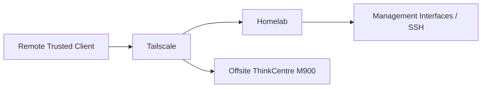

# Remote Access

This document describes the remote-access model used to administer the homelab securely from outside the local network.

Remote administration is handled through private access paths rather than by exposing management interfaces directly to the public Internet.

The primary remote-access technology is Tailscale.

Public game connectivity is handled separately through Playit.gg and is not part of the administrative access model.

---

## Overview

| Item | Value |
|---|---|
| Primary remote-access technology | Tailscale |
| Administrative protocols | HTTPS / SSH |
| Public management exposure | Not intentionally used |
| Main administration path | Trusted client → Tailscale → internal systems |
| Offsite access node | ThinkCentre M900 |
| Offsite host OS | Debian 12 minimal |
| Game connectivity | Playit.gg, separate from administration |

The main design principle is:

```text
Administrative access
        ≠
Public service exposure
```

---

# Purpose

Remote access is required for:

- Proxmox administration
- server maintenance
- SSH access
- service management
- troubleshooting
- offsite monitoring
- recovery work when away from the local network

The goal is to provide this access without making sensitive management interfaces directly reachable from the public Internet.

---

# Architecture

The remote-access path is built around Tailscale.



Conceptually:

```text
Remote administrator
        │
        ▼
Tailscale
        │
        ▼
Private homelab access
        │
        ├── HTTPS management interfaces
        └── SSH
```

---

# Tailscale

Tailscale provides the private remote-access overlay.

It is used so that management traffic does not require direct public exposure of internal administration interfaces.

The intended model is:

```text
Remote client
      │
      ▼
Tailscale
      │
      ▼
Internal system
```

Tailscale is therefore part of the administrative path rather than part of the public-service path.

---

# Administrative Access

The main administration methods are:

```text
HTTPS
SSH
```

depending on the target system.

Typical web-managed systems include:

- Proxmox VE
- TrueNAS
- Proxmox Backup Server
- Omada Controller
- Pi-hole
- Home Assistant
- Homepage
- Uptime Kuma

Typical SSH-managed systems include:

- Proxmox hosts
- Linux servers
- offsite ThinkCentre M900
- other Linux infrastructure where SSH is enabled

Not every system exposes both methods.

---

# Local Administration

Inside the homelab, the primary administration workstation resides on:

```text
TRUSTED / VLAN 20
```

and can initiate approved management traffic toward infrastructure.

Conceptually:

```text
TRUSTED
   │
   ▼
INFRA
```

This local trust relationship is independent from Tailscale.

Remote access does not replace the internal VLAN and ACL model.

Detailed segmentation documentation:

[`segmentation.md`](segmentation.md)

---

# Remote Administration vs. Network Segmentation

Tailscale and VLAN segmentation solve different problems.

```text
Tailscale
   │
   └── provides private remote reachability

VLANs / ACLs
   │
   └── define internal trust boundaries
```

A system being reachable through Tailscale does not mean the internal network should become flat or unrestricted.

The local segmentation model remains important even when private remote access is available.

---

# Offsite ThinkCentre M900

The offsite Lenovo ThinkCentre M900 is an important part of the remote-access environment.

It runs:

```text
Debian 12 minimal
```

and provides:

- Uptime Kuma
- Tailscale
- SSH access
- lightweight offsite utility services

The ThinkCentre is physically separate from the main homelab.

This gives the environment an independent remote system that can remain available during some local outages.

Detailed node documentation:

[`../nodes/offsite-m900.md`](../nodes/offsite-m900.md)

---

# Relationship to Uptime Kuma

Uptime Kuma and Tailscale have different roles.

```text
Uptime Kuma
    │
    └── availability monitoring

Tailscale
    │
    └── private remote administration
```

Both are present on the offsite ThinkCentre.

This allows the offsite node to provide both visibility and a private management path where connectivity remains available.

Detailed Uptime Kuma documentation:

[`../services/uptime-kuma.md`](../services/uptime-kuma.md)

---

# Public Management Exposure

Management interfaces are not intentionally exposed directly to the public Internet.

This includes:

- Proxmox VE
- TrueNAS
- Proxmox Backup Server
- Omada Controller
- Pi-hole
- Home Assistant
- Homepage
- SSH administration

The preferred model is:

```text
Internet
   │
   X
   │
Direct management interface

Internet
   │
   ▼
Tailscale
   │
   ▼
Private management interface
```

This reduces the external attack surface of the homelab.

---

# Playit.gg

Playit.gg is used for public game-server connectivity.

It is intentionally separated from remote administration.

Conceptually:

```text
External player
      │
      ▼
Playit.gg
      │
      ▼
GAME-DMZ workload
```

while administration follows:

```text
Administrator
      │
      ▼
Tailscale
      │
      ▼
Management path
```

Playit.gg should therefore not be used as a general-purpose administrative tunnel.

Detailed game-server documentation:

[`../services/game-servers.md`](../services/game-servers.md)

---

# Management Plane Separation

The remote-access design preserves the distinction between management and workload traffic.

For example:

```text
pve-game-server management
        │
        └── INFRA

Game-server VM
        │
        └── GAME-DMZ
```

Remote administration should target the management path rather than treating the public game-service path as an administrative route.

---

# Access Scope

Remote access should be limited to systems that actually require administration.

Typical remote-management targets include:

- Proxmox hosts
- PBS
- TrueNAS
- selected Linux servers
- Omada Controller
- offsite M900

A service does not need direct public exposure simply because it may occasionally require remote management.

---

# SSH

SSH is used where command-line administration is required.

Current examples include:

- Proxmox hosts
- Linux game-server systems
- Proxmox Backup Server host/container environment where applicable
- offsite ThinkCentre M900

SSH access should remain private and should not be intentionally published as an unrestricted Internet-facing service.

The preferred remote path is through Tailscale or another explicitly trusted internal route.

---

# Web Management Interfaces

Many homelab systems use browser-based administration.

Examples include:

```text
Proxmox VE
TrueNAS
PBS
Omada
Pi-hole
Home Assistant
Homepage
Uptime Kuma
```

These interfaces are intended for private access.

Remote access should therefore reach them through the private network path rather than through public port forwarding.

---

# DNS

Remote administration may depend on DNS where services are accessed by hostname.

The homelab uses redundant Pi-hole DNS internally.

However, remote-access design should not depend exclusively on one internal DNS instance remaining available.

The Pi-hole pair provides local DNS redundancy across two Proxmox hosts.

Detailed DNS documentation:

[`../services/pihole.md`](../services/pihole.md)

---

# Failure Scenarios

## Tailscale Client Failure

If Tailscale fails on the remote client:

```text
Remote administration unavailable
```

The homelab itself can continue operating normally.

---

## Tailscale Service Failure on a Target

If a target system loses its Tailscale connectivity, that specific private remote path may become unavailable.

Local administration can still remain possible from the internal network.

---

## Main-Site Internet Failure

If the main homelab loses Internet connectivity:

- local services may remain operational
- local administration may remain available
- remote Tailscale access to the main site may be interrupted
- offsite Uptime Kuma may report loss of reachability

This should be distinguished from failure of the internal services themselves.

---

## Main-Site Power Failure

A complete local power outage can remove:

- Proxmox hosts
- gateway
- switches
- local services
- local Tailscale endpoints

The offsite ThinkCentre may remain online and can help confirm that the main site is unreachable.

---

## Offsite ThinkCentre Failure

Loss of the offsite M900 affects:

- Uptime Kuma
- Tailscale on that node
- SSH access to that node

It does not automatically remove Tailscale access to other systems that have their own working Tailscale endpoint.

---

# Recovery

Remote-access recovery should focus on restoring a trusted administrative path.

General sequence:

```text
Verify Internet connectivity
        │
        ▼
Verify target system is online
        │
        ▼
Verify Tailscale
        │
        ▼
Verify private reachability
        │
        ▼
Verify HTTPS / SSH access
```

The failure should be isolated to determine whether it is:

- target-system failure
- local network failure
- Internet failure
- Tailscale failure
- application-level management failure

---

# Security Principles

Remote administration is a high-value access path.

The design therefore follows these principles:

- no intentional direct public management exposure
- use private remote-access paths
- preserve internal VLAN segmentation
- keep administrative traffic separate from public game traffic
- use least privilege where supported
- keep authentication secrets outside GitHub
- avoid publishing private overlay-network information
- keep remote-access clients and servers updated
- remove obsolete access paths when no longer required

---

# Credentials and Authentication

The public repository must not contain:

- Tailscale authentication keys
- private Tailscale addresses
- SSH private keys
- passwords
- API tokens
- session cookies
- recovery keys
- private certificates
- Playit.gg authentication credentials

Authentication material belongs in private configuration only.

---

# Public Repository Security

The public repository may safely document:

- that Tailscale is used
- the high-level remote-access architecture
- administrative protocols
- the offsite-node role
- the separation between Tailscale and Playit.gg
- failure-domain reasoning

It should avoid publishing details that materially reduce the privacy or security of the remote-access environment.

---

# Operational Principles

Remote-access changes should be made carefully because a mistake can remove the administrator's recovery path.

Recommended principles:

1. Keep at least one known-good access path before changing remote networking.
2. Avoid changing multiple remote-access components simultaneously.
3. Verify local access before restarting or reconfiguring Tailscale.
4. Test SSH or web access after significant changes.
5. Do not remove the old working path until the replacement has been verified.
6. Keep offsite-node changes conservative when no local physical access is available.

---

# Design Decisions

## Tailscale Instead of Public Port Forwarding

The management plane is intentionally private.

Using Tailscale avoids requiring direct Internet exposure of sensitive interfaces such as:

```text
Proxmox
TrueNAS
PBS
SSH
Omada
```

This reduces the number of public administrative entry points.

---

## Separate Public Game Connectivity

Public game access is treated as a different security requirement from administration.

Using Playit.gg for games while using Tailscale for administration provides a clear separation:

```text
Players → Playit.gg → GAME-DMZ
Admins  → Tailscale → management systems
```

This separation is intentional.

---

## Offsite Node

The ThinkCentre M900 provides a remote system outside the main homelab failure domain.

Its role is intentionally lightweight:

- monitoring
- Tailscale
- SSH
- utility services

It is not treated as another primary compute host.

---

# Current State

Current confirmed state:

- Tailscale: in use
- Remote administration: private rather than directly public
- Main local administration network: `TRUSTED`
- Infrastructure management network: `INFRA`
- Administrative protocols: HTTPS and SSH
- Offsite ThinkCentre M900: active
- Offsite host OS: Debian 12 minimal
- Tailscale on offsite node: active
- SSH on offsite node: active
- Uptime Kuma on offsite node: active
- Direct public management interfaces: not intentionally exposed
- Playit.gg: used separately for public game connectivity
- Internal VLAN segmentation remains active independently of Tailscale

---

# Roadmap

Potential improvements include:

- document the intended Tailscale device inventory at a high level
- periodically review active remote-access endpoints
- remove stale or unused Tailscale devices
- review SSH authentication and hardening
- document recovery procedures for loss of remote connectivity
- periodically verify offsite-node access
- maintain separation between administrative and public game access
- keep remote-access software updated

---

# Scope of This Document

This file owns the high-level remote-access security model:

- Tailscale usage
- administrative access path
- SSH and web management
- offsite-node relationship
- public-management exposure policy
- separation from Playit.gg
- failure scenarios
- recovery principles
- credential handling
- remote-access security principles

It does not own:

- private Tailscale configuration
- Tailscale authentication keys
- private SSH keys
- detailed host firewall rules
- Playit.gg credentials
- exact ACL rule definitions
- full endpoint inventory

Those belong in private configuration or the relevant network and service documentation.

---

## Related Documentation

- [`segmentation.md`](segmentation.md) — network trust model
- [`backup-strategy.md`](backup-strategy.md) — backup and resilience
- [`../network/acl-policy.md`](../network/acl-policy.md) — implemented inter-VLAN policy
- [`../network/vlan-design.md`](../network/vlan-design.md) — VLAN architecture
- [`../nodes/offsite-m900.md`](../nodes/offsite-m900.md) — offsite host
- [`../services/uptime-kuma.md`](../services/uptime-kuma.md) — offsite monitoring
- [`../services/game-servers.md`](../services/game-servers.md) — Playit.gg and GAME-DMZ
