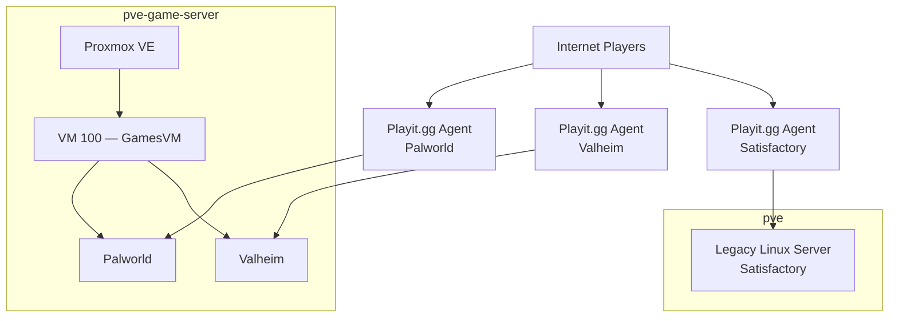

# Game Servers

This document describes the dedicated game-server environment used in the homelab.

Game workloads are being consolidated onto a dedicated Proxmox host and isolated from the core infrastructure through the `GAME-DMZ` network.

The current environment actively hosts Palworld and Valheim on the dedicated game-server VM, while Satisfactory remains on the legacy server during migration.

---

## Overview

| Item | Value |
|---|---|
| Physical host | `pve-game-server` |
| Proxmox management network | `INFRA` / VLAN 10 |
| Game VM | `GamesVM` |
| VM ID | `100` |
| Game network | `GAME-DMZ` / VLAN 25 |
| Game VM address | `192.168.25.10` |
| CPU | 8 vCPU |
| Memory | 24 GiB |
| VM disk | 300 GB |
| Machine type | `q35` |
| Firmware | OVMF (UEFI) |
| External connectivity | Playit.gg |
| Game updates | Automated through SteamCMD |
| VM backup | Proxmox Backup Server |

The dedicated host exists so that game-server maintenance, updates, restarts, and external exposure remain separated from private infrastructure services.

---

# Current Game Status

| Game | Current Host | Status | Migration State |
|---|---|---|---|
| Palworld | `GamesVM` on `pve-game-server` | Active | Migrated |
| Valheim | `GamesVM` on `pve-game-server` | Active | Migrated |
| Satisfactory | Legacy Linux server on `pve` | Active | Not yet migrated |

The intended end state is for all dedicated game-server workloads to run on `pve-game-server`.

---

# Architecture



Each game uses its own Playit.gg agent/tunnel path.

Public tunnel addresses, secrets, and authentication tokens are intentionally excluded from this repository.

---

# Dedicated Proxmox Host

The game environment runs on the dedicated:

```text
pve-game-server
```

Proxmox node.

The physical host management interface resides on:

```text
INFRA / VLAN 10
```

while the game workload VM resides on:

```text
GAME-DMZ / VLAN 25
```

This separates the hypervisor management plane from the externally reachable game workloads.

Node documentation:

[`../nodes/pve-gameserver.md`](../nodes/pve-gameserver.md)

---

# GamesVM

The primary game-server VM is:

```text
VM 100 — GamesVM
```

Current verified VM configuration:

| Resource | Configuration |
|---|---|
| CPU | 8 cores |
| Memory | 24 GiB |
| Disk | 300 GB |
| Machine type | `q35` |
| Firmware | OVMF / UEFI |
| SCSI controller | VirtIO SCSI single |
| Network adapter | VirtIO |
| VLAN tag | `25` |
| Network | `GAME-DMZ` |
| Address | `192.168.25.10` |

Ubuntu Server 24.04.3 installation media is present in the Proxmox configuration.

The exact installed guest OS version should be verified from inside the VM before being treated as authoritative.

---

# Why Use a Dedicated VM?

The game services run inside a VM rather than directly on the Proxmox host.

This provides:

- separation from the hypervisor
- simpler backup and restore
- cleaner service management
- easier network isolation
- easier migration
- reduced impact from game-specific configuration changes

The physical Proxmox host remains an infrastructure layer rather than becoming the application server itself.

---

# Network Segmentation

`GamesVM` resides on:

```text
GAME-DMZ / VLAN 25
```

The VM receives:

- Internet access
- Pi-hole DNS
- Playit.gg connectivity

It is prevented from initiating unrestricted connections toward:

- `INFRA`
- `TRUSTED`
- `IOT`
- `GUEST`

Administration is initiated from `TRUSTED`.

Detailed policy:

[`../network/acl-policy.md`](../network/acl-policy.md)

---

## Management vs. Workload Plane

The design intentionally separates:

```text
Proxmox management
        │
        ▼
INFRA
```

from:

```text
Game workloads
        │
        ▼
GAME-DMZ
```

This prevents a game workload from sharing the same trust zone as the hypervisor management interface.

---

# Palworld

Current state:

```text
Migrated
Active
Hosted on GamesVM
```

Palworld runs inside the dedicated game-server VM.

External player connectivity is provided through its own Playit.gg agent/tunnel.

The service is included in the automated update workflow.

---

# Valheim

Current state:

```text
Migrated
Active
Hosted on GamesVM
```

Valheim also runs inside the dedicated game-server VM.

External player connectivity is provided through its own Playit.gg agent/tunnel.

The service is included in the automated update workflow.

---

# Satisfactory

Current state:

```text
Active
Not yet migrated
```

Satisfactory still runs on the legacy Linux server hosted on:

```text
pve
```

This is transitional.

The intended architecture is to migrate Satisfactory to `GamesVM` so that the main Proxmox node no longer hosts game-server workloads.

---

# Migration Model

Previous layout:

```text
pve
├── Core infrastructure
├── TrueNAS
├── Immich
├── Home Assistant
├── Omada
├── Pi-hole
└── Game servers
```

Current transitional layout:

```text
pve
├── Core infrastructure
└── Satisfactory (legacy)

pve-game-server
└── GamesVM
    ├── Palworld
    └── Valheim
```

Target layout:

```text
pve
└── Core private infrastructure

pve-game-server
└── GamesVM
    ├── Palworld
    ├── Valheim
    └── Satisfactory
```

---

# Game File Layout

Each game is installed into its own dedicated directory/path inside the game-server environment.

Conceptually:

```text
game-server-root/
├── palworld/
├── valheim/
└── satisfactory/
```

The exact local filesystem paths are intentionally not required for the public architecture documentation.

This keeps the document portable while still documenting the separation between services.

---

# SteamCMD

SteamCMD is used to install and update the dedicated game-server software.

The update workflow is automated.

Current process:

```text
Stop game service
        │
        ▼
Back up save data
        │
        ▼
Run SteamCMD update
        │
        ▼
Start game service
```

This reduces the chance of modifying game files while the server is actively writing save data.

---

# Automated Update Workflow

The update process follows:

```text
1. Stop service
2. Create save backup
3. Update through SteamCMD
4. Start service
```

The workflow is automated rather than requiring each update to be performed manually.

This is particularly useful for dedicated game servers because application updates are relatively frequent.

---

## Why Stop Before Updating?

Updating a live game server can introduce:

- inconsistent files
- save corruption risk
- version mismatch
- failed restart

Stopping the game process before updating provides a cleaner maintenance state.

---

## Why Back Up Before Updating?

A pre-update save backup provides a fast recovery point if:

- a game update breaks compatibility
- save files are damaged
- configuration changes fail
- a new server version causes problems

This complements the broader VM backup provided by PBS.

---

# Backup Strategy

The game environment uses more than one recovery layer.

```text
Save-file backup
       +
PBS VM backup
```

These solve different problems.

---

## Save Backup

A save backup is created as part of the automated update workflow.

This provides a recent application-level recovery point before the game server is modified.

The exact backup script implementation and private paths belong under:

[`../../configs/scripts/`](../../configs/scripts/)

Secrets and credentials must not be stored in the public repository.

---

## Proxmox Backup Server

The game VM is protected through Proxmox Backup Server.

Backup target:

```text
PBS on elitedesk
```

Logical relationship:

```text
GamesVM
   │
   ▼
Proxmox Backup Server
   │
   ▼
elitedesk
```

This places the VM backup on separate physical hardware from the game-server host.

Detailed PBS documentation:

[`proxmox-backup-server.md`](proxmox-backup-server.md)

---

# Backup Layers

| Failure | Preferred Recovery |
|---|---|
| Broken game update | Save backup / rollback |
| Corrupted game config | Save/config backup |
| Game VM failure | PBS VM restore |
| VM deletion | PBS VM restore |
| Physical game-host failure | Repair host + restore VM from PBS |
| Complete main-site loss | Current local PBS may also be affected |

PBS is still located at the same physical site as the game server, so it is not a complete offsite disaster-recovery solution.

---

# Playit.gg

Direct inbound port forwarding is not available through the upstream network.

Playit.gg is therefore used to provide external game connectivity.

Each game uses:

```text
one Playit.gg agent/tunnel path
```

with its own external address.

Conceptually:

```text
Internet
   │
   ▼
Playit.gg
   │
   ▼
Individual Game Service
```

---

## Separate Agents per Game

Current design:

```text
Palworld      → dedicated Playit path
Valheim       → dedicated Playit path
Satisfactory  → dedicated Playit path
```

This keeps the external connectivity of each game service independent.

If one tunnel requires maintenance or replacement, the other game services do not necessarily need to be changed.

---

## Public Repository Safety

The repository must not contain:

- Playit.gg tunnel addresses
- tunnel IDs
- authentication secrets
- tokens
- public management endpoints
- server passwords

The architecture is useful to document; the actionable connection secrets are not.

---

# Remote Administration

Remote administration and player connectivity are separate functions.

```text
Tailscale / trusted access
        │
        ▼
Administration
```

```text
Playit.gg
        │
        ▼
Player traffic
```

This avoids using public game connectivity as a management path.

---

# Autostart

The game environment is configured to start automatically once the physical server is powered on.

Current operational model:

```text
Physical server power-on
        │
        ▼
Proxmox boots
        │
        ▼
GamesVM starts automatically
        │
        ▼
Game services start automatically
        │
        ▼
Playit.gg connectivity starts
```

The physical server itself currently requires manual power-on.

There is no requirement that the game host remain powered on continuously if the services are not needed.

---

# Host Power Behavior

Important distinction:

```text
Service autostart: Yes
Physical PC auto-power-on: No / manual
```

Once the server is powered on, the game environment returns automatically.

This simplifies recovery after planned shutdowns while retaining manual control of the physical machine.

---

# Service Dependencies

The dedicated game environment depends on:

- physical `pve-game-server` host
- Proxmox VE
- GamesVM
- local SSD storage
- `GAME-DMZ`
- Pi-hole DNS
- Internet connectivity
- Playit.gg
- individual game services

Simplified:

```text
Physical Host
      │
      ▼
Proxmox
      │
      ▼
GamesVM
      │
      ├── Palworld
      ├── Valheim
      └── future Satisfactory
              │
              ▼
          Playit.gg
```

---

# Failure Scenarios

## Individual Game Service Failure

Affected:

- one game

Other services on `GamesVM` can remain operational.

---

## GamesVM Failure

Affected:

- Palworld
- Valheim
- future migrated game workloads
- game-level Playit connectivity hosted by the VM

The Proxmox host itself may remain healthy.

---

## Physical Game Host Failure

Affected:

- GamesVM
- all migrated game services

Not directly affected:

- TrueNAS
- Immich
- Home Assistant
- Pi-hole
- Omada
- PBS
- Satisfactory while it remains on legacy `pve`

---

## PBS Failure

Game services continue running.

The primary impact is loss of normal VM restore capability until PBS is recovered.

---

## Internet / Playit.gg Failure

The local game services can remain running.

External players may be unable to connect.

This is different from an actual game-server process failure.

---

# Maintenance

Typical maintenance includes:

- Proxmox updates
- guest OS updates
- SteamCMD updates
- game updates
- save backups
- configuration changes
- Playit.gg validation
- storage-health checks

The dedicated node allows these tasks to occur without affecting private infrastructure.

---

# Pre-Update Workflow

For a game update:

```text
Check service state
      │
      ▼
Stop service
      │
      ▼
Back up save
      │
      ▼
SteamCMD update
      │
      ▼
Start service
      │
      ▼
Validate locally
      │
      ▼
Validate through Playit.gg
```

---

# Post-Update Validation

After an update, verify:

- service process running
- save/world loaded correctly
- expected game version
- local network reachability
- external Playit.gg connectivity
- no obvious errors in logs

A service process being active does not by itself prove that players can connect.

---

# Post-Reboot Validation

After rebooting `pve-game-server`:

1. Confirm Proxmox is reachable.
2. Confirm GamesVM started automatically.
3. Confirm `192.168.25.10` is active.
4. Verify Pi-hole DNS.
5. Verify Internet access.
6. Verify Palworld.
7. Verify Valheim.
8. Verify each Playit.gg path.
9. Verify PBS connectivity.

After Satisfactory is migrated, it should be added to this validation sequence.

---

# Monitoring

The environment should be monitored at several levels.

## Proxmox Host

Monitor:

- CPU
- memory
- local storage
- host temperature
- VM state

## GamesVM

Monitor:

- CPU
- memory
- disk space
- network
- operating-system health

## Game Services

Monitor:

- service state
- logs
- update state
- save-file health

## External Connectivity

Monitor:

- Playit.gg tunnel availability
- player-facing service reachability where practical

---

# Security

Game servers have a higher external exposure profile than private infrastructure.

Current controls include:

- dedicated physical Proxmox host
- dedicated game VM
- separate `GAME-DMZ`
- Proxmox management on `INFRA`
- Gateway ACL isolation
- trusted administration path
- Playit.gg for player traffic
- no direct public exposure of Proxmox management
- backup on separate physical hardware

---

# Why GAME-DMZ?

Game servers run third-party software that:

- receives external traffic
- updates frequently
- can have game-specific vulnerabilities
- may use plugins/mods
- does not require unrestricted access to private infrastructure

The network design therefore allows:

```text
GAME-DMZ → Internet
GAME-DMZ → Pi-hole DNS
```

while blocking general initiation toward private VLANs.

---

# Design Decisions

## Dedicated Physical Host

Game-server workloads are intentionally separated from the main infrastructure server.

This reduces the impact of:

- game updates
- VM crashes
- heavy game load
- restarts
- experimentation

---

## One Shared GamesVM

Palworld and Valheim currently share one dedicated game-server VM.

This provides application-level organization while avoiding unnecessary VM overhead for each individual game.

Each game still has its own:

- directory/path
- service
- update lifecycle
- Playit.gg path

---

## SteamCMD Automation

Automating updates reduces repetitive manual maintenance.

The stop-backup-update-start sequence provides a controlled update workflow rather than blindly updating a live server.

---

## Separate Player and Admin Access

Player traffic and administrative access are intentionally not handled through the same mechanism.

This gives clearer security boundaries and simpler troubleshooting.

---

# Current State

Current confirmed state:

- Physical host: `pve-game-server`
- GamesVM: active
- VM ID: `100`
- CPU: 8 vCPU
- Memory: 24 GiB
- Disk: 300 GB
- Machine type: `q35`
- OVMF / UEFI: configured
- Network: `GAME-DMZ`
- VLAN tag: `25`
- Address: `192.168.25.10`
- Palworld: migrated and active
- Valheim: migrated and active
- Satisfactory: active on legacy `pve`, not yet migrated
- SteamCMD update workflow: automated
- Pre-update save backup: implemented
- PBS VM backup: in use
- One Playit.gg path per game: in use
- Game VM/services autostart after host boot: enabled
- Physical host power-on: manual

---

# Roadmap

Planned improvements include:

- Migrate Satisfactory to GamesVM
- Remove remaining legacy game-hosting responsibility from `pve`
- Standardize per-game directory structure
- Standardize service naming
- Keep automated save backups before updates
- Validate PBS restore of GamesVM
- Improve game-level monitoring
- Document recovery for each game
- Consider automatic physical host power-on if operationally useful

---

# Public Repository Notes

This document intentionally excludes:

- public Playit.gg addresses
- tunnel IDs
- Playit.gg tokens
- server passwords
- Steam credentials
- admin/player allowlists
- private save data
- usernames
- public endpoints

Internal RFC1918 addresses and architectural information are retained because they provide technical documentation value.

---

# Scope of This Document

This file owns game-server service documentation:

- GamesVM architecture
- current game placement
- migration state
- SteamCMD update workflow
- save backup workflow
- Playit.gg architecture
- backup/recovery
- autostart behavior
- security model

It does not own:

- physical host hardware
- complete ACL definitions
- Playit.gg secrets
- detailed game configuration files
- server passwords
- exact private filesystem paths

Those belong in the corresponding node, network, security, or private configuration documentation.

---

## Related Documentation

- [`../nodes/pve-gameserver.md`](../nodes/pve-gameserver.md) — dedicated physical host
- [`../nodes/pve-main.md`](../nodes/pve-main.md) — legacy Satisfactory host
- [`../network/vlan-design.md`](../network/vlan-design.md) — `GAME-DMZ`
- [`../network/acl-policy.md`](../network/acl-policy.md) — game-network policy
- [`../network/ip-plan.md`](../network/ip-plan.md) — addressing
- [`proxmox-backup-server.md`](proxmox-backup-server.md) — VM backup
- [`../security/backup-strategy.md`](../security/backup-strategy.md) — backup architecture
- [`../../configs/scripts/`](../../configs/scripts/) — reusable update/backup scripts
