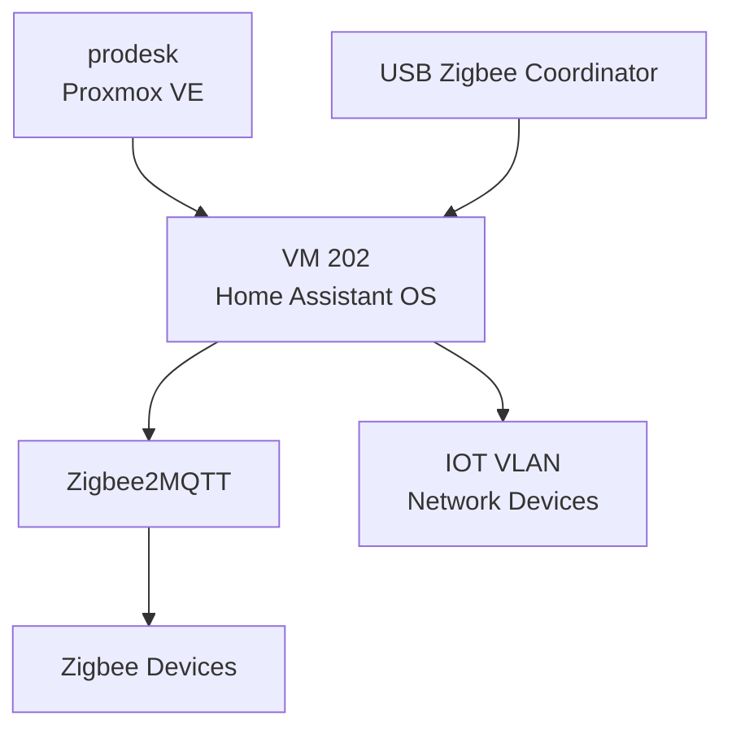
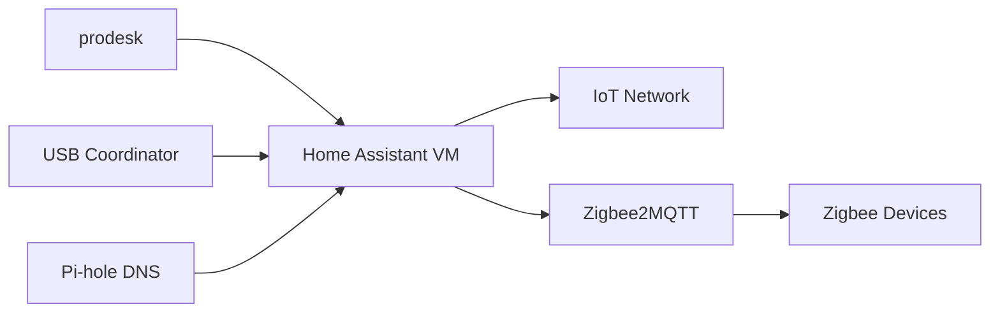

# Home Assistant

This document describes the Home Assistant deployment used for home automation in the homelab.

Home Assistant runs as a dedicated virtual machine on the ProDesk Proxmox host and communicates with smart-home devices through both the network and a dedicated USB radio passed through from the physical server.

---

## Overview

| Item | Value |
|---|---|
| Platform | Home Assistant OS |
| Host | `prodesk` |
| VM ID | `202` |
| Network | `INFRA` / VLAN 10 |
| Address | `192.168.10.70` |
| Installation method | Home Assistant OS |
| Zigbee integration | Zigbee2MQTT |
| Physical device access | USB radio passed through from `prodesk` |

Home Assistant is treated as an infrastructure service rather than as an IoT client.

The VM resides on `INFRA`, while smart-home devices are placed on the separate `IOT` network where applicable.

---

# Current Software

Current Home Assistant software versions:

| Component | Version |
|---|---|
| Home Assistant Core | `2026.8.1` |
| Supervisor | `2026.07.5` |
| Home Assistant OS | `18.2` |
| Frontend | `20260729.6` |

These versions represent the current documented state and will change as Home Assistant is updated.

---

# Architecture

Home Assistant combines network-based device communication with a locally attached USB radio.



The VM therefore has two important device-access paths:

```text
USB passthrough → Zigbee devices
Network         → IP-based IoT devices
```

---

# Proxmox Deployment

Home Assistant runs as:

```text
VM 202
```

on:

```text
prodesk
```

The VM is dedicated to Home Assistant OS rather than sharing a general-purpose Linux server with unrelated applications.

This keeps the Home Assistant deployment self-contained and makes it easier to:

- back up
- restore
- reboot
- update
- troubleshoot

without affecting unrelated workloads.

Physical host documentation:

[`../nodes/pve-prodesk.md`](../nodes/pve-prodesk.md)

---

# Home Assistant OS

The installation uses the full:

```text
Home Assistant OS
```

deployment model.

This includes:

- Home Assistant Core
- Supervisor
- Home Assistant OS
- add-on management
- integrated update management

This deployment was chosen instead of running Home Assistant as a manually maintained Docker container.

---

# USB Device Passthrough

The physical `prodesk` server has a dedicated USB radio used by Home Assistant to communicate with wireless smart-home devices.

The USB device is passed through from the Proxmox host to VM 202.

Conceptually:

```text
Physical USB Radio
       │
       ▼
prodesk
       │
       │ USB passthrough
       ▼
Home Assistant VM
       │
       ▼
Zigbee2MQTT
       │
       ▼
Zigbee Devices
```

This creates a direct hardware dependency between Home Assistant and the USB device attached to `prodesk`.

---

## USB Dependency

Home Assistant may boot successfully even if the USB radio is unavailable.

However, Zigbee-based automation can fail if:

- the USB device is disconnected
- USB passthrough is missing
- the device path changes
- the coordinator fails
- Zigbee2MQTT cannot access the coordinator

Post-maintenance validation must therefore include actual Zigbee device communication rather than only checking that the VM is running.

---

# Zigbee2MQTT

Zigbee2MQTT is used to bridge Zigbee devices into the Home Assistant environment.

The current Home Assistant interface exposes Zigbee2MQTT as part of the smart-home management workflow.

Logical relationship:

```text
Zigbee Device
     │
     ▼
USB Coordinator
     │
     ▼
Zigbee2MQTT
     │
     ▼
Home Assistant
```

This allows Zigbee devices to be managed from Home Assistant while keeping the radio communication local.

---

# Connected Device Types

The current deployment is used for smart-home functions including:

- lighting
- Zigbee devices
- network-connected IoT devices
- television/media integrations
- environmental/weather information
- general automation

Individual device names, exact room mappings, and full smart-home inventory are intentionally excluded from this public repository.

The service documentation focuses on architecture rather than personal household details.

---

# Networking

Home Assistant resides on:

```text
INFRA / VLAN 10
```

Address:

```text
192.168.10.70
```

Many network-connected smart-home devices reside on:

```text
IOT / VLAN 30
```

This creates an intentional security boundary.

---

# Home Assistant → IOT ACL Exception

General traffic from `INFRA` toward `IOT` is blocked.

Home Assistant is the explicit exception.

```text
Home Assistant
192.168.10.70
      │
      │ permitted
      ▼
IOT VLAN
```

The Gateway ACL:

```text
ALLOW-HA-IOT
```

allows Home Assistant to initiate connections toward devices on the IoT network.

The broader rule:

```text
BLOCK-INFRA-TO-IOT
```

continues blocking other infrastructure systems.

---

## Why Use a Specific Exception?

Without the exception, Home Assistant could not communicate normally with network-based IoT devices.

Allowing all of `INFRA` to access `IOT` would be broader than necessary.

The current design therefore follows:

```text
Home Assistant → IOT     ALLOW
Other INFRA → IOT        BLOCK
```

This is one of the clearest least-privilege relationships in the network design.

Detailed ACL policy:

[`../network/acl-policy.md`](../network/acl-policy.md)

---

# Trust Boundary

Home Assistant is treated as trusted infrastructure.

IoT devices are treated as a lower-trust zone.

```text
INFRA
└── Home Assistant
        │
        │ controlled exception
        ▼
IOT
└── Smart-home devices
```

The architecture allows the controller to reach the devices without granting those devices equivalent access back into infrastructure.

---

# DNS

Home Assistant uses the homelab DNS infrastructure provided by the Pi-hole pair.

DNS architecture:

```text
Home Assistant
      │
      ▼
Pi-hole 1 / Pi-hole 2
```

The two DNS servers run on separate physical Proxmox nodes.

Detailed documentation:

[`pihole.md`](pihole.md)

---

# Service Dependencies

Home Assistant depends on several infrastructure components.



Important dependencies include:

- `prodesk`
- Home Assistant VM 202
- USB Zigbee coordinator
- Zigbee2MQTT
- `INFRA` networking
- Pi-hole DNS
- Gateway ACL exception
- IoT network availability

---

# Failure Scenarios

## Home Assistant VM Failure

Affected:

- Home Assistant interface
- automations
- network-based device control
- Zigbee control through Home Assistant

Other homelab services continue operating.

---

## `prodesk` Failure

Home Assistant becomes unavailable because VM 202 is hosted on `prodesk`.

Other services hosted on different physical nodes can remain operational.

---

## USB Coordinator Failure

Home Assistant itself can remain online.

Likely affected:

- Zigbee2MQTT communication
- Zigbee lights/devices
- Zigbee-based automations

Network-based IoT integrations may continue functioning.

---

## IOT Network Failure

Home Assistant remains online on `INFRA`.

Network-based IoT devices may become unavailable.

Zigbee devices using the local USB radio may remain operational if they do not depend on the affected network path.

---

## Pi-hole Failure

Because DNS is redundant across two Pi-hole instances, failure of one Pi-hole should not remove normal DNS service.

Failure of both DNS servers can affect integrations that depend on hostname resolution or external services.

---

# Backup

Home Assistant VM 202 is included in the Proxmox backup architecture.

The VM can be backed up to:

```text
Proxmox Backup Server
```

running on:

```text
prodesk
```

This protects the Home Assistant VM from several failure scenarios such as:

- VM corruption
- failed update
- accidental deletion
- main-host rebuild

Detailed backup architecture:

[`proxmox-backup-server.md`](proxmox-backup-server.md)

---

# Home Assistant Backups

Home Assistant also supports application-level backups through its own backup system.

Using both layers provides different recovery options:

```text
Home Assistant backup
        +
Proxmox VM backup
```

The application-level backup is useful for restoring Home Assistant configuration.

The Proxmox backup provides recovery of the entire virtual machine.

The exact Home Assistant backup schedule should be documented once a stable policy is defined.

---

# Recovery

A full Home Assistant recovery should validate more than VM startup.

Recommended recovery sequence:

```text
Restore / start VM
       │
       ▼
Verify Home Assistant
       │
       ▼
Verify network
       │
       ▼
Verify USB coordinator
       │
       ▼
Verify Zigbee2MQTT
       │
       ▼
Verify IoT access
       │
       ▼
Test an actual automation/device
```

---

## Recovery Validation

After a restore or migration, verify:

- Home Assistant web interface
- expected version/configuration
- `INFRA` address
- DNS resolution
- Zigbee2MQTT
- USB coordinator access
- Zigbee device availability
- IP-based IoT device availability
- automations
- dashboards

A successful Home Assistant login is not sufficient validation if the underlying device integrations are broken.

---

# Maintenance

Typical maintenance includes:

- Home Assistant Core updates
- Supervisor updates
- Home Assistant OS updates
- add-on updates
- Zigbee2MQTT updates
- integration review
- backup verification
- USB passthrough validation

---

## Pre-Update Checklist

Before a major Home Assistant update:

1. Confirm the current system is healthy.
2. Create or verify a recent backup.
3. Check release notes where relevant.
4. Verify the Proxmox backup state.
5. Record any known integration warnings.
6. Apply the update.

---

## Post-Update Validation

After an update:

- Home Assistant starts normally
- Supervisor healthy
- Zigbee2MQTT starts
- USB coordinator detected
- Zigbee devices respond
- IoT integrations respond
- automations execute
- dashboard loads normally

---

# Monitoring

Home Assistant can be monitored at several levels.

## Proxmox

Monitor:

- VM state
- CPU
- memory
- storage
- network

## Home Assistant

Monitor:

- system health
- integrations
- unavailable entities
- add-ons
- update state

## Functional Validation

The most useful validation is often an actual smart-home action.

Examples:

```text
Toggle a Zigbee light
```

or:

```text
Control an IP-based IoT device
```

This tests more of the dependency chain than a simple ping.

---

# Security

Home Assistant has privileged access to smart-home devices and should therefore be treated as sensitive infrastructure.

Current controls include:

- Home Assistant on `INFRA`
- IoT devices separated into `IOT`
- specific `ALLOW-HA-IOT` Gateway ACL
- general `INFRA → IOT` traffic blocked
- administration from `TRUSTED`
- no intentional direct public exposure
- credentials excluded from GitHub

---

# Public Repository Privacy

A Home Assistant installation can expose highly personal information, including:

- device names
- room names
- presence information
- routines
- automation schedules
- sensor history
- household behavior

The public repository should therefore avoid publishing a complete Home Assistant inventory.

Screenshots should be reviewed carefully before publication.

Recommended public screenshots are those that demonstrate:

- general dashboard design
- integration architecture
- version information
- non-sensitive example devices

Avoid screenshots that expose:

- precise presence history
- door/lock state
- alarm configuration
- personal location
- private automation schedules
- API tokens
- webhook URLs

---

# Design Decisions

## Home Assistant OS VM

Using a dedicated Home Assistant OS VM provides:

- simple update management
- Supervisor support
- add-on support
- VM isolation
- straightforward Proxmox backup
- simple recovery model

---

## USB Passthrough

The Zigbee radio is attached directly to the VM.

This keeps Zigbee communication local and avoids depending on a cloud service for normal Zigbee operation.

The trade-off is that Home Assistant becomes tied to hardware physically attached to `prodesk`.

---

## Home Assistant on INFRA

Home Assistant is a controller and automation platform, not an untrusted IoT endpoint.

It therefore resides on `INFRA`.

The IoT devices remain in their lower-trust VLAN.

A narrow ACL exception connects the two where required.

---

## Separate IoT Zone

Putting Home Assistant and the devices it controls in the same unrestricted network would be simpler.

The current architecture deliberately chooses stronger separation:

```text
Home Assistant → IoT allowed
IoT → Infrastructure blocked
```

This provides better containment without preventing normal automation.

---

# Current State

Current confirmed state:

- Home Assistant OS: active
- Host: `prodesk`
- VM ID: `202`
- Network: `INFRA`
- Address: `192.168.10.70`
- Core: `2026.8.1`
- Supervisor: `2026.07.5`
- OS: `18.2`
- Frontend: `20260729.6`
- Dedicated USB radio: active
- Zigbee2MQTT: in use
- Network-based IoT integration: active
- `ALLOW-HA-IOT`: active
- General `INFRA → IOT`: blocked
- Home Assistant → IoT communication: tested and working

---

# Roadmap

Potential improvements include:

- Formalize Home Assistant backup schedule
- Periodically test full restore
- Document USB coordinator recovery/replacement
- Document Zigbee2MQTT configuration at a high level
- Add health monitoring for unavailable entities
- Continue reviewing IoT ACL requirements
- Keep public screenshots sanitized

---

# Scope of This Document

This file owns Home Assistant service documentation:

- deployment model
- Home Assistant versions
- Proxmox placement
- USB coordinator relationship
- Zigbee2MQTT
- network segmentation
- IoT ACL dependency
- backup/recovery
- maintenance
- security considerations

It does not own:

- full smart-home device inventory
- private automation definitions
- Zigbee network keys
- MQTT credentials
- API tokens
- detailed Gateway ACL definitions

Those belong in private configuration or the relevant network documentation.

---

## Related Documentation

- [`../nodes/pve-prodesk.md`](../nodes/pve-prodesk.md) — physical host
- [`../network/vlan-design.md`](../network/vlan-design.md) — IoT segmentation
- [`../network/acl-policy.md`](../network/acl-policy.md) — `ALLOW-HA-IOT`
- [`../network/ip-plan.md`](../network/ip-plan.md) — addressing
- [`pihole.md`](pihole.md) — DNS
- [`proxmox-backup-server.md`](proxmox-backup-server.md) — VM backup
- [`../security/segmentation.md`](../security/segmentation.md) — security model
