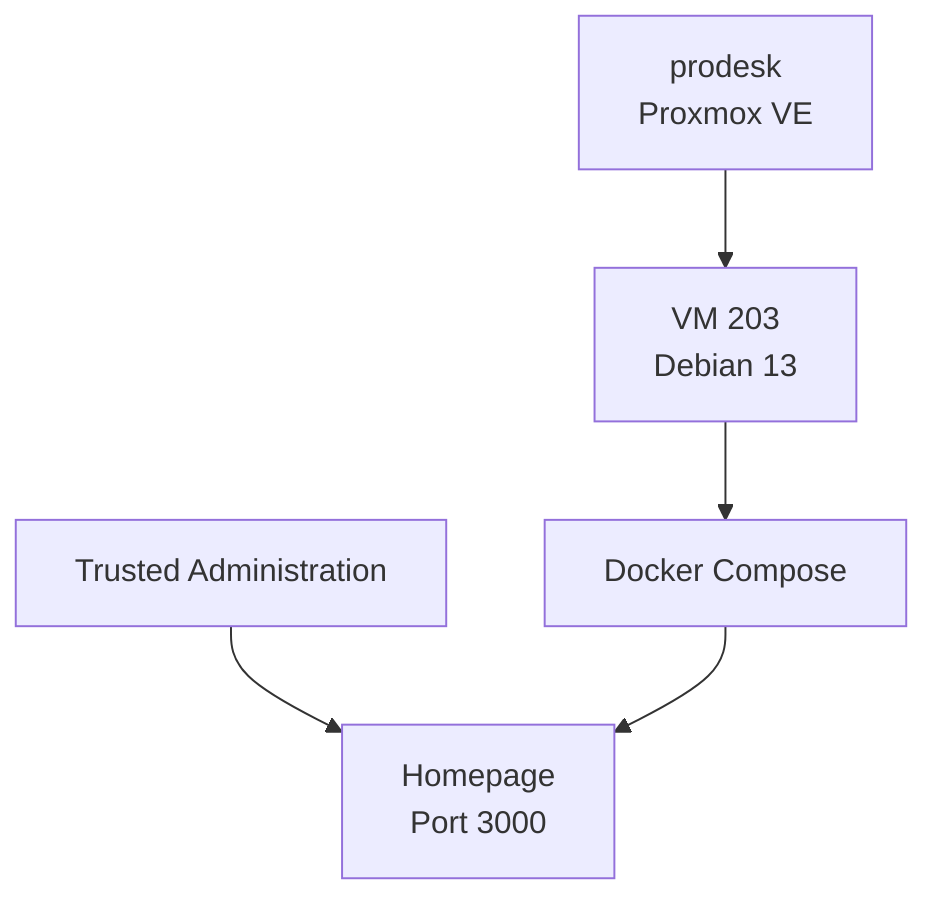
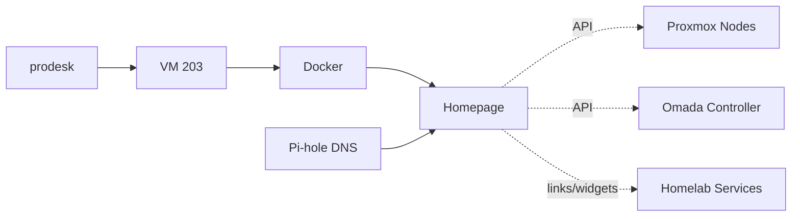

# Homepage Dashboard

This document describes the Homepage dashboard used as the internal service overview for the homelab.

Homepage runs as a dedicated virtual machine on the ProDesk Proxmox host and provides a centralized view of important homelab services, infrastructure status, and selected integrations.

The dashboard is an operational convenience layer. It does not replace the native management interfaces of the systems it displays.

---

## Overview

| Item | Value |
|---|---|
| Service | Homepage |
| Host | `prodesk` |
| VM ID | `203` |
| Guest OS | Debian 13 |
| Network | `INFRA` / VLAN 10 |
| Address | `192.168.10.80` |
| Web interface | HTTP / port `3000` |
| CPU | 2 vCPU |
| Memory | 2 GiB |
| Boot disk | 20 GB |
| Deployment | Docker Compose |
| Container restart policy | `unless-stopped` |
| VM backup | Proxmox Backup Server |

Homepage is used as a single internal entry point for frequently accessed homelab services.

---

# Architecture

Homepage is hosted inside a dedicated Debian VM.



The dashboard then connects to selected internal services and APIs for status information.

```text
Trusted client
      │
      ▼
Homepage
      │
      ├── service links
      ├── Proxmox integrations
      └── selected service widgets
```

---

# Proxmox Deployment

Homepage runs as:

```text
VM 203
```

on:

```text
prodesk
```

Current documented VM resources:

| Resource | Configuration |
|---|---|
| CPU | 2 vCPU |
| Memory | 2 GiB |
| Boot disk | 20 GB |
| Guest OS | Debian 13 |
| Network | `INFRA` |
| Address | `192.168.10.80` |

The VM is dedicated to the dashboard rather than sharing a general-purpose application server with unrelated workloads.

Physical host documentation:

[`../nodes/pve-prodesk.md`](../nodes/pve-prodesk.md)

---

# Application Deployment

Homepage is deployed through Docker Compose inside the Debian VM.

Conceptually:

```text
Debian 13 VM
     │
     ▼
Docker
     │
     ▼
Docker Compose
     │
     ▼
Homepage
```

The Homepage container uses:

```text
restart: unless-stopped
```

This allows the application to return automatically after normal VM or Docker restarts.

---

# Web Interface

Homepage is available internally on:

```text
http://192.168.10.80:3000
```

The dashboard is intended for internal use from trusted administration paths.

It is not intentionally exposed directly to the public Internet.

---

# Purpose

Homepage provides a centralized navigation and status layer for the homelab.

Typical uses include:

- quick links to management interfaces
- service organization
- infrastructure overview
- selected API-backed status information
- Proxmox node visibility
- operational shortcuts

The dashboard is not considered authoritative for configuration.

Each underlying service remains managed through its own native interface.

---

# Proxmox Integrations

Homepage uses Proxmox API integrations to display information from the virtualization environment.

The current Proxmox environment consists of:

```text
pve-main
prodesk
elitedesk
pve-game-server
```

The dashboard should treat each Proxmox host as a separate API endpoint.

Conceptually:

```text
Homepage
   │
   ├── pve-main API
   ├── prodesk API
   ├── elitedesk API
   └── pve-game-server API
```

API access should use dedicated read-only credentials with only the permissions required for monitoring.

The public repository must not contain:

- API tokens
- API secrets
- passwords
- private authentication material

---

# Privilege Separation

The Proxmox integrations use restricted monitoring credentials rather than administrative accounts.

The intended model is:

```text
Homepage
   │
   │ read-only API access
   ▼
Proxmox
```

This reduces the impact of a dashboard compromise because Homepage does not require full administrative privileges simply to display status information.

The Proxmox API accounts should remain limited to the minimum privileges required for dashboard functionality.

---

# Service Cards

Homepage can provide direct links to internal services such as:

- Proxmox VE
- TrueNAS
- Proxmox Backup Server
- Pi-hole
- Home Assistant
- Immich
- Omada Controller
- Uptime Kuma
- game-server administration

A service card is primarily a navigation element.

Where supported, widgets can supplement the card with API-backed information.

---

# Widget Integrations

Some Homepage widgets require direct API communication with the underlying service.

This creates additional dependencies beyond a simple hyperlink.

Conceptually:

```text
Service card
   │
   ├── URL only
   │
   └── optional API widget
```

A failed widget does not necessarily mean the underlying service is unavailable.

For troubleshooting, the native service interface should always be checked independently.

---

# Omada Integration

Homepage can integrate with the Omada Controller for network information.

This integration requires authenticated API communication over HTTPS.

Certificate trust and authentication should be handled explicitly rather than weakening TLS validation globally.

The preferred model is:

```text
Homepage
      │
      │ trusted HTTPS
      ▼
Omada Controller
```

If an Omada widget is disabled or unavailable, the normal Omada management interface and network operation remain unaffected.

Detailed Omada documentation:

[`omada-controller.md`](omada-controller.md)

---

# Networking

Homepage resides on:

```text
INFRA / VLAN 10
```

Address:

```text
192.168.10.80
```

Administration originates from the trusted management network.

Because Homepage communicates with several infrastructure services, it is treated as an internal infrastructure application rather than as a normal client.

---

# DNS

Homepage uses the redundant Pi-hole DNS infrastructure.

```text
Homepage
    │
    ▼
Pi-hole 1 / Pi-hole 2
```

The two DNS instances are located on separate physical Proxmox hosts.

Detailed DNS documentation:

[`pihole.md`](pihole.md)

---

# Service Dependencies

The core Homepage service depends on:

- `prodesk`
- VM 203
- Debian
- Docker
- Docker Compose
- Homepage container
- `INFRA` networking
- DNS

Individual widgets may add dependencies on their respective services or APIs.

Simplified relationship:



---

# Failure Scenarios

## Homepage Application Failure

Affected:

- dashboard interface
- dashboard widgets
- centralized service navigation

Not affected:

- underlying homelab services
- Proxmox
- routing
- DNS
- storage
- Home Assistant
- game servers

The dashboard is not in the critical data path.

---

## VM 203 Failure

Homepage becomes unavailable.

The services linked from the dashboard remain independently accessible through their normal interfaces.

---

## `prodesk` Failure

Homepage becomes unavailable because VM 203 is hosted on `prodesk`.

Other effects depend on the additional workloads hosted on ProDesk.

Services running on `pve-main`, `elitedesk`, and `pve-game-server` can continue operating independently if their own dependencies remain available.

---

## DNS Failure

If both Pi-hole DNS servers are unavailable, Homepage may have difficulty reaching integrations configured by hostname.

Direct IP-based links may continue to work depending on the configuration.

---

## API Integration Failure

A service may remain fully operational even when its Homepage widget fails.

Possible causes include:

- API credential failure
- insufficient permissions
- certificate validation
- changed API endpoint
- service update
- networking issue

The native service interface should be used to distinguish a widget problem from an actual service outage.

---

# Backup

VM 203 is included in the Proxmox backup architecture.

Backups are stored through:

```text
Proxmox Backup Server
```

running on:

```text
prodesk
```

The VM backup can protect:

- Debian installation
- Docker configuration
- Homepage configuration
- service definitions
- widget configuration
- local application state

Credentials and secret values should not be committed to the public GitHub repository even if they are included inside private VM backups.

Detailed backup documentation:

[`proxmox-backup-server.md`](proxmox-backup-server.md)

---

# Recovery

Homepage is comparatively simple to validate after a restore.

Recommended recovery sequence:

```text
Restore / start VM 203
        │
        ▼
Verify networking
        │
        ▼
Verify Docker
        │
        ▼
Verify Homepage container
        │
        ▼
Open dashboard
        │
        ▼
Test representative integrations
```

---

## Recovery Validation

After recovery, verify:

- VM 203 is running
- `192.168.10.80` is reachable
- Docker is running
- Homepage container is running
- port `3000` responds
- dashboard configuration loads
- service links are correct
- Proxmox widgets respond
- DNS works
- selected API integrations work

A working dashboard page alone does not confirm that all API-backed integrations are healthy.

---

# Maintenance

Typical maintenance includes:

- Debian updates
- Docker updates
- Homepage image updates
- Docker Compose configuration review
- widget/API validation
- backup verification
- credential rotation when required

---

## Update Workflow

A typical Homepage update can follow:

```text
Verify current dashboard
        │
        ▼
Confirm recent backup
        │
        ▼
Pull updated container image
        │
        ▼
Recreate container
        │
        ▼
Validate dashboard
        │
        ▼
Validate integrations
```

Configuration should be preserved independently of the container lifecycle.

---

# Monitoring

Homepage itself can be monitored through:

- Proxmox VM state
- Docker container state
- HTTP availability on port `3000`
- Uptime Kuma
- manual dashboard validation

Because Homepage is not a critical infrastructure dependency, monitoring should focus on availability rather than introducing unnecessary complexity.

---

# Security

Homepage has visibility into a large portion of the homelab and may contain authenticated API integrations.

It should therefore be treated as sensitive internal infrastructure.

Current design principles include:

- hosted on `INFRA`
- administration from `TRUSTED`
- no intentional direct public exposure
- read-only API permissions where possible
- credentials excluded from GitHub
- internal services remain independently authenticated

Homepage should not become a path for broad administrative access simply because it aggregates links and status information.

---

# Public Repository Security

The public repository may safely document:

- service architecture
- internal RFC1918 address
- VM ID
- Docker deployment model
- generic integration relationships
- read-only API design

Do not publish:

- API tokens
- API secrets
- passwords
- session cookies
- authentication headers
- private certificates or keys
- sensitive widget configuration
- external access credentials

Example configuration committed to GitHub should use placeholders where authentication values would normally appear.

---

# Design Decisions

## Dedicated VM

Running Homepage in its own Debian VM provides:

- isolation
- independent updates
- predictable network identity
- simple Proxmox backup
- straightforward troubleshooting
- easy rebuild or restore

---

## Docker Compose Deployment

Docker Compose keeps the application deployment compact and reproducible.

It provides a clear place to define:

- container image
- ports
- volumes
- restart behavior
- environment configuration

Secrets should remain outside public configuration examples.

---

## Central Dashboard, Not Central Control

Homepage aggregates information but does not replace the native administration interfaces.

This means a dashboard failure has a small operational blast radius.

```text
Homepage unavailable
        │
        ▼
Services remain independently manageable
```

This separation is intentional.

---

## Read-Only Integrations

Monitoring integrations should use the minimum permissions needed to retrieve status information.

For Proxmox, this means using dedicated read-only API access rather than a full administrative account.

This follows the same least-privilege principle used in the network architecture.

---

# Current State

Current confirmed state:

- Homepage: active
- Host: `prodesk`
- VM ID: `203`
- Guest OS: Debian 13
- CPU: 2 vCPU
- Memory: 2 GiB
- Boot disk: 20 GB
- Network: `INFRA`
- Address: `192.168.10.80`
- Deployment: Docker Compose
- Web interface: port `3000`
- Container restart policy: `unless-stopped`
- Proxmox API integrations: in use
- VM backup through PBS: available
- Direct public exposure: not used

---

# Roadmap

Potential improvements include:

- Review all service cards after workload migrations
- Keep Proxmox integrations aligned with the four-node environment
- Periodically review API permissions
- Re-enable or improve widgets only where they provide useful operational value
- Add health checks for the dashboard itself
- Keep example configuration sanitized for the public repository
- Periodically test VM restore

---

# Scope of This Document

This file owns Homepage service documentation:

- VM deployment
- Docker Compose deployment
- network placement
- dashboard purpose
- service cards
- integrations
- Proxmox API relationship
- backup and recovery
- maintenance
- security considerations

It does not own:

- credentials
- API tokens
- full Proxmox configuration
- Omada configuration
- service-specific administration
- VLAN or ACL definitions

Those belong in the corresponding node, network, service, security, or private configuration documentation.

---

## Related Documentation

- [`../nodes/pve-prodesk.md`](../nodes/pve-prodesk.md) — physical host
- [`../architecture/logical-topology.md`](../architecture/logical-topology.md) — service relationships
- [`../network/ip-plan.md`](../network/ip-plan.md) — addressing
- [`pihole.md`](pihole.md) — DNS
- [`omada-controller.md`](omada-controller.md) — network management
- [`proxmox-backup-server.md`](proxmox-backup-server.md) — VM backup
- [`uptime-kuma.md`](uptime-kuma.md) — availability monitoring
