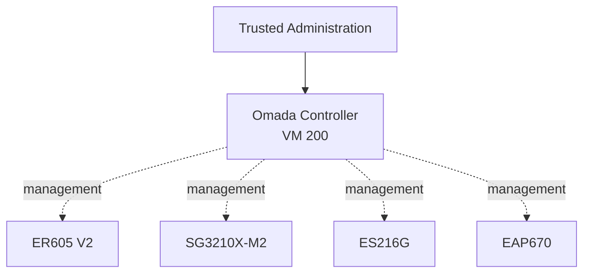

# Omada Controller

This document describes the TP-Link Omada Software Controller used as the central management plane for the homelab network.

The controller runs as a dedicated virtual machine on the ProDesk Proxmox host and manages the gateway, switches, and wireless access point.

TP-Link Cloud Access is not used. The controller is operated locally through the homelab network.

---

## Overview

| Item | Value |
|---|---|
| Service | TP-Link Omada Software Controller |
| Controller version | `6.1.0.19` |
| Host | `prodesk` |
| VM ID | `200` |
| Network | `INFRA` / VLAN 10 |
| Address | `192.168.10.100` |
| CPU | 2 vCPU |
| Memory | 4 GiB |
| Boot disk | 30 GB |
| Machine type | `q35` |
| Cloud Access | Disabled |
| Managed devices | 4 |
| Configuration backup | Manual after significant changes |
| VM backup | Proxmox Backup Server |

The controller is responsible for centralized configuration, monitoring, device adoption, and management of the Omada network infrastructure.

---

# Proxmox Deployment

The Omada Controller runs as:

```text
VM 200
```

on:

```text
prodesk
```

Current verified VM configuration:

| Resource | Configuration |
|---|---|
| CPU | 2 cores |
| Memory | 4 GiB |
| Boot disk | 30 GB |
| Machine type | `q35` |
| BIOS | SeaBIOS |
| SCSI controller | VirtIO SCSI single |
| Network adapter | VirtIO |
| Start at boot | Yes |
| Startup order | `4` |
| QEMU Guest Agent | Enabled |

The VM is configured to start automatically with the Proxmox host.

---

## Guest Operating System

Proxmox classifies the VM as:

```text
Linux
```

The VM currently has a Debian 12.12 Bookworm installation ISO attached to its virtual CD/DVD drive.

This strongly indicates a Debian-based deployment, but the exact currently installed guest distribution/version is not treated as authoritative here until verified from inside the VM.

---

# Controller Version

Current documented Omada Software Controller version:

```text
6.1.0.19
```

Controller versions are expected to change over time as the software is updated.

The version in this document should therefore be treated as a documented current state rather than a permanent architecture value.

---

# Managed Devices

The controller currently manages four Omada devices.

| Device | Role | Management Address | State |
|---|---|---|---|
| ER605 V2 | Gateway / Router | `192.168.0.1` | Connected |
| SG3210X-M2 | Core managed switch | `192.168.10.102` | Connected |
| ES216G | Secondary managed switch | `192.168.10.103` | Connected |
| EAP670 | Wi-Fi 6 access point | `192.168.10.104` | Connected |

At the time of documentation, all four devices reported healthy status in Omada.

Point-in-time uptime and client-count values are intentionally not stored as architectural documentation.

---

# Architecture

The Omada Controller is a **management-plane service**.

It does not sit inline with normal client traffic.



The dashed links represent controller and management communication.

Normal packet forwarding occurs directly through the physical gateway, switches, and access point.

---

# Management Network

The controller resides on:

```text
INFRA / VLAN 10
```

with the stable address:

```text
192.168.10.100
```

Most managed infrastructure also uses `INFRA` for management.

This includes:

- SG3210X-M2
- ES216G
- EAP670

The ER605 is the exception.

Its management interface remains on:

```text
DEFAULT / VLAN 1
```

This is the current intended design.

Detailed addressing is maintained in:

[`../network/ip-plan.md`](../network/ip-plan.md)

---

# Local-Only Management

TP-Link Cloud Access is:

```text
Disabled
```

The Omada Controller is administered locally rather than through TP-Link's cloud management service.

This means normal management does not depend on:

- a TP-Link cloud account
- external cloud availability
- direct Internet exposure of the controller

Remote administration should use the homelab's private remote-access path rather than exposing the controller to the public Internet.

---

# Stable Controller Address

The managed environment uses:

```text
192.168.10.100
```

as the controller address.

No alternate public controller endpoint is part of the current design.

The controller address should be treated as a stable infrastructure anchor because changes can affect:

- device/controller communication
- adoption
- monitoring
- dashboard integrations
- recovery procedures

---

# Management Plane vs. Data Plane

One of the most important characteristics of the design is that the controller is **not the data plane**.

Once configuration has been deployed to the network hardware, the physical devices retain and enforce that configuration locally.

A temporary controller outage should therefore not normally stop already-configured:

- routing
- NAT
- DHCP
- Gateway ACLs
- VLAN forwarding
- Ethernet switching
- Wi-Fi SSIDs

The controller is primarily required for:

- configuration changes
- centralized monitoring
- device adoption
- telemetry
- logs
- historical information
- controller integrations

---

## Expected Behavior During Controller Downtime

| Function | Expected State |
|---|---|
| ER605 routing | Continues |
| NAT | Continues |
| DHCP | Continues |
| Gateway ACL enforcement | Continues |
| SG3210X-M2 switching | Continues |
| ES216G switching | Continues |
| EAP670 Wi-Fi | Continues |
| Omada web interface | Unavailable |
| Central configuration changes | Unavailable |
| Device adoption | Unavailable |
| Controller telemetry/history | Unavailable or limited |

This allows routine controller maintenance without intentionally taking down the network.

---

# Network Configuration Responsibilities

The controller is used to configure and monitor several areas of the network.

These include:

- LAN networks
- VLANs
- DHCP
- gateway routing
- Gateway ACLs
- switch profiles
- trunks
- access ports
- wireless networks
- device adoption
- device health
- logs and events

The controller is the management interface for these functions, but their detailed state belongs in dedicated network documentation.

---

## VLAN Design

The current network uses:

```text
DEFAULT
INFRA
TRUSTED
GAME-DMZ
IOT
GUEST
```

The reasoning and trust model are documented in:

[`../network/vlan-design.md`](../network/vlan-design.md)

---

## IP Plan

Management addresses, gateways, DHCP pools, and DNS endpoints are documented in:

[`../network/ip-plan.md`](../network/ip-plan.md)

This file does not duplicate the complete IP inventory.

---

## Gateway ACLs

Inter-VLAN policy is primarily enforced through:

```text
Gateway ACLs
```

on the ER605.

The controller is used to configure and deploy these rules.

The authoritative ACL rule order and validation belong in:

[`../network/acl-policy.md`](../network/acl-policy.md)

---

## Switch Port Configuration

The controller also manages:

- access ports
- trunks
- native VLANs
- tagged VLANs
- disabled unused ports

The authoritative switch map is:

[`../network/port-mapping.md`](../network/port-mapping.md)

---

# Device Adoption

Managed Omada devices require a valid management path to the controller.

Simplified relationship:

```text
Managed Device
      │
      │ management connectivity
      ▼
192.168.10.100
      │
      ▼
Omada Controller
```

For devices managed through `INFRA`, the required VLAN must be transported correctly across all relevant trunks.

---

# ES216G Incident

A previous ES216G management incident demonstrated the importance of the controller path.

A change to the inter-switch uplink interrupted management traffic between:

```text
ES216G
  │
  ▼
SG3210X-M2
  │
  ▼
Omada Controller
```

Symptoms included:

```text
Adopting...
Adopt Failed
```

The visible adoption failure was not the root cause.

The actual fault was the broken VLAN/management path.

Recovery required:

- local switch access
- restoration of the correct management configuration
- verification of VLAN 10 across the trunk
- verification of controller reachability
- re-adoption into Omada

The full incident report is maintained separately:

[`../network/incidents/es216g-recovery.md`](../network/incidents/es216g-recovery.md)

---

# Controller Backup

Omada configuration backups are currently created:

```text
Manually after significant changes
```

Changes that should trigger a fresh configuration backup include:

- VLAN changes
- Gateway ACL changes
- major switch-port changes
- device adoption or replacement
- wireless configuration changes
- management-path changes

This provides an application-level recovery option independent of the full VM backup.

---

# Proxmox Backup

VM 200 is part of the Proxmox backup architecture.

The VM is backed up to:

```text
Proxmox Backup Server
```

running on:

```text
prodesk
```

This provides two recovery layers:

```text
Omada configuration backup
          +
Full VM backup through PBS
```

---

## Why Both Backup Types Matter

### Omada Configuration Backup

Useful for:

- rebuilding the controller application
- restoring controller configuration
- migrating to a clean installation
- recovering from controller-level configuration problems

### PBS VM Backup

Useful for:

- full VM loss
- OS corruption
- failed upgrade
- accidental VM deletion
- Proxmox host rebuild

The two backup methods protect against different failure scenarios.

---

# Recovery

A complete controller recovery should validate both the VM and the managed network state.

Preferred sequence:

```text
1. Restore or start VM 200
2. Verify 192.168.10.100
3. Verify Omada web interface
4. Verify controller configuration
5. Verify device reachability
6. Verify all four devices reconnect
7. Verify VLAN and ACL state
8. Test representative network paths
```

---

## Recovery Validation

Confirm:

- ER605 V2 connected
- SG3210X-M2 connected
- ES216G connected
- EAP670 connected
- expected VLANs exist
- Gateway ACLs are present
- switch profiles are present
- trunks are correct
- access ports are correct
- wireless networks are operational
- Pi-hole DNS works
- trusted client Internet access works
- IoT isolation works
- GAME-DMZ isolation works
- guest isolation works

A successful controller login alone is not enough to declare the service fully recovered.

---

# Homepage Integration

The internal Homepage dashboard uses the Omada Controller as a data source for network visibility.

The dashboard does not replace the native Omada management interface.

The Omada Controller remains the authoritative management system.

A previous integration issue involved TLS certificate validation between Homepage and the controller.

The preferred solution is to trust the appropriate controller certificate rather than disabling TLS verification globally.

---

# TLS

The controller web interface uses HTTPS.

Internally generated certificates can create trust issues for applications consuming the Omada API.

Preferred integration model:

```text
Client trusts controller certificate
```

instead of:

```text
Disable TLS verification
```

This preserves encrypted internal communication without weakening certificate validation globally.

Credentials and certificates themselves are not committed to the public repository.

---

# Startup Behavior

The Omada VM is configured with:

```text
Start at boot: Yes
Startup order: 4
```

This allows the controller to return automatically when the main Proxmox node starts.

The physical network does not require the controller to boot before normal switching/routing can begin, but automatic controller startup restores centralized management without manual intervention.

---

# Monitoring

The Omada Controller provides operational visibility into:

- device connectivity
- device health
- client counts
- uptime
- logs
- events
- configuration results

At the current documented state:

```text
4 / 4 devices connected
```

All managed devices report healthy status.

Point-in-time traffic, uptime, and client counts are deliberately not stored here because they change continuously.

---

# Maintenance

Normal maintenance includes:

- Omada Controller updates
- guest OS updates
- Proxmox VM backup
- manual controller configuration backup
- device-health review
- log review
- post-update network validation

---

## Pre-Update Checklist

Before updating Omada:

1. Verify all four managed devices are connected.
2. Create a current Omada configuration backup.
3. Confirm a recent PBS backup exists.
4. Record the current controller version.
5. Avoid combining the controller update with VLAN or trunk changes.
6. Apply the update.

---

## Post-Update Validation

After maintenance:

- VM running
- `192.168.10.100` reachable
- Omada web interface available
- ER605 connected
- SG3210X-M2 connected
- ES216G connected
- EAP670 connected
- VLAN configuration present
- Gateway ACLs present
- switch profiles present
- wireless networks operational
- representative clients have expected connectivity

---

# Change Control

Controller-managed changes can affect a large part of the network.

Significant changes should therefore follow:

```text
Document current state
        │
        ▼
Create Omada backup
        │
        ▼
Make one change
        │
        ▼
Verify management connectivity
        │
        ▼
Verify intended traffic
        │
        ▼
Continue
```

Management VLAN and trunk changes require particular care because an error can remove access to the device being modified.

---

## High-Risk Changes

Examples include:

- management VLAN changes
- native VLAN changes
- inter-switch trunk changes
- gateway uplink changes
- controller addressing changes
- large ACL changes

These should have an explicit rollback path before implementation.

---

# Failure Scenarios

## Omada VM Failure

Affected:

- centralized management
- telemetry
- configuration changes
- adoption
- controller integrations

Expected to continue:

- routing
- NAT
- DHCP
- switching
- VLAN enforcement
- Gateway ACL enforcement
- Wi-Fi

---

## `prodesk` Failure

The controller is unavailable because it runs on the ProDesk Proxmox node.

However, the physical Omada devices remain powered independently and retain their deployed configuration.

---

## Controller Address Change

Changing:

```text
192.168.10.100
```

can affect:

- managed device communication
- adoption
- Homepage
- monitoring
- documentation
- recovery procedures

The address should therefore remain stable unless a deliberate migration is planned.

---

## Management VLAN Failure

The controller can remain fully operational while an individual managed device loses controller communication.

Troubleshooting should then focus on:

- management VLAN
- trunk configuration
- native/tagged VLAN state
- device address
- gateway path
- controller reachability

before changing unrelated infrastructure.

---

# Security

The Omada Controller is a high-value service because it can modify the network.

Current controls include:

- controller hosted on `INFRA`
- administration from `TRUSTED`
- Cloud Access disabled
- no intentional direct public exposure
- PBS VM backup
- manual application backup
- segmented network
- credentials stored outside GitHub

---

# Public Repository Security

Do not publish:

- Omada administrator credentials
- device credentials
- API tokens
- session cookies
- cloud account information
- private keys
- controller backup files containing secrets
- complete MAC-address inventories
- device serial numbers

Internal RFC1918 addresses and hardware models are retained where they provide useful architecture context.

---

# Design Decisions

## Software Controller as a VM

Running Omada as a VM provides:

- isolation
- predictable management address
- Proxmox backup
- easy recovery
- no requirement for dedicated controller hardware

---

## Local-Only Management

Cloud Access is disabled.

This keeps normal network administration local and removes external cloud availability as a dependency.

---

## Controller on INFRA

The controller is a management service and therefore resides on the infrastructure network.

This provides a clear relationship to the switches and access point it manages.

---

## Stable Controller Address

The fixed address:

```text
192.168.10.100
```

reduces complexity for:

- adoption
- monitoring
- integrations
- troubleshooting
- documentation

---

## Separate Management and Forwarding Roles

The controller configures the network but does not forward normal client traffic itself.

This reduces the blast radius of controller maintenance or controller VM failure.

---

# Current State

Current confirmed state:

- Omada Software Controller: active
- Version: `6.1.0.19`
- Host: `prodesk`
- VM ID: `200`
- CPU: 2 vCPU
- Memory: 4 GiB
- Boot disk: 30 GB
- Machine type: `q35`
- BIOS: SeaBIOS
- VirtIO SCSI: configured
- VirtIO networking: configured
- Start at boot: enabled
- Startup order: `4`
- QEMU Guest Agent: enabled
- Network: `INFRA`
- Address: `192.168.10.100`
- Cloud Access: disabled
- ER605 V2: connected
- SG3210X-M2: connected
- ES216G: connected
- EAP670: connected
- Manual controller backup after significant changes: in use
- PBS VM backup: in use
- ES216G management incident: resolved

---

# Roadmap

Potential improvements include:

- Verify installed guest OS/version from inside VM
- Define a regular controller configuration-backup cadence
- Periodically test controller restore
- Continue management-plane hardening
- Maintain rollback procedures for management-path changes
- Review VM memory use after major Omada upgrades
- Keep the controller address stable

---

# Scope of This Document

This file owns documentation for the Omada Controller service:

- Proxmox deployment
- controller version
- VM resources
- managed devices
- management-plane role
- local-only operation
- backup
- recovery
- adoption behavior
- maintenance
- security considerations

It does not own:

- detailed VLAN design
- complete IP plan
- Gateway ACL rule definitions
- switch port mappings
- ES216G incident details
- device credentials

Those belong in the dedicated network and security documentation.

---

## Related Documentation

- [`../nodes/pve-prodesk.md`](../nodes/pve-prodesk.md) — physical host
- [`../network/README.md`](../network/README.md) — network overview
- [`../network/vlan-design.md`](../network/vlan-design.md) — VLAN architecture
- [`../network/ip-plan.md`](../network/ip-plan.md) — addressing
- [`../network/acl-policy.md`](../network/acl-policy.md) — Gateway ACL policy
- [`../network/port-mapping.md`](../network/port-mapping.md) — switch connectivity
- [`../network/incidents/es216g-recovery.md`](../network/incidents/es216g-recovery.md) — ES216G incident
- [`proxmox-backup-server.md`](proxmox-backup-server.md) — VM backup
