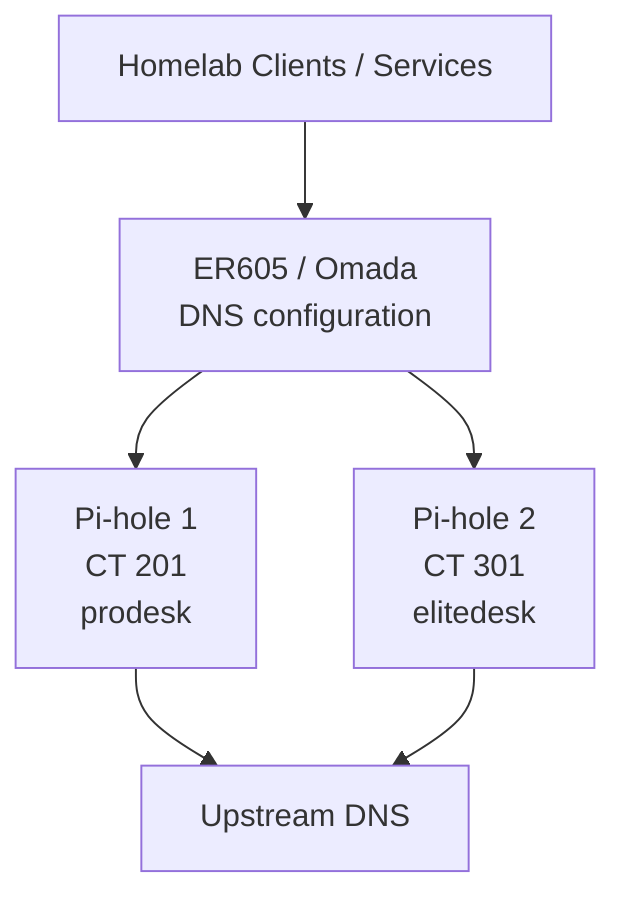

# Pi-hole

This document describes the redundant Pi-hole DNS service used by the homelab.

Two Pi-hole instances run on separate physical Proxmox hosts and are provided to the active VLANs through the Omada gateway configuration.

The two instances are intentionally configured to serve the same role so that DNS remains available if one Pi-hole container or one Proxmox host is unavailable.

---

## Overview

| Instance | Host | Container ID | Address | Role |
|---|---|---:|---|---|
| Pi-hole 1 | `prodesk` | `201` | `192.168.10.90` | DNS resolver / filtering |
| Pi-hole 2 | `elitedesk` | `301` | `192.168.10.91` | DNS resolver / filtering |

Both instances reside on:

```text
INFRA / VLAN 10
```

Both are configured as DNS servers for the active VLANs through Omada.

DNS failover has been tested and confirmed to work.

---

# Purpose

Pi-hole provides:

- Local DNS resolution
- DNS-based filtering
- Redundant DNS service
- Query visibility
- Central DNS configuration for the segmented network

The important architectural goal is not only ad/tracker filtering.

The two-instance design prevents normal DNS resolution from depending on one container or one physical Proxmox host.

---

# Architecture

The two Pi-hole instances are placed on different physical hosts.



Physical placement:

```text
prodesk
└── Pi-hole 1

elitedesk
└── Pi-hole 2
```

This means that the two DNS servers do not share the same physical compute failure domain.

---

# Instance Configuration

The two Pi-hole containers use the same general resource configuration.

| Resource | Pi-hole 1 | Pi-hole 2 |
|---|---:|---:|
| Container ID | `201` | `301` |
| CPU | 1 core | 1 core |
| Memory | 256 MiB | 256 MiB |
| Swap | 256 MiB | 256 MiB |
| Root disk | ~8 GB | ~8 GB |
| Platform | Debian-based LXC | Debian-based LXC |
| Host | `prodesk` | `elitedesk` |

Both containers are lightweight because DNS filtering requires very little compute capacity in this environment.

---

# Pi-hole 1

Host:

```text
prodesk
```

Container:

```text
CT 201
```

Address:

```text
192.168.10.90
```

Internal web interface:

```text
https://192.168.10.90
```

Role:

- DNS resolver
- DNS filtering
- One half of the redundant DNS pair

If the ProDesk host is unavailable, Pi-hole 1 is also unavailable.

Pi-hole 2 remains on the separate EliteDesk node.

---

# Pi-hole 2

Host:

```text
elitedesk
```

Container:

```text
CT 301
```

Address:

```text
192.168.10.91
```

Internal web interface:

```text
https://192.168.10.91
```

Role:

- DNS resolver
- DNS filtering
- Second half of the redundant DNS pair

If the EliteDesk is unavailable, Pi-hole 1 remains available on `prodesk`.

---

# DNS Distribution

The ER605/Omada network configuration provides both Pi-hole addresses to the active VLANs.

Current DNS pair:

```text
192.168.10.90
192.168.10.91
```

The following networks use the Pi-hole pair:

- `INFRA`
- `TRUSTED`
- `GAME-DMZ`
- `IOT`
- `GUEST`

`DEFAULT` is intentionally restricted and is not part of the normal DNS service model.

Detailed network configuration belongs in:

[`../network/ip-plan.md`](../network/ip-plan.md)

---

# Redundancy

The DNS architecture is designed around two separate failure domains.

```text
Pi-hole 1
   │
   └── prodesk

Pi-hole 2
   │
   └── elitedesk
```

This protects DNS availability against:

- Pi-hole service failure
- LXC failure
- maintenance on one Proxmox host
- complete failure of one Proxmox host

It does not provide protection against failures shared by both systems, such as:

- core network outage
- gateway failure
- complete local power loss
- site-wide failure

---

## Tested Failover

Failover between the two Pi-hole instances has been tested.

Confirmed behavior:

```text
One Pi-hole unavailable
        │
        ▼
Clients continue using the remaining DNS server
```

Result:

```text
DNS resolution remains available
```

This is an important distinction between **configured redundancy** and **verified redundancy**.

The current design has been function-tested.

---

# Network Segmentation

Both Pi-hole servers reside on `INFRA`.

Several lower-trust VLANs are otherwise blocked from initiating general traffic toward infrastructure.

DNS therefore uses explicit Gateway ACL exceptions.

Restricted networks receive access only to the DNS service rather than broad access to `INFRA`.

Conceptually:

```text
IOT
GAME-DMZ
GUEST
   │
   │ DNS port 53 only
   ▼
Pi-hole 1 / Pi-hole 2
```

Detailed rules are documented in:

[`../network/acl-policy.md`](../network/acl-policy.md)

---

## DNS ACL Object

The network ACL design uses a dedicated object for Pi-hole DNS access.

Conceptually:

```text
PIHOLE-DNS-53
```

represents:

```text
Pi-hole 1
Pi-hole 2
DNS port 53
```

This object is used by narrow permit rules for isolated VLANs.

The addresses themselves are maintained in:

[`../network/ip-plan.md`](../network/ip-plan.md)

---

# DNS Filtering

Both Pi-hole instances provide DNS-based filtering.

The Pi-hole dashboards provide operational visibility into:

- total DNS queries
- blocked queries
- active clients
- query types
- upstream resolution
- permitted domains
- blocked domains

These values vary continuously and are therefore **not stored as static numbers in this documentation**.

The repository documents the architecture and configuration role rather than point-in-time statistics.

---

# Blocklists

The Pi-hole instances use DNS blocklists to filter unwanted domains.

The current dashboard shows a large shared domain-list set configured on the instances.

The exact count is not treated as architectural state because list sizes change as upstream sources update.

The important operational requirement is that both Pi-hole instances maintain equivalent filtering configuration.

---

# Configuration Consistency

The two instances are intended to be functionally identical.

This includes the same general:

- DNS role
- blocklist policy
- filtering behavior
- upstream resolver configuration
- network availability expectations

The goal is that clients should receive equivalent DNS behavior regardless of which Pi-hole answers a request.

Configuration drift between the two instances should therefore be avoided.

---

# Upstream Resolution

Pi-hole forwards queries that are not answered locally or blocked to configured upstream DNS resolvers.

The specific upstream resolver addresses are intentionally not duplicated here because they are implementation details that may change independently from the homelab architecture.

Changes to upstream resolution should be applied consistently to both Pi-hole instances.

---

# Service Dependencies

Pi-hole itself depends on:

- its Proxmox host
- LXC
- `INFRA` networking
- upstream DNS connectivity
- the local gateway/network path

Clients depend on at least one Pi-hole instance for normal DNS resolution.

Simplified relationship:

```text
Client
   │
   ▼
Pi-hole
   │
   ▼
Upstream DNS
```

With redundancy:

```text
              ┌── Pi-hole 1 ──┐
Client ───────┤               ├── Upstream DNS
              └── Pi-hole 2 ──┘
```

---

# Failure Scenarios

## Pi-hole 1 Failure

Affected:

```text
Pi-hole 1
```

Expected result:

```text
Pi-hole 2 continues answering DNS
```

---

## Pi-hole 2 Failure

Affected:

```text
Pi-hole 2
```

Expected result:

```text
Pi-hole 1 continues answering DNS
```

---

## `prodesk` Failure

Affected:

- Pi-hole 1
- other services hosted on `prodesk`

Pi-hole 2 remains available on `elitedesk`.

---

## `elitedesk` Failure

Affected:

- Pi-hole 2

Pi-hole 1 remains available on `prodesk`.

---

## Both Pi-hole Instances Unavailable

Normal client DNS resolution will fail unless another resolver is configured.

This is why both instances should not be taken offline simultaneously during normal maintenance.

---

# Maintenance

Pi-hole maintenance includes:

- Pi-hole updates
- Debian/container updates
- blocklist updates
- DNS validation
- configuration consistency checks
- resource monitoring
- backup validation

Maintenance should normally be performed one instance at a time.

---

## Safe Maintenance Sequence

Preferred process:

```text
Verify both Pi-holes healthy
        │
        ▼
Maintain Pi-hole 1
        │
        ▼
Verify DNS through Pi-hole 2
        │
        ▼
Return Pi-hole 1 to service
        │
        ▼
Verify both healthy
        │
        ▼
Maintain Pi-hole 2
```

This preserves DNS availability during planned maintenance.

---

## Post-Maintenance Validation

After updating or restarting a Pi-hole instance:

1. Confirm the LXC is running.
2. Confirm the management interface is reachable.
3. Verify DNS resolution through the instance.
4. Verify blocklist/filtering functionality.
5. Confirm clients continue resolving normally.
6. Confirm both DNS servers are still configured in Omada.

---

# Backup and Recovery

The Pi-hole containers are suitable for PBS backup because they are small and infrastructure-critical.

Pi-hole configuration can also be exported independently if a service-level recovery method is desired.

A complete recovery should verify:

- container boot
- correct network address
- Pi-hole service startup
- DNS resolution
- blocklist configuration
- Omada still references both DNS addresses

---

# Monitoring

Pi-hole health can be observed through:

- Proxmox container status
- Pi-hole web dashboard
- DNS query activity
- Homepage integrations
- external/internal DNS checks

Monitoring should focus on whether the service is actually answering DNS, not merely whether the LXC is running.

---

# Security

Pi-hole is treated as internal infrastructure.

Current principles include:

- service hosted on `INFRA`
- administration from `TRUSTED`
- no intentional direct public exposure
- isolated VLANs receive only required DNS access
- credentials excluded from GitHub

The public repository does not contain:

- Pi-hole passwords
- API/authentication secrets
- private tokens
- detailed client query histories
- personal browsing history

---

# Privacy Considerations

Pi-hole query logs can reveal which domains individual clients access.

That information has operational value inside the homelab but should not be published as part of the GitHub repository.

Screenshots containing:

- client query histories
- identifiable client names
- detailed browsing activity

should therefore be reviewed or sanitized before being committed publicly.

Static documentation should focus on the DNS architecture rather than user activity.

---

# Design Decisions

## Two Instances Instead of One

DNS is a foundational service.

Running only one Pi-hole would make DNS availability depend on:

- one container
- one Proxmox node

Two instances on separate hosts provide a simple and effective resilience improvement.

---

## Different Physical Hosts

The two Pi-holes are deliberately not placed on the same Proxmox node.

```text
Two containers on one host
```

would protect against some application-level failures but not against host failure.

The current placement provides:

```text
Application redundancy
+
Host-level separation
```

---

## Central DNS Through Omada

The Pi-hole pair is configured at the network level through the gateway.

This means clients receive the DNS architecture automatically through the normal network configuration rather than relying on manual DNS configuration per device.

---

## DNS Exceptions Instead of Broad INFRA Access

`IOT`, `GAME-DMZ`, and `GUEST` need DNS but should not receive unrestricted access to infrastructure.

The ACL model therefore permits:

```text
DNS only
```

instead of:

```text
Full VLAN access
```

This follows the least-privilege design used throughout the network.

---

# Current State

Current confirmed state:

- Pi-hole 1: active
- Pi-hole 2: active
- Pi-hole 1 host: `prodesk`
- Pi-hole 2 host: `elitedesk`
- Pi-hole 1 address: `192.168.10.90`
- Pi-hole 2 address: `192.168.10.91`
- Both containers: 1 vCPU
- Both containers: 256 MiB RAM
- Both containers: 256 MiB swap
- Both containers: ~8 GB root disk
- Both provided through Omada DNS configuration
- DNS available across required VLANs
- Cross-VLAN DNS ACL exceptions: active
- DNS failover: tested successfully

---

# Roadmap

Potential improvements include:

- Formalize configuration synchronization between both Pi-hole instances
- Add a documented service-level restore procedure
- Periodically retest failover
- Continue reviewing blocklists
- Add automated health checks for DNS response
- Ensure updates are performed sequentially rather than simultaneously

---

# Public Repository Notes

This document intentionally excludes:

- passwords
- Pi-hole authentication secrets
- API tokens
- detailed DNS query logs
- browsing history
- MAC addresses
- Tailscale addresses
- public/WAN information

Internal RFC1918 DNS addresses are included because they are part of the documented network architecture.

---

# Scope of This Document

This file owns documentation for the Pi-hole DNS service:

- two-instance architecture
- LXC resources
- physical host placement
- DNS redundancy
- Omada integration
- failover
- ACL relationship
- maintenance
- recovery
- privacy considerations

It does not own:

- full VLAN design
- IP-plan details beyond the Pi-hole endpoints
- complete Gateway ACL definitions
- Proxmox node hardware
- individual client query history

Those belong in the corresponding network and node documentation.

---

## Related Documentation

- [`../nodes/pve-prodesk.md`](../nodes/pve-prodesk.md) — host for Pi-hole 1
- [`../nodes/pve-elitedesk.md`](../nodes/pve-elitedesk.md) — host for Pi-hole 2
- [`../network/ip-plan.md`](../network/ip-plan.md) — DNS and addressing
- [`../network/acl-policy.md`](../network/acl-policy.md) — DNS exceptions
- [`../architecture/logical-topology.md`](../architecture/logical-topology.md) — service relationships
- [`proxmox-backup-server.md`](proxmox-backup-server.md) — PBS backup platform
