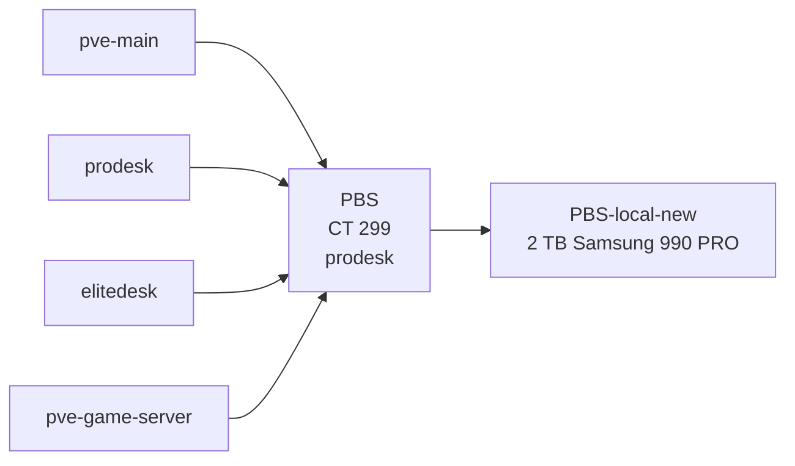

# Proxmox Backup Server

This document describes the Proxmox Backup Server used to protect selected virtual machines and containers in the homelab.

PBS runs as an LXC container on the `prodesk` Proxmox node. Its datastore is stored on a dedicated 2 TB Samsung 990 PRO NVMe mounted separately from the Proxmox system storage.

---

## Overview

| Item | Value |
|---|---|
| Service | Proxmox Backup Server |
| Host | `prodesk` |
| Container ID | `299` |
| Deployment | LXC container |
| Network | `INFRA` / VLAN 10 |
| Address | `192.168.10.50` |
| Backup datastore | `PBS-local-new` |
| Source nodes | Proxmox nodes backed up on staggered jobs |
| Backup mode | Snapshot |
| Schedule | Sunday at 01:00, 02:00, 03:00, and 04:00 |

PBS is the primary VM/LXC backup platform for the local homelab.

It is intended for fast recovery of important virtual workloads rather than for full replication of the TrueNAS bulk-storage pools.

---

# Architecture

The backup design uses a dedicated PBS datastore on the ProDesk while backup jobs are staggered so that the Proxmox nodes do not all start sending backup traffic at the same time.



Backup jobs run sequentially on Sunday:

```text
01:00
02:00
03:00
04:00
```

One source node is scheduled per hour so the four Proxmox nodes do not all start their backup jobs simultaneously.

For workloads on `pve-main`, `elitedesk`, and `pve-game-server`, PBS is on separate physical hardware. Workloads hosted on `prodesk` share the same physical node as PBS and therefore do not have the same host-level failure separation.

---

# Deployment

PBS runs inside LXC container `299` on `prodesk`.

Current container resources:

| Resource | Configuration |
|---|---|
| CPU | 4 cores |
| Memory | 6 GiB |
| Swap | 512 MiB |
| Root disk | 40 GB |
| Container type | Privileged LXC |
| Host | `prodesk` |

The container is currently running on the ProDesk node.

---

## Why Run PBS on `prodesk`?

The ProDesk now carries the local backup role and hosts the dedicated PBS datastore.

The design keeps the PBS datastore physically separate from the storage used by `pve-main`, TrueNAS, Immich, and the dedicated game-server host. This improves recovery options for those systems if their source node fails.

The trade-off is that ProDesk-hosted workloads and PBS share the same physical node. Those workloads therefore require additional protection if host-level separation is needed.

Node documentation:

[`../nodes/pve-prodesk.md`](../nodes/pve-prodesk.md)

---

# Datastore

The active PBS datastore is:

```text
PBS-local-new
```

The datastore resides on a dedicated:

```text
Samsung 990 PRO 2 TB NVMe
```

The disk is formatted as:

```text
ext4
```

and mounted on the ProDesk host at:

```text
/mnt/pbs-datastore
```

The PBS LXC receives the datastore through a bind mount at:

```text
/mnt/backup-local
```

Conceptually:

```text
Samsung 990 PRO 2 TB
        │
        ▼
ProDesk host
/mnt/pbs-datastore
        │
        │ LXC bind mount
        ▼
PBS CT 299
/mnt/backup-local
        │
        ▼
PBS-local-new
```

This datastore is physically separate from the `pve-main` storage and TrueNAS data disks.

---

# Backup Jobs

Backups are scheduled weekly on Sunday and staggered by source node.

Current schedule:

```text
01:00 — one Proxmox node
02:00 — one Proxmox node
03:00 — one Proxmox node
04:00 — one Proxmox node
```

The jobs are intentionally separated by one hour so that all Proxmox nodes do not start sending backup traffic to PBS simultaneously.

Backup mode:

```text
Snapshot
```

Workload selection is maintained in the active Proxmox backup-job configuration and should be reviewed whenever VMs or containers are migrated between nodes.

---

# Backup Mode

The job uses:

```text
Snapshot
```

Snapshot mode allows supported VMs and containers to be backed up without requiring a full shutdown of each workload.

Application consistency still depends on the workload and how it handles live writes.

For important stateful services, successful backup completion should not be treated as proof that application-level recovery has been tested.

---

# Backup Scope

PBS is intended to protect workloads that are:

- important
- time-consuming to rebuild
- configuration-heavy
- operationally significant

Examples include:

- Home Assistant
- Immich
- Omada Controller
- Pi-hole
- TrueNAS VM configuration
- Linux infrastructure
- selected lab workloads

Backup selection can evolve as the homelab changes.

---

# TrueNAS and PBS

TrueNAS requires special treatment.

PBS can back up:

```text
TrueNAS VM 101
```

including the virtual boot disk and VM configuration.

However, the physical TrueNAS data disks are mapped separately to VM 101 with:

```text
backup=0
```

Those disks are therefore **not included** in the normal Proxmox VM backup.

Conceptually:

```text
PBS backup
   │
   ├── TrueNAS boot disk        ✅
   ├── VM configuration         ✅
   │
   └── ZFS data disks           ❌
```

This distinction is critical.

Detailed TrueNAS storage documentation:

[`truenas.md`](truenas.md)

---

# What PBS Protects Well

PBS is well suited to protecting:

- VM boot disks
- LXC filesystems
- VM configuration
- Linux server configuration
- Home Assistant
- Omada Controller
- Pi-hole
- Immich system/application VM
- game-server VMs
- test or lab systems where recovery is useful

---

# What PBS Does Not Replace

PBS does not replace:

- ZFS snapshots
- full NAS data backup
- offsite backup
- application-aware export where required
- game-save-specific backup
- configuration-as-code
- disaster recovery planning

The overall backup design therefore has multiple layers.

---

# Backup Layers

A simplified model is:

```text
Application / configuration backup
              │
              ▼
VM / LXC backup with PBS
              │
              ▼
Separate physical backup host
              │
              ▼
Future offsite protection
```

Each layer protects against a different class of failure.

---

# Retention

The current retention policy is:

```text
keep-last    = 3
keep-weekly  = 8
keep-monthly = 12
```

Retention balances recent recovery points with longer-term weekly and monthly history while remaining within the available datastore capacity.

---

# Recovery

The purpose of PBS is recovery, not merely successful scheduled backup jobs.

A useful recovery process is:

```text
Identify failed workload
        │
        ▼
Select known-good backup
        │
        ▼
Restore VM / LXC
        │
        ▼
Boot workload
        │
        ▼
Validate application
```

Restore validation must continue beyond the point where Proxmox reports that the VM is running.

---

## Recovery Validation

Depending on the service, verify:

- VM/LXC boots
- network configuration is correct
- DNS works
- web interface responds
- storage dependencies are available
- application data is present
- service-specific integrations work

Examples:

### Immich

Verify:

```text
Immich VM
   +
TrueNAS NFS storage
```

### Home Assistant

Verify:

```text
Home Assistant
   +
IoT connectivity
```

### Omada Controller

Verify:

```text
Controller
   +
device connectivity
```

---

# Restore Testing

Regular restore testing should be part of backup maintenance.

Recommended tests include:

- browse backup snapshots
- restore a small non-critical VM/LXC
- validate restored boot
- validate networking
- validate application behavior
- document the restore procedure

A backup that has never been restored is only an unverified recovery candidate.

---

# Failure Scenarios

## Failure of `pve-main`

PBS remains available because it runs on `prodesk`.

Potential recovery path:

```text
pve-main failure
    │
    ▼
repair / rebuild pve-main
    │
    ▼
connect to PBS
    │
    ▼
restore workloads
```

This is the primary reason for separating the backup host from the primary compute host.

---

## Failure of `elitedesk`

Pi-hole 2 and other workloads hosted on the EliteDesk are affected.

PBS remains available on `prodesk`.

---

## Failure of `prodesk`

Affected:

- PBS service
- PBS datastore
- ProDesk-hosted workloads

Backups stored on the local PBS datastore are unavailable until the ProDesk is recovered.

Workloads on `pve-main`, `elitedesk`, and `pve-game-server` can continue operating independently if their own hosts and the network remain available.

---

## Complete Main-Site Failure

PBS is still located at the same physical site as the main homelab.

A complete site-level failure may therefore affect both:

- source systems
- local PBS backup

This is a known limitation.

Offsite backup remains part of the roadmap.

---

# Relationship to Offsite M900

The offsite ThinkCentre M900 and PBS serve different purposes.

## PBS / ProDesk

Best suited for:

- regular VM/LXC backups
- fast local restores
- Proxmox-native recovery
- recent restore points

## Offsite M900

Current primary role:

- external monitoring
- Tailscale
- utility services

Potential future role:

- selected offsite backup data

The M900 does not currently provide a full second copy of the PBS datastore or the complete TrueNAS dataset.

---

# Networking

PBS resides on:

```text
INFRA / VLAN 10
```

Address:

```text
192.168.10.50
```

Backup traffic from authorized Proxmox hosts uses the internal infrastructure network.

PBS management is not intentionally exposed directly to the public Internet.

Administrative access originates from trusted management paths.

---

# Security

Backup infrastructure should be treated as sensitive.

A backup system may contain copies of:

- operating systems
- configuration
- application data
- service credentials stored inside guest filesystems
- internal topology information

Current principles include:

- PBS on `INFRA`
- no intentional public exposure
- administration from trusted systems
- credentials excluded from GitHub
- separate physical host from workloads on the other Proxmox nodes

The public repository does not contain:

- PBS passwords
- API tokens
- datastore credentials
- encryption keys
- backup authentication secrets

---

# Monitoring

PBS should be monitored at several levels.

## Container Level

Monitor:

- container state
- CPU usage
- memory usage
- filesystem capacity

## PBS Level

Monitor:

- datastore health
- backup-job completion
- failed jobs
- pruning/retention
- verification jobs if configured
- available storage

## Recovery Level

Monitor indirectly through periodic restore testing.

A datastore reporting healthy does not by itself prove that every backup is recoverable.

---

# Maintenance

Typical maintenance includes:

- Debian/container updates
- PBS updates
- datastore capacity review
- backup-job review
- pruning/retention validation
- backup verification
- restore tests
- underlying NVMe health checks

---

## Pre-Maintenance Checklist

Before PBS or ProDesk maintenance:

1. Confirm no backup or restore job is currently running.
2. Review recent job results.
3. Check datastore free space.
4. Confirm Pi-hole 2 is available if the ProDesk will be rebooted.
5. Record failed jobs requiring investigation.
6. Stop services cleanly if required.

---

## Post-Maintenance Validation

After maintenance:

- `prodesk` online
- PBS container running
- PBS management interface reachable
- `PBS-local-new` available
- datastore writable
- source Proxmox hosts can reach PBS
- backup jobs still enabled
- no unexpected datastore errors

---

# Capacity Considerations

The dedicated 2 TB PBS datastore has limited capacity compared with the main TrueNAS system.

PBS storage should therefore prioritize workloads where VM/LXC recovery provides the greatest value.

The backup platform is not sized to hold a complete duplicate of all NAS data.

Future capacity planning should consider:

- backup growth
- retention length
- number of protected workloads
- game-server backup requirements
- potential additional services
- offsite replication strategy

---

# Design Decisions

## Dedicated PBS Datastore on ProDesk

PBS uses a dedicated 2 TB Samsung 990 PRO on `prodesk`.

For workloads hosted on the other Proxmox nodes, this provides a physical host boundary between the source workload and the backup datastore.

For workloads hosted on `prodesk` itself, that host-level separation does not exist, which is an acknowledged limitation of the current design.

---

## PBS Inside LXC

PBS currently runs as container `299` rather than as a separate bare-metal installation.

The datastore is bind-mounted into the container from dedicated host storage.

The trade-off is that PBS availability depends on the ProDesk Proxmox host and the LXC environment.

---

## Selected-Guest Backup

The main backup job uses:

```text
Include selected VMs
```

rather than blindly backing up every temporary workload.

This allows backup capacity to be focused on systems with actual recovery value.

Selection should be periodically reviewed as workloads are added, migrated, or removed.

---

# Current State

Current confirmed state:

- PBS container `299`: running
- Host: `prodesk`
- CPU: 4 cores
- Memory: 6 GiB
- Swap: 512 MiB
- Root disk: 40 GB
- Network: `INFRA`
- Address: `192.168.10.50`
- Datastore: `PBS-local-new`
- Datastore device: Samsung 990 PRO 2 TB
- Datastore filesystem: ext4
- Host mount: `/mnt/pbs-datastore`
- LXC mount: `/mnt/backup-local`
- Backup mode: Snapshot
- Backup schedule: Sunday at 01:00, 02:00, 03:00, and 04:00
- Backup jobs: staggered one source node at a time
- Retention: keep-last 3 / keep-weekly 8 / keep-monthly 12
- Full TrueNAS data backup: not provided by PBS

---

# Roadmap

Planned improvements include:

- Perform regular restore tests
- Review backup selection after workload migrations
- Monitor datastore growth
- Add verification jobs where appropriate
- Improve offsite backup coverage
- Document disaster-recovery procedures for rebuilding `pve-main`
- Consider backup protection for selected offsite-critical data

---

# Public Repository Notes

This document intentionally excludes:

- PBS usernames
- passwords
- API tokens
- encryption keys
- datastore secrets
- MAC addresses
- Tailscale addresses
- public endpoints
- private authentication details

Internal RFC1918 addressing and non-secret backup configuration are retained because they provide architectural value.

---

# Scope of This Document

This file owns the PBS service documentation:

- deployment
- container resources
- datastore role
- backup job
- backup scope
- recovery model
- failure impact
- maintenance
- capacity considerations

It does not own:

- ProDesk hardware
- TrueNAS pool configuration
- application-specific backup procedures
- game-save scripts
- offsite backup implementation
- credentials

Those belong in the corresponding node, service, security, and configuration documentation.

---

## Related Documentation

- [`../nodes/pve-prodesk.md`](../nodes/pve-prodesk.md) — physical backup host
- [`../nodes/pve-main.md`](../nodes/pve-main.md) — primary storage/workload host
- [`truenas.md`](truenas.md) — NAS and ZFS storage
- [`../security/backup-strategy.md`](../security/backup-strategy.md) — overall backup architecture
- [`../nodes/offsite-m900.md`](../nodes/offsite-m900.md) — offsite node
- [`game-servers.md`](game-servers.md) — game-server backup considerations
