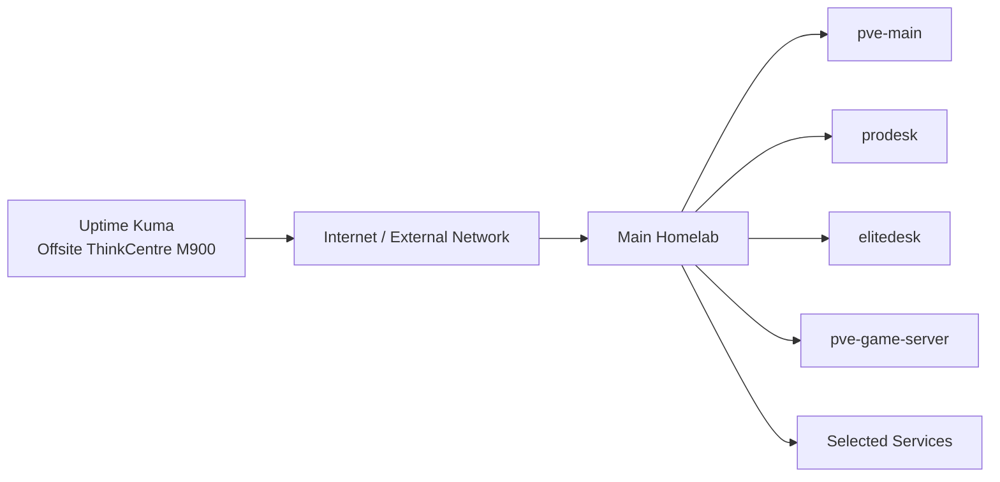

# Uptime Kuma

This document describes the Uptime Kuma deployment used for independent availability monitoring of the homelab.

Uptime Kuma runs directly on the offsite Lenovo ThinkCentre M900 rather than inside a Proxmox VM or LXC container.

The ThinkCentre is physically separated from the main homelab and runs Debian 12 minimal. This placement allows monitoring to remain available during failures that may affect the entire local homelab.

---

## Overview

| Item | Value |
|---|---|
| Service | Uptime Kuma |
| Host | Offsite ThinkCentre M900 |
| Host OS | Debian 12 minimal |
| Virtualization | None |
| Role | External availability monitoring |
| Remote administration | SSH / Tailscale |
| Physical location | Separate from the main homelab |
| Application installation method | Host-level deployment; exact method not documented here |

Uptime Kuma provides an independent view of whether important homelab systems and services are reachable.

---

# Purpose

Monitoring is most useful when it does not share the same failure domain as the infrastructure being monitored.

Hosting Uptime Kuma inside the main homelab would make it unavailable during failures such as:

- complete local power loss
- gateway failure
- local Internet outage
- core network failure
- failure of the Proxmox host running the monitoring service

The offsite deployment avoids this dependency.

---

# Architecture

The monitoring path is intentionally external to the main site.



The important design principle is:

```text
Monitoring host
      ≠
Main homelab failure domain
```

---

# Host Platform

Uptime Kuma runs on:

```text
Lenovo ThinkCentre M900
```

with:

```text
Debian 12 minimal
```

The ThinkCentre is not a Proxmox node and Uptime Kuma is not assigned a VM or container ID.

The service therefore depends directly on the physical Debian host.

Detailed node documentation:

[`../nodes/offsite-m900.md`](../nodes/offsite-m900.md)

---

# ThinkCentre Role

The offsite M900 is used for lightweight infrastructure that remains useful when the main site is unavailable.

Current responsibilities include:

- Uptime Kuma
- Tailscale
- SSH administration
- external availability monitoring
- selected future utility/offsite tasks

Uptime Kuma is the primary monitoring service on this system.

---

# Monitoring Model

Uptime Kuma is used to determine whether systems and services in the main homelab remain reachable.

Conceptually:

```text
Offsite Uptime Kuma
        │
        ├── local homelab reachability
        ├── host availability
        └── service availability
```

The exact monitor inventory can change as services are added, migrated, or removed.

This document therefore focuses on the monitoring architecture rather than maintaining a static list of every configured check.

---

# What Offsite Monitoring Can Detect

The offsite placement can help identify failures such as:

- complete local power loss
- Internet connectivity loss
- gateway or routing failure
- Proxmox host failure
- individual service failure
- loss of remote reachability

This is particularly useful because a monitoring service hosted only inside the main network could disappear at the same time as the infrastructure it is intended to monitor.

---

# Failure Domain

The ThinkCentre is physically separate from:

```text
pve-main
prodesk
elitedesk
pve-game-server
ER605
SG3210X-M2
```

A local homelab outage can therefore occur while Uptime Kuma remains operational.

This does not make the monitoring system fully independent of every shared dependency. External connectivity and the offsite location itself still have their own failure modes.

---

# Relationship to Tailscale

Tailscale is also installed on the ThinkCentre.

Its purpose is different from Uptime Kuma:

```text
Uptime Kuma
    │
    └── availability monitoring

Tailscale
    │
    └── private remote administration
```

The two services complement each other.

Uptime Kuma provides visibility into service availability, while Tailscale provides a private administrative path where available.

Detailed remote-access documentation:

[`../security/remote-access.md`](../security/remote-access.md)

---

# Service Dependencies

Uptime Kuma depends on:

- the ThinkCentre M900
- Debian 12
- local power at the offsite location
- offsite network connectivity
- Internet connectivity where required
- the Uptime Kuma service itself

The systems being monitored do not depend on Uptime Kuma to operate.

This is an important distinction:

```text
Uptime Kuma failure
        │
        ▼
Monitoring unavailable

Homelab services
        │
        ▼
Continue operating independently
```

---

# Failure Scenarios

## Uptime Kuma Service Failure

Affected:

- availability monitoring
- monitoring history
- Uptime Kuma alerts

Not automatically affected:

- Proxmox
- TrueNAS
- DNS
- Home Assistant
- Omada
- game servers
- network forwarding

---

## ThinkCentre Failure

If the ThinkCentre is unavailable, Uptime Kuma and the other services running on that physical system become unavailable.

The main homelab can continue operating normally.

The consequence is loss of the independent monitoring point rather than loss of the services being monitored.

---

## Main Homelab Failure

This is the scenario the offsite deployment is intended to observe.

Potential local failures include:

```text
Power loss
Network failure
Gateway failure
Proxmox failure
Service outage
```

Uptime Kuma can remain online at the offsite location and report loss of reachability.

---

## Local Internet Failure

If the main homelab loses Internet connectivity, services may remain operational internally while becoming unreachable from the offsite monitor.

This distinction is useful when troubleshooting whether an outage is:

- application-specific
- host-specific
- network-wide
- Internet/upstream-related

---

## Offsite Network Failure

If the network at the ThinkCentre location fails, Uptime Kuma can lose the ability to monitor the main homelab even when the homelab itself is healthy.

Monitoring results should therefore be interpreted in the context of both sites.

---

# Alerts

Uptime Kuma is used to provide outage notifications.

The exact notification integrations and destination details are intentionally not documented in the public repository.

This avoids exposing:

- webhook URLs
- authentication tokens
- notification credentials
- private account information

The repository documents the monitoring architecture rather than secret integration configuration.

---

# Monitoring Scope

Suitable monitoring targets include:

- Proxmox hosts
- important web interfaces
- DNS availability
- storage services
- Home Assistant
- Omada Controller
- Homepage
- game-server availability
- other selected infrastructure services

Not every service requires the same check type or monitoring frequency.

The configured monitor set should reflect actual operational value rather than simply monitoring everything that responds to a network request.

---

# Recovery

Uptime Kuma recovery is independent from Proxmox recovery because the service does not run inside the Proxmox environment.

A general recovery sequence is:

```text
Recover / start ThinkCentre
        │
        ▼
Verify Debian
        │
        ▼
Verify network connectivity
        │
        ▼
Verify Uptime Kuma
        │
        ▼
Verify configured monitors
        │
        ▼
Verify alerting
```

The exact application installation procedure should be documented once the current deployment method has been verified.

---

## Recovery Validation

After maintenance or recovery, verify:

- ThinkCentre boots normally
- Debian networking works
- Internet connectivity is available
- Tailscale is available where expected
- Uptime Kuma starts
- dashboard is reachable through the intended administrative path
- configured monitors resume checking
- representative checks return expected results
- alerting remains functional

---

# Maintenance

Typical maintenance includes:

- Debian updates
- Uptime Kuma updates
- host reboot validation
- storage-health checks
- service startup validation
- monitor review
- alert testing
- Tailscale validation

Because the system is offsite, maintenance should also consider how access will be recovered if a reboot or network change removes remote connectivity.

---

# Monitoring the Monitor

An offsite monitoring system can still fail silently.

Useful operational checks include:

- verifying recent monitor activity
- reviewing failed checks
- confirming alerts periodically
- checking ThinkCentre uptime and storage health
- confirming Uptime Kuma starts automatically after reboot

The host should be configured so that monitoring returns automatically after normal power recovery.

---

# Security

The monitoring node provides visibility into internal infrastructure and has remote-administration capability.

It should therefore be treated as an infrastructure system.

Current design principles include:

- Debian minimal installation
- SSH administration
- Tailscale for private remote access
- no requirement for Proxmox
- no credentials committed to GitHub
- notification secrets kept private
- no publication of private Tailscale addressing

---

# Public Repository Security

The public repository may document:

- hardware model
- Debian version
- service role
- monitoring architecture
- failure-domain design
- generic monitor categories

Do not publish:

- Tailscale authentication keys
- private Tailscale addresses
- SSH private keys
- passwords
- notification tokens
- webhook URLs
- session cookies
- sensitive monitor credentials

---

# Design Decisions

## Offsite Instead of Local Monitoring

The most important design decision is physical separation.

Running the only monitoring system inside the main homelab would create a blind spot during complete local outages.

The current design provides:

```text
Main site failure
       ≠
Monitoring host failure
```

This makes Uptime Kuma useful for detecting outages beyond individual applications.

---

## Bare-Metal Linux Host

Uptime Kuma does not require a dedicated Proxmox VM in the current architecture.

It runs on the Debian-based ThinkCentre together with lightweight infrastructure services.

This keeps the offsite monitoring layer independent from the Proxmox environment it monitors.

---

## Lightweight Offsite Role

The ThinkCentre is intentionally not treated as another primary compute node.

Its role is focused on:

- monitoring
- remote access
- utility functions
- possible selected future offsite protection

Keeping the node simple reduces unnecessary dependencies in the monitoring path.

---

# Current State

Current confirmed state:

- Uptime Kuma: active
- Host: Lenovo ThinkCentre M900
- Host OS: Debian 12 minimal
- Deployment: directly on the physical offsite Linux host
- Proxmox VM/LXC: not used
- Primary role: external availability monitoring
- Tailscale: available on the same host
- SSH administration: available
- Physical location: separate from the main homelab
- Main-site outage detection: intended and in use

The exact Uptime Kuma application installation method and version are not currently documented and should be verified before being added as authoritative details.

---

# Roadmap

Potential improvements include:

- Verify and document the exact Uptime Kuma installation method
- Document service startup/restart management
- Confirm automatic recovery after power loss
- Periodically review configured monitors
- Periodically test alert delivery
- Add monitoring for new critical services as they are introduced
- Keep the monitoring node lightweight and independent
- Consider selected offsite backup tasks separately from monitoring

---

# Scope of This Document

This file owns Uptime Kuma service documentation:

- offsite placement
- monitoring role
- host relationship
- failure-domain design
- Tailscale relationship
- alerts at a high level
- recovery
- maintenance
- security considerations

It does not own:

- ThinkCentre hardware details beyond service context
- Tailscale configuration
- notification secrets
- private monitor credentials
- SSH keys
- complete monitor configuration exports

Those belong in the node, remote-access, or private configuration documentation.

---

## Related Documentation

- [`../nodes/offsite-m900.md`](../nodes/offsite-m900.md) — physical offsite host
- [`../architecture/overview.md`](../architecture/overview.md) — overall architecture
- [`../architecture/logical-topology.md`](../architecture/logical-topology.md) — service relationships
- [`../security/remote-access.md`](../security/remote-access.md) — Tailscale and remote administration
- [`homepage-dashboard.md`](homepage-dashboard.md) — internal operational dashboard
